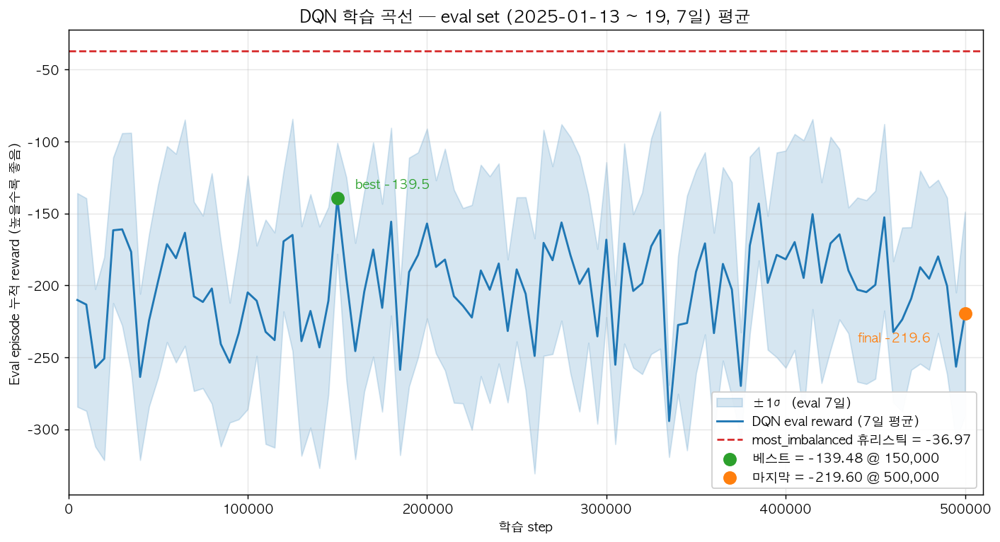

# 따릉이 재배치 최적화 (RL)

서울시 공공자전거 "따릉이"의 정류소 간 자전거 재배치를 강화학습으로 최적화하는 프로젝트.
트럭이 자전거를 적재/하차하며 대여 실패(stockout)와 반납 실패(full)를 최소화하는 정책을 학습한다.

---

## 1. 문제 정의

- **목표**: 자치구 단위 권역에서 N대의 트럭이 자전거를 재배치하여 24시간 동안의 누적 실패(대여 실패 + 반납 실패)를 최소화한다.
- **데이터**: 서울시 공공자전거 대여 이력 + 정류소 마스터 + 날씨 + 공휴일.
- **접근**: Gymnasium 커스텀 환경 + Stable-Baselines3 DQN.

---

## 2. Environment Design

학습을 시작하기 전에 아래 항목들을 확정해야 합니다. 현재 `config/default.yaml`의 값은 초안이며, 데이터 EDA 후 조정 필요.

### 2.1 권역
- [ ] 서울 전체 따릉이 정류소 = 약 2,700개 → 시뮬레이터로 돌리기엔 너무 많음
- [ ] 권역 단위로 묶어서 시뮬레이터 구현 필요
  - 예: 강남구, 종로구, 마포구 등 5~10개 권역으로 나누기
  
### 2.2 시간 해상도

> **DQN이 결정을 내릴 step과 episode를 정하는 항목.**

#### 결정 사항

| 결정 | 현재값 | 의미 |
|---|---|---|
| **1 step = 몇 분?** | **10분** | 시뮬레이터가 한 번 처리하는 시간 단위 |
| **1 episode = 몇 시간?** | **24시간** | DQN이 한 번 학습하는 시뮬레이션 길이 |
| **Episode 시작 시각** | **매번 00:00 고정** | 평가 일관성 / 구현 단순화 |
| **학습/평가 분할** | **시간순 9:3** | 앞 9개월 학습, 뒤 3개월 평가 (`default.yaml`의 `data.split`) |

→ 두 값(step / episode)이 정해지면 자동: **1 episode = 144 step** (DQN이 하루에 144번 결정)

### 2.3 트럭 설정

#### 기본 파라미터

| 항목 | 현재값 | 비고 |
|---|---|---|
| 트럭 수 N | **3대** | config로 변경 가능 |
| 트럭 적재 용량 | **20대** | 1대 트럭이 한 번에 운반 가능한 자전거 수 |
| 평균 이동 속도 | **25 km/h** | Haversine 거리 / 속도로 이동 시간 계산 |

---

#### 다중 트럭 제어 방식

> N대 트럭이 **하나의 Q-network를 공유할지, 각자 Q-network를 가질지** 결정하는 항목.
> 4가지 옵션이 있고, **각각 신경망 개수와 action space가 완전히 달라진다.**

##### 4가지 옵션 비교

| 옵션 | 신경망 개수 | Action space | 학습 난이도 | SB3 호환 |
|---|---|---|---|---|
| **(a) Centralized** | 1개 | `Discrete(n)^N` 또는 MultiDiscrete | ❌ 매우 어려움 | ❌ DQN은 MultiDiscrete 미지원 |
| **(b) Parameter Sharing** ✅ | 1개 (모든 트럭 공유) | `Discrete(n)` | ✅ 쉬움 | ✅ DQN 그대로 |
| **(c) Independent DQN** | N개 (트럭마다 별개) | `Discrete(n)` × N | ⚠️ 불안정 (non-stationarity) | △ 환경 N개 필요 |
| **(d) CTDE** | 학습용 + 실행용 분리 | 다양 | ❌ QMIX/MADDPG 등 별도 프레임워크 필요 | ❌ 미지원 |

##### 비유

| 옵션 | 비유 |
|---|---|
| (a) Centralized | **사령관 1명**이 모든 트럭에 동시에 명령 |
| **(b) Parameter Sharing** ✅ | **운전 매뉴얼 1권**을 모든 트럭 기사가 공유 (자기 차례에 매뉴얼 보고 결정) |
| (c) Independent | **트럭마다 다른 기사**, 서로 소통 안 함 |
| (d) CTDE | **훈련은 함께**, 실전엔 각자 |

##### 추천: (b) Parameter Sharing — single-agent wrapper

> 표면적으로는 single-agent DQN이지만, 학습된 정책은 자연스럽게 N대 트럭에 공유되는 형태.

### 2.4 상태(State) 표현
- [ ] 정류소별 현재 자전거 수
- [ ] 트럭별 현재 위치/ 현재 적재량 / 목적지까지 이동 잔여 step
- [ ] 시간 정보 (시각, 요일, 공휴일 여부)
- [ ] 날씨 (기온, 강수량, 풍속, 습도)
- [ ] (추후 고려) **수요 예측 feature를 포함할지** (다음 H step 예상 대여/반납) 
  - 현재 + 예측을 사용하면 선제적으로 대응 가능해짐. 하지만 예측 모형을 별도로 구현해야함. 

### 2.5 행동(Action) 공간
- [ ] 다음에 갈 정류소 선택
- [ ] 적재/하차 수량은 규칙 기반 
- [ ] action mask 적용
  - action mask: 가능한 행동만 선택하도록 마스킹하여 탐색 효율 개선, 예: 이동 중인 트럭, 자기 위치 선택, 트럭 충돌
    - SB3 DQN은 action mask 미지원 → 행동 선택 시 mask 적용하여 불가능한 행동은 무작위로 다른 행동 선택하도록 구현 필요

### 2.6 보상(Reward)

#### 점수 항목 (모두 음수 = 벌점)

| 항목 | 현재값 | 의미 | 언제 발생? |
|---|---|---|---|
| **대여 실패 (stockout)** | **-1.0** | 시민이 자전거 빌리려는데 정류소가 비어있음 | 빈 정류소에서 대여 시도 1건당 |
| **반납 실패 (full)** | **-0.8** | 시민이 반납하려는데 정류소가 가득 참 | 가득 찬 정류소에서 반납 시도 1건당 |
| **이동 거리 비용** | **-0.01 / km** | 트럭이 멀리 가면 연료/시간 낭비 | 트럭이 1km 이동할 때마다 |
| **이동 시간 비용** | **-0.005 / step** | 트럭이 오래 이동 중이면 그만큼 일을 못 함 | 트럭이 1 step(10분) 이동할 때마다 |

#### stockout > full 이유
- 대여 실패 = 시민이 **다른 교통수단을 찾아야 함** → 사용자 경험 큰 손실
- 반납 실패 = 시민이 **근처 다른 정류소로 옮기면 됨** → 비교적 작은 손실
- 따라서 stockout(-1.0) > full(-0.8) 로 가중치 차등
- 학습하면서 가중치 조정 필요


### 2.7 시뮬레이터(Demand Model)

#### 수요 생성 방식
- [ ] **(a) 서울시 공공자전거 대여이력 정보 데이터로 replay** — Phase 2~4 채택
  - 초기 자전거 분포도 데이터 기반으로 설정
- [ ] (b) Poisson 샘플링 — Phase 6 확장 시 OD(Origin-Destination) 분포 추정

---

## 3. 프로젝트 진행 단계

### Phase 1. 데이터 준비 (Week 1)
1. `data/raw/`에 원본 CSV 배치 (대여 이력, 정류소 마스터, 날씨, 공휴일)
2. EDA — 권역별 정류소 수, 시간대별 대여 패턴, 결측 확인
3. 전처리

### Phase 2. 환경 구현 (Week 2)
1. `src/envs/` — Gymnasium `Env` 인터페이스 (reset, step, observation/action space)
2. 수요 모델 (replay 우선)
3. 트럭 이동 / 적재·하차 로직
4. 보상 계산

### Phase 3. 베이스라인 (Week 3)

> RL과 비교할 "기준선" 정책을 먼저 구현. 학습이 오래 걸리는 RL과 달리 즉시 결과 측정 가능.

1. **NO-OP** — 트럭이 아예 움직이지 않는 정책
   - "재배치 자체가 의미 있나?" 판단용 (RL의 상한선)

2. **휴리스틱** — 단순 규칙 기반 정책 (`default.yaml`의 `baseline.heuristic.rule`)
   - 기본 규칙: `most_imbalanced` — 가장 균형 어긋난 정류소로 이동
     - 트럭 비어있음 → 가장 가득 찬 정류소로 가서 적재
     - 트럭 가득 참 → 가장 비어있는 정류소로 가서 하차
   - "RL이 넘어야 할 합격선"

- 각 경우의 stockout/full 누적 횟수 비교 → RL이 개선 효과 있는지 확인
- **Phase 3 완료 조건**: NO-OP / 휴리스틱 정책 평가 완료, 비교 표 작성

### Phase 4. RL 학습 (Week 4-5)
#### 단계
1. **Stable-Baselines3 DQN 적용** 
2. **TensorBoard로 학습 곡선 모니터링** 
3. **하이퍼파라미터 튜닝** 
4. **Phase 4 완료 조건**: 휴리스틱 베이스라인 대비 누적 실패(stockout + full) 감소 확인

### Phase 5. 알고리즘 비교 (Week 6)

> DQN으로 학습이 됐다면, **다른 알고리즘과 비교해 어느 게 더 나은지** 검증하는 단계.
> 같은 환경 / 같은 데이터 / 같은 평가 metric으로 공정 비교.

#### 비교 대상

| 알고리즘 | 계열 | 특징 |
|---|---|---|
| **DQN** (기준) | Value-based | 가장 단순한 deep RL |
| **Double DQN** | Value-based | Q-value 과대추정 완화 |
| **Dueling DQN** | Value-based | state value와 action advantage 분리 |
- 최소 **3개 알고리즘** (DQN + 2개 변형) 결과 비교 완료
- 가장 성능 좋은 알고리즘 선정 + 그 이유 분석

---

## 4. 프로젝트 설계 단계에서 결정해야 할 사항

> 코드 작성 전에 확정해야 할 결정 사항을 우선순위별로 정리.

### 🔴 필수 — Phase 2 시작 전 반드시

| # | 결정 사항 | 옵션 | 영향 |
|---|---|---|---|
| 1 | **권역 선택** | 마포구 / 강남구 / 종로구 / ... | 정류소 수 → action space 크기 결정 |
| 2 | **다중 트럭 제어 방식** | (a) Centralized / **(b) Parameter Sharing** / (c) Independent / (d) CTDE | 신경망 구조, action space, 라이브러리 호환성 |
| 3 | **시간 해상도** | 1 step = 5분 / **10분** / 15분 | DQN이 결정을 내리는 주기, episode당 step 수 → 학습 시간 |
| 4 | **Episode 길이** | **24h** / 12h / 6h | 학습 난이도, 평가 일관성, 24h 안에 출근/점심/퇴근/야간 패턴이 한번씩 나오므로 적합 |
| 5 | **Action 정의** | 정류소 선택 / 정류소+수량 / 경로 | action space 크기, 복잡도 |
| 6 | **적재/하차 수량 규칙** | 규칙 기반(자동) / 학습 대상 | action 차원 결정 |
| 7 | **수요 모델** | **Replay** / Poisson / Hybrid | 시뮬레이터 구현 방식 |

### 🟡 권장 — Phase 2 중 결정해도 OK

| # | 결정 사항 | 옵션 |
|---|---|---|
| 8 | **State에 포함할 feature** | 정류소 자전거 수 / 트럭 상태 / 시각 / 날씨 / 예측 feature(후) |
| 9 | **시각/요일 인코딩 방식** | one-hot / **sin-cos** / 정규화 |
| 10 | **트럭 초기 위치** | 차고지 1곳 / 랜덤 / 데이터 기반 |
| 11 | **자전거 초기 분포** | 데이터 스냅샷 / 균등 분포 / 랜덤 |
| 12 | **Action mask 적용 범위** | 자기 위치만 / + 트럭 충돌 / + 무의미한 행동 |
| 13 | **트럭 충돌 정의** | 같은 정류소 동시 도착 허용? / 같은 step 결정 mask? |
| 14 | **Stockout 시민의 substitution** | 무시 (MVP) / 인근 정류소 재시도 |

### 🟢 튜닝 — 학습 시작 후 조정 가능

| # | 결정 사항 | 1차 값 |
|---|---|---|
| 15 | **보상 가중치 (stockout vs full)** | -1.0 / -0.8 |
| 16 | **이동 비용 가중치** | -0.01/km, -0.005/step |
| 17 | **Reward shaping 추가 여부** | 처음엔 NO, ablation으로 검증 |
| 18 | **DQN 하이퍼파라미터** | lr, batch, buffer size, ε-decay |
| 19 | **네트워크 구조** | MLP `[512, 256]` 정도 |
| 20 | **트럭 수 N** | 2대 (MVP) → 3대 |
| 21 | **트럭 적재 용량** | 20대 |

### 📊 평가/실험 설계 — Phase 3 전

| # | 결정 사항 | 옵션 |
|---|---|---|
| 22 | **학습/평가 분할** | **시간순 9:3** / random / k-fold |
| 23 | **평가 metric** | (stockout, full) 따로 / weighted sum / 둘 다 |
| 24 | **베이스라인 정책** | **NO-OP + Heuristic** / + Greedy / + Random |
| 25 | **휴리스틱 규칙** | `most_imbalanced` / `nearest_critical` / ... |
| 26 | **Seed 개수** | 3 / **5** / 10 |
| 27 | **통계적 유의성 검증 방법** | paired t-test / bootstrap CI |

### ❓ 데이터 관련 — Phase 1에서 결정

| # | 결정 사항 |
|---|---|
| 28 | 데이터 기간 (몇 년치?) |
| 29 | 정류소 활성도 컷오프 (하위 N% 제거?) |
| 30 | 결측치 처리 방법 (대여이력/날씨) |
| 31 | 이상치 처리 (정비 중 정류소, 특별 이벤트 날짜 등) |
| 32 | 비정상 trip 필터링 (1분 미만, 24시간 초과 등) |

---

### 🎯 핵심 권고

**최소한 이 5개만 정해지면 Phase 2 코딩 시작 가능:**

- ✅ 권역 = **마포구** (1번)
- ✅ 제어 방식 = **Parameter Sharing** (2번)
- ✅ Step / Episode = **10분 / 24h** (3, 4번)
- ✅ Action = **정류소 선택 + 수량 규칙 자동** (5, 6번)
- ✅ 수요 모델 = **Replay** (7번)

> 나머지는 학습하면서 **ablation study**로 검증하는 게 효율적.

---

## 5. 구현 구조

### 5.1 데이터 흐름

```
[원본 CSV]                 [전처리]                  [Episode 로더]               [환경]                    [학습/평가]
data/*.csv  ──run_preprocess.py──▶  data/processed/*.parquet
                                              │
                                              ▼
                                   src/envs/data_loader.load_episode()
                                              │ EpisodeData (정류소·거리·수요 → numpy 배열)
                                              ▼
                                   src/envs/RebalanceEnv (Gymnasium)
                                              │
                              ┌───────────────┴───────────────┐
                              ▼                               ▼
                   scripts/run_baseline.py            scripts/train.py
                   (NO-OP / random / heuristic)      (SB3 DQN + EvalCallback)
                                                              │
                                                              ▼
                                                     logs/dqn_<tag>/
                                                       ├ tb/ eval/ best/
                                                       ├ history.npy
                                                       └ dqn_final.zip
```

### 5.2 processed parquet 스키마

| 파일 | 역할 | 사용처 |
|---|---|---|
| `stations.parquet` | 정류소 마스터 + 자치구 파생 | `data_loader._filter_stations` |
| `trips.parquet` | 필터링된 개별 trip | (학습엔 직접 안 씀, demand 재집계용) |
| `demand_10min.parquet` ⭐ | (시각×정류소) 단위 대여/반납 카운트 | 환경 demand replay |
| `weather_10min.parquet` ⚠️ | 10분 resample된 ASOS 기상 (의도) | 현재 미사용 |

**`demand_10min.parquet`** = "특정 정류소에서 특정 10분 구간에 발생한 대여/반납 건수" sparse 테이블.

| 컬럼 | 의미 |
|---|---|
| `t` | 10분 단위 timestamp |
| `station_id` | 정류소 ID |
| `rentals` | 그 구간에 그 정류소에서 **출발**한 trip 수 |
| `returns` | 그 구간에 그 정류소로 **도착**한 trip 수 |

생성 (`preprocess.trips_to_demand`):
`start_time`을 `floor(10min)` → `(t, start_station)` count = `rentals`,
`end_time`을 `floor(10min)` → `(t, end_station)` count = `returns`, 둘을 outer merge.
환경에서는 `_build_demand_grid`가 이걸 dense `(T=144, N)` 격자로 펼쳐 매 step `rentals[t]`, `returns[t]`로 인덱싱한다.

**`weather_10min.parquet`** — 의도는 기온/강수량/풍속/습도를 10분으로 ffill resample이지만,
**현재 원본 `weather_asos_hourly.csv`에 QC플래그 컬럼만 있고 값 컬럼이 누락된 상태**라
preprocess가 QC를 drop하면 결과적으로 `t` 한 컬럼만 남는다 (52,549행 × 1열).
또한 `data_loader`가 weather parquet을 읽지 않고 `RebalanceEnv` observation에도 날씨 feature가 없어
**현재 학습에 전혀 영향 없음**. 활용하려면 기상자료개방포털에서 값 컬럼 포함 재다운로드 → 재전처리 필요.

### 5.3 `data_loader.py` 역할

> **"전체 서울/전체 기간 parquet에서 'episode 1개 돌리는 데 필요한 모든 정적 데이터'를 골라/계산해서 numpy 묶음으로 환경에 주입"** 하는 어댑터.

환경(`RebalanceEnv`)은 시뮬레이션 로직만 갖고, "어느 정류소가 마포구인지" "A→B 몇 km인지" "1/15 08:30에 X에서 몇 명이 빌리려 했는지" 같은 정적 데이터는 모른다.

`load_episode(processed_dir, district, episode_start, ...)` → `EpisodeData`:

| 필드 | shape | 만들어지는 방식 |
|---|---|---|
| `station_ids` | list 길이 N | `stations.parquet`에서 `gu==district` 필터 |
| `station_coords` | (N, 2) | 정류소들의 `lat`, `lon` |
| `distance_matrix` | (N, N) km | Haversine (`utils/geo`) |
| `travel_steps` | (N, N) int | `distance / 25km/h / 10min` |
| `capacity` | (N,) | `stations.parquet`의 `capacity` 컬럼 (정류소별 실측값, 마포구 5~40·평균 12·중앙값 10). 컬럼 없을 때만 `capacity_per_station=20` fallback |
| `initial_bikes` | (N,) | data_based(첫 6 step net flow 보정) / uniform |
| `rentals` | (T=144, N) | `demand_10min` 슬라이스 → dense 격자 |
| `returns` | (T=144, N) | 위와 동일 |
| `timestamps` | 길이 144 | `episode_start`부터 10분 간격 |

이렇게 분리한 이유:
- 환경은 같은 코드로 **여러 episode**(날짜)를 돌려야 함 → `train.py`가 날짜별로 `load_episode`해 리스트로 환경에 넘기면 `env.reset()`마다 무작위 회전
- 거리행렬·이동 step은 episode마다 안 변함 → 한 번 계산해 들고있으면 됨
- demand parquet은 sparse 1년치 → 필요한 24h만 dense `(144, N)`으로 미리 펼쳐 매 step O(1) 인덱싱

### 5.4 환경 (`src/envs/rebalance_env.py`)

Parameter sharing single-agent wrapper — **1 RL step = 1 트럭의 1 결정**. 환경이 turn을 관리하며, 모든 트럭이 이동 중이면 시계를 진행시켜 다음 idle 트럭이 생길 때까지 demand replay를 돌린다.

- `action_space = Discrete(N)` — 다음 갈 정류소. 자기 위치 선택 시 1 step 머무름
- `observation` (`Box[-1,1]`):
  `[bike_ratio(N), truck_loc_norm, load_ratio, remaining_steps_norm, current_truck_onehot, sin/cos(hour), sin/cos(episode_frac)]`
- 도착 시 적재/하차는 **규칙 기반** — `target = 정류소 capacity × target_fill_ratio(=0.5)` 기준 (정류소마다 capacity가 다르므로 target도 다름). 잉여면 트럭에 싣고, 부족이면 트럭에서 내림. 트럭 적재 한도는 별도 `truck_capacity`(기본 20, `--truck-capacity`로 조정)
- 보상: `stockout=-1.0, full=-0.8, travel_km=-0.01, travel_step=-0.005`
- `done`은 `t >= T` (24h = 144 step)
- `action_masks()` (alias `get_action_mask`): in-flight 트럭 목적지 차단, `strict_urgent_mask=True`면 위급 정류소만 허용(자기 위치 stay 항상 허용), 전부 막히면 자기 위치 fallback. `use_action_mask=False`면 all-ones

### 5.5 베이스라인 (`src/agents/common/baselines.py`)

- `NoopPolicy` — 자기 위치 반환 (재배치 없음, RL의 상한선)
- `MostImbalancedPolicy` — load==0 → 잉여 큰 곳, load==full → 부족 큰 곳, 부분 → |bikes-target| 큰 곳.
  다른 트럭 목적지 제외. 현재 RL이 넘어야 하는 강한 베이스라인.
- `random` — `run_baseline.py` 안에서 즉석 샘플링

### 5.6 학습 셋업 (`scripts/train.py`)

| 항목 | 값 |
|---|---|
| 알고리즘 | Stable-Baselines3 DQN (MlpPolicy, `net_arch=[256, 256]`) |
| Train pool | `2025-01-01 ~ 2025-02-28` 중 앞 20일, `reset()`마다 무작위 회전 |
| Eval set | `2025-01-13 ~ 2025-01-19` 7일 고정 (휴리스틱과 같은 셋 → 직접 비교) |
| `learning_rate` | 1e-4 |
| `buffer_size` | 100,000 |
| `batch_size` | 64 |
| `gamma` | 0.99 |
| `exploration_fraction / final_eps` | 0.3 / 0.05 |
| `target_update_interval` | 1,000 |
| `train_freq / gradient_steps` | 4 / 1 |
| `eval_freq` | 5,000 step |

`EvalLoggerCallback`이 매 5k step마다 eval 7개 episode 평균 reward를 stdout + `history.npy`에 기록하고, 학습 전 측정한 휴리스틱 reward와의 Δ를 함께 출력한다.

### 5.7 자주 쓰는 명령

```bash
python scripts/run_preprocess.py                                # 마포구, 10분 step
python scripts/test_env.py                                      # 환경 sanity check
python scripts/run_baseline.py                                  # noop/random/heuristic 비교
python scripts/train.py                                         # 기본 100k step → logs/dqn_run1
python scripts/train.py --timesteps 500000 --tag long           # 더 길게 + 태그 분리
tensorboard --logdir logs
```

---

## 6. 1차 학습 결과 (DQN 500k, `logs/dqn_long`)



| 기준 | reward (7일 평균) | vs 휴리스틱 |
|---|---|---|
| `most_imbalanced` 휴리스틱 | **-36.97** | — |
| DQN best (step 150,000) | -139.48 ± 38.58 | Δ = **-102.5** ❌ |
| DQN final (step 500,000) | -219.60 ± 70.72 | Δ = **-182.6** ❌ |

### 진단

- **휴리스틱을 한참 못 따라잡음.** RL이 처음부터 끝까지 휴리스틱 라인 근처에도 도달하지 못함.
- **150k 이후 발산.** best(-139) → final(-219), best 이후 최저는 -294까지 떨어짐. 분산도 std 38 → 70으로 약 2배 증가 — 정책이 일별 패턴에 robust하지 못함.
- 곡선은 단조 상승 없이 진동만 — 학습 신호 자체가 약한 신호.

### 원인 후보 (효과 큰 순)

1. **Action mask 실제 미적용** — `RebalanceEnv.get_action_mask`가 placeholder(`np.ones`). 자기 위치/다른 트럭 destination을 마스킹 안 해서 무의미한 액션에 학습 신호 낭비.
2. **휴리스틱이 너무 강한 베이스라인** — `most_imbalanced`는 도메인 지식 직접 사용. raw DQN이 `bike_ratio` 벡터로부터 이걸 재학습하는 건 비효율적.
3. **기본 DQN의 Q 과대추정** — Double DQN 비활성. 150k→500k 악화의 전형적 신호.
4. **이동 비용 가중치** — `travel_step=-0.005`가 매 step 들어와 "안 움직이는 정책"으로 끌어당길 수 있음. `cum_travel_km` 비교 필요.

---

## 7. 환경 개선 사항 (Phase 4 진행 중)

§6 진단을 바탕으로 환경·보상·observation을 단계적으로 개선. 각 항목은 CLI 인자로 노출되어 ablation 비교 가능.

### 7.1 Action mask 실제 구현 (`RebalanceEnv.action_masks`)
이전엔 placeholder였던 마스크를 실제 구현. 다른 트럭이 향하는 destination을 차단해 중복 작업 회피. `MaskableDQN`이 학습·평가 모두에서 이를 활용.

### 7.2 MaskableDQN + Double DQN (`src/agents/models/masked_dqn.py`)
SB3 DQN을 상속해 ε-greedy 탐색·argmax·predict에서 invalid action을 -∞로 처리. `--double-q`로 Double DQN 타깃 활성화(Q 과대추정 완화).

### 7.3 SMDP 트리거 (`urgent_low_ratio` / `urgent_high_ratio`)
트럭이 idle일 때마다 무조건 결정 요청 X → **위급 정류소(자전거 비율 ≤ low 또는 ≥ high)가 있을 때만** 결정 요청. 없으면 환경이 시계만 흘림. 결정 횟수 ~32% 감소, "의미 있는 결정"에 집중.

### 7.4 Reward shaping — 위급 정류소 도착 보너스 (`urgent_bonus`)
도착 정류소가 위급 상태였으면 +`urgent_bonus`. "위급 곳 가야 한다" 학습 신호 명시화. urgent_bonus=2.0 + sparse stockout/full reward 조합이 효과적.

### 7.5 Strict urgent mask (`--strict-mask`)
위급 정류소만 action 가능하게 제한 (자기 위치 stay 항상 허용). **실험 결과 역효과** — Q value collapse가 좁은 후보 안에서 더 심해짐. 현재 기본 OFF.

### 7.6 이동 비용 옵션화 (`--w-travel-km` / `--w-travel-step`)
기본 -0.01/km, -0.005/step → CLI로 가변. 너무 작으면 "굳이 멀리 안 가는 함정", 너무 크면 trucks 움직임 위축. 권장값 -0.008/km, -0.002/step.

### 7.7 Exploration 강화 (`--exploration-fraction` / `--exploration-final-eps`)
기본 0.3 / 0.05 → ε-greedy 무작위 비율을 크게. 권장 0.6 / 0.15 (학습 후반에도 15% 무작위 유지 → 다양한 정류소 시도).

### 7.8 Visit count bonus (`--explore-bonus`)
방문 횟수가 적은 정류소에 +`explore_bonus / √n` 보상. Intrinsic motivation 기법. 다만 휴리스틱도 동일하게 이득 → 격차 미세 증가. 0.3 권장.

### 7.9 Observation 확장 (캘린더 + 날씨)
기존 162 dim → **171 dim**.
- **캘린더 5 dim**: `sin/cos(dayofweek)`, `is_weekend`, `is_holiday`, `is_holiday_eve` — 전처리 parquet에서 직접 가져옴 (`holidays` 패키지 의존 제거).
- **날씨 4 dim**: `temp_c`, `precip_mm`, `wind_ms`, `humidity_pct` — 매 step별 시계열로 `[-1,1]` 정규화. 1년치 데이터에서 봄/여름/가을/겨울 모두 다른 분포 학습 가능.

### 7.10 데이터 분할 재설계 (1년치 random 80/20)
이전: 1/1~1/20 (20일) train, eval(1/13~1/19)이 train 안에 포함된 **데이터 누수** 상태.
현재: `seed=42` 기반 random shuffle → 292일 train pool / 7일 eval. 모든 12개월에 골고루 분포, 누수 0. `--n-train-dates`로 추출량 조절.

---

## 8. 실험 로그 — 휴리스틱 추격 진화

마포구 단일, 트럭 3대 고정. 표의 `Δ`는 휴리스틱 대비 DQN best.

| Tag | 핵심 변경 | timesteps | 휴리스틱 | DQN best | Δ |
|---|---|---|---|---|---|
| `dqn_long` (§6) | 원본 (mask placeholder) | 500k | -36.97 | -139.5 | -102.5 ❌ |
| `mapo_smdp_v1` | + SMDP 트리거 | 100k | -14.52 | -75.6 | -61.0 ❌ |
| `mapo_smdp_shaped_v1` | + shaping + strict_mask + 이동비 ↓↓ | 100k | +43.93 | +18.8 | -25.1 ❌ |
| `mapo_smdp_shaped_v2` | 이동비 살짝 복원 | 100k | +42.69 | +37.8 | -4.9 ❌ |
| `mapo_smdp_shaped_v3` | 더 길게 | 300k | +42.69 | +70.7 | **+28.0 ✅** |
| `mapo_explore_v1` | + exploration ↑ + visit count | 300k | +91.67 | +49.96 | -41.7 ❌ |
| `mapo_open_v1` | strict_mask 제거 | 300k | +128.22 | **+166.7** | **+38.5 ✅** |
| `mapo_year_v1` | + 1년치 데이터 (계절 다양성) | 500k | (학습 중) | — | — |

### 핵심 발견

1. **strict_mask는 역효과** — Q-network가 좁은 후보 안에서 collapse 재발생. 푸는 게 정답.
2. **shaping + exploration + 적절한 이동 비용**의 조합이 작동. 단독으로는 부족.
3. **단조 상승 곡선** — `open_v1`에서 처음으로 best=final, 발산 없음. 더 길게 학습하면 더 향상 가능 시사.
4. **1년치 데이터**는 캘린더+날씨 feature가 의미 있어지는 전제 조건 (1월만으론 계절 변화 X).

### Replay 분석으로 본 정책 변화

같은 1/15 episode 기준 트럭들의 정류소 방문 다양성:

| Tag | 전체 unique 방문 | 트럭들 같은 곳 모임 | 1일 이동거리 |
|---|---|---|---|
| `dqn_long` | 7개 | **67.6%** | 985 km |
| `mapo_smdp_v1` | 8개 | 0% | 170 km |
| `mapo_smdp_shaped_v3` | 3개 (strict_mask collapse) | 0% | 16 km |
| `mapo_open_v1` | **8개** (트럭 1은 9개) | 0% | **118 km** |

→ `open_v1`이 처음으로 **다양성 회복 + 의미 있는 이동** 달성.

---

## 9. 자주 쓰는 명령 (현재 권장 설정)

```bash
# 전처리 (필요 시)
python scripts/run_preprocess.py --gu 마포구 영등포구 강남구 --step 10min

# 환경 sanity check
python scripts/test_env.py --district 마포구

# 베이스라인 (트리거 ON 환경에서)
python scripts/run_baseline.py --district 마포구 --urgent-low 0.15 --urgent-high 0.85

# 권장 학습 설정 (open_v1 기반)
python scripts/train.py \
  --algo masked_dqn --double-q \
  --urgent-low 0.15 --urgent-high 0.85 \
  --urgent-bonus 2.0 --explore-bonus 0.3 \
  --w-travel-km -0.008 --w-travel-step -0.002 \
  --exploration-fraction 0.6 --exploration-final-eps 0.15 \
  --n-train-dates 60 \
  --tag <태그> --timesteps 500000

# 학습된 모델 → replay JSON (viewer용)
python scripts/export_replay.py \
  --algo masked_dqn \
  --model logs/masked_dqn_<태그>/best/best_model.zip \
  --urgent-low 0.15 --urgent-high 0.85 \
  --out docs/replay_<태그>.json

# 결과 시각화
open docs/project_overview.html      # 프로젝트 전체 흐름
open docs/source_guide.html          # 소스 가이드
open docs/training_flow.html         # 5 정류소 미니 시뮬레이터
open docs/replay_viewer.html         # 학습 결과 episode 재생
tensorboard --logdir logs            # 학습 곡선
```
