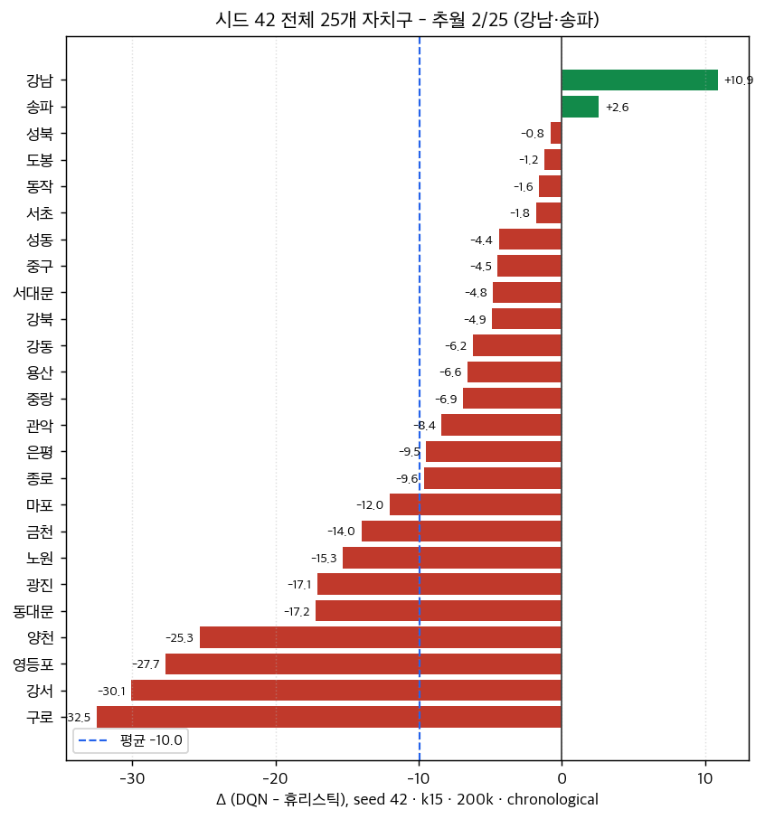
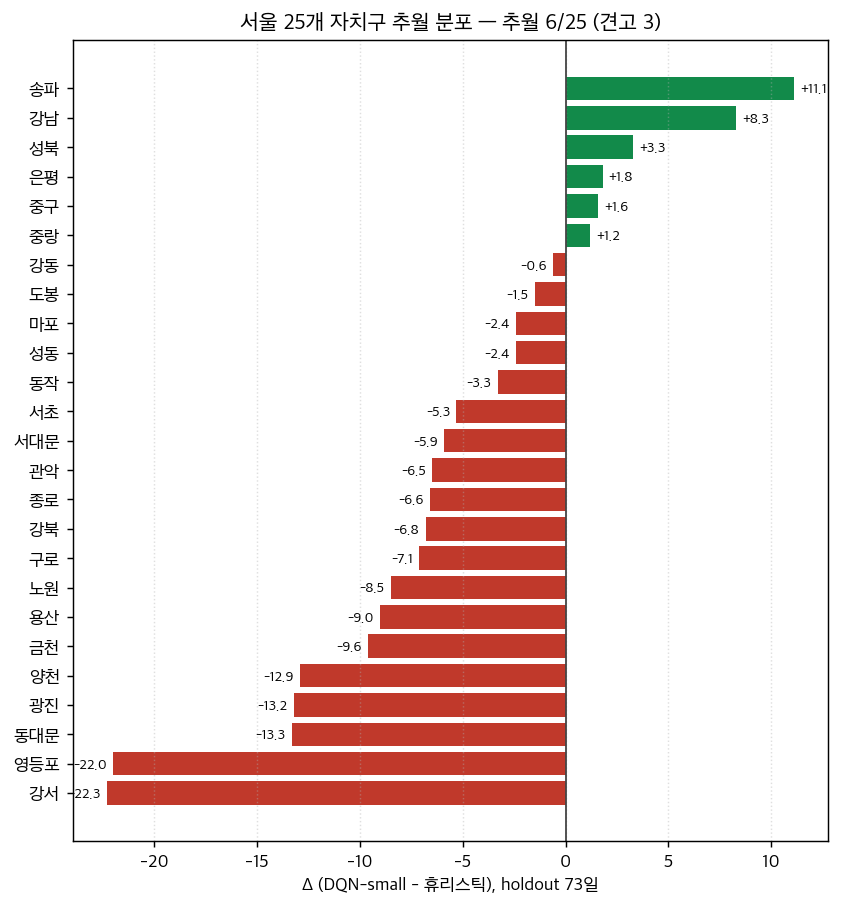
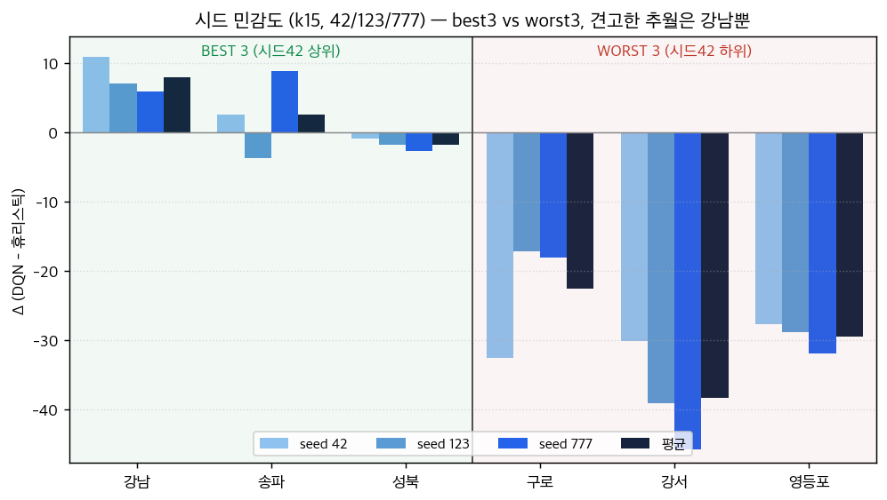
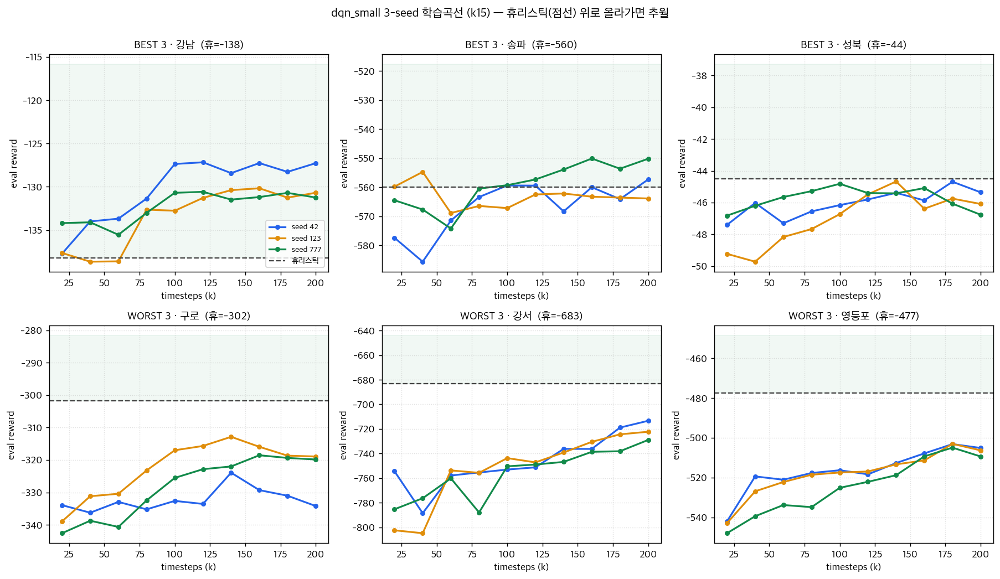
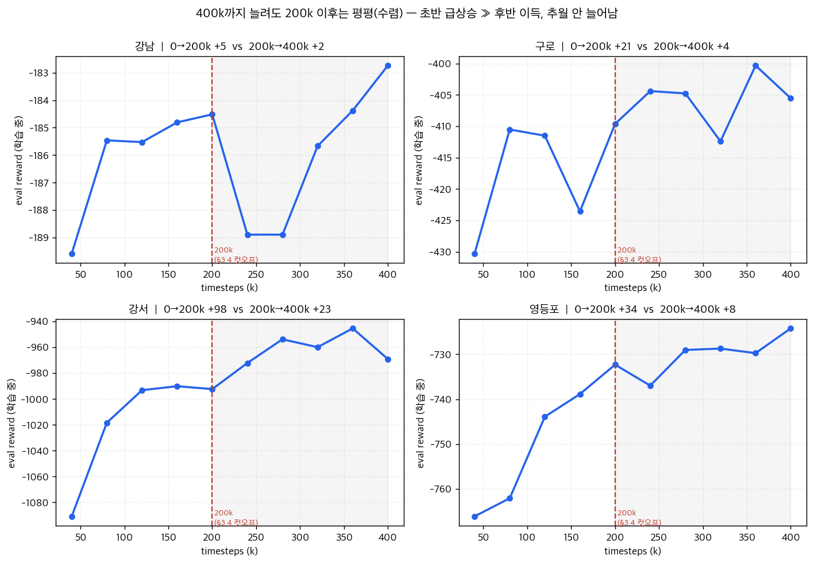
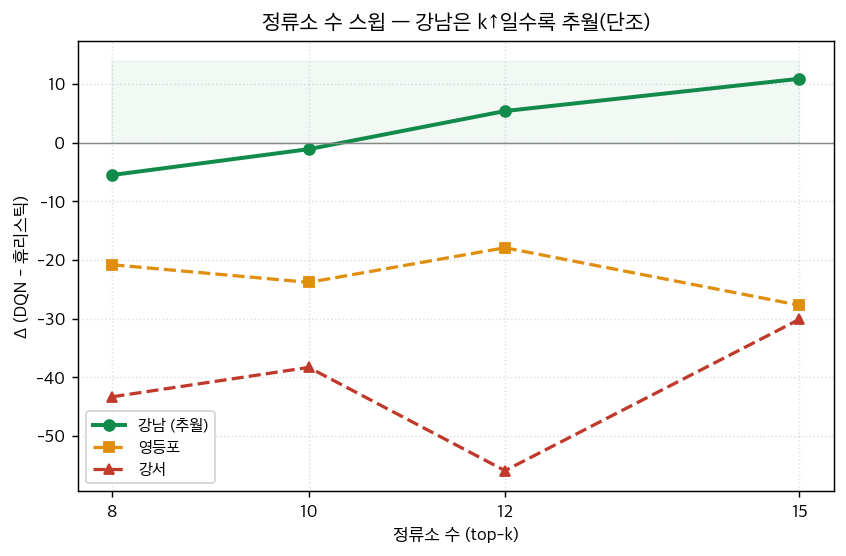
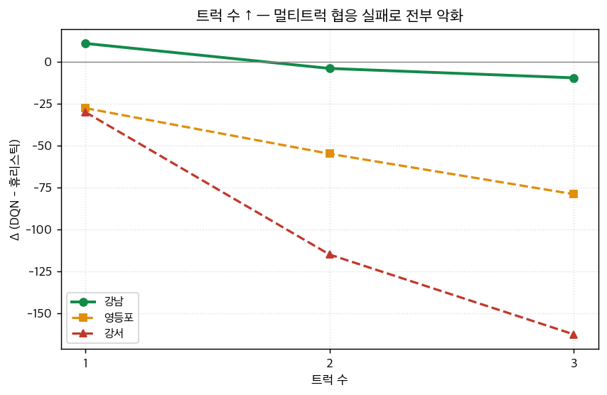
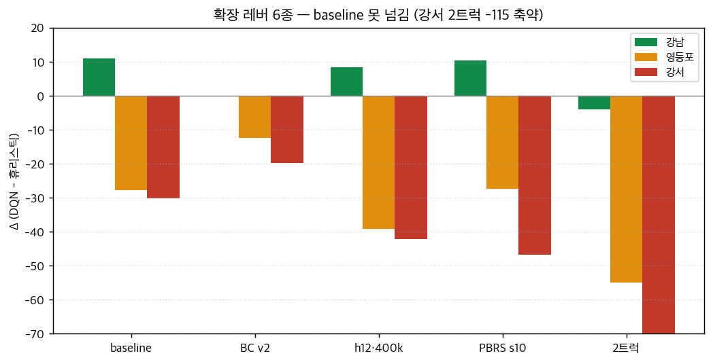
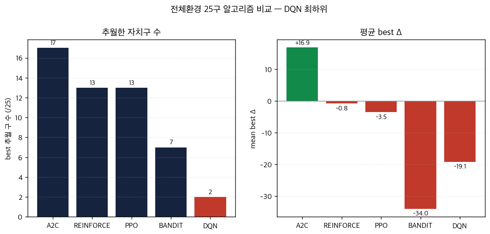

# DQN 실험 종합 정리 — 자전거 재배치 RL

---

## 0. 한 줄 요약

> **DQN은 "문제를 배울 수 있는 크기로 줄였을 때만" 휴리스틱을 추월한다.**
> 전체환경(146정류소·다트럭)에선 학습 자체가 실패했고, 환경을 top-N 정류소·트럭 1대로 축소하자
> 추월이 나타났다. 실제 25개 자치구에서 **견고한 추월은 강남구 1곳**(단일트럭·비포화·k15)뿐이며,
> 시도한 6개 확장 레버는 모두 무효~악화. 한계는 DQN 튜닝이 아니라 **문제 구조**다.

---

## 1. 알고리즘 (Algorithm)

| 구분 | 내용 |
|---|---|
| **베이스** | stable-baselines3 계열 DQN. 두 가지 구현 트랙으로 진행 |
| **`dqn` (전체환경)** | MaskableDQN(Double) + candidate Top-K(행동 후보 12개로 제한). **상태는 자치구 전체 정류소** |
| **`dqn_small` (축소환경)** | MaskableDQN(Double), MlpPolicy `[256,256]`. 출퇴근 압력 **top-N 정류소 + depot + 트럭 1대**로 환경 자체를 축소 |
| **정책 구조** | 행동 = 목적지 정류소 선택(K개) [+ 옵션: 재배치량 레벨 3단계]. 관측에 **forecast 미래 순수요** 포함 |
| **비교 휴리스틱** | 실제환경: `most_imbalanced`(반응형 그리디) / SmallProblem: `SLA`(예측형 lookahead), `STR`(반응형), `do-nothing` |

**핵심 설계 결정**: 전체환경에서 model-free DQN이 학습에 실패(§4.1) → "배울 수 있는 크기"로
환경을 축소(top-N 정류소 + 트럭 1대)하는 `dqn_small`로 전환한 것이 전체 연구의 전환점.

### 관측(Observation) 구성 — `dqn_small`, obs_dim 92 (k15 기준)

| 구성 | 차원 |
|---|---|
| 정류소 재고율 | 15 |
| 트럭(위치·적재·남은이동·현재트럭) | 4 |
| 시각 sin/cos·진행 | 4 |
| 캘린더(요일 sin/cos·주말·공휴일·휴일전날) | 5 |
| 날씨(기온·강수·풍속·습도) | 4 |
| **forecast 미래 순수요 (15×4)** | 60 |

비용(=리워드, 높을수록 좋음): `stockout×(−1.0) + full×(−0.8) + 이동km×(−0.008) + 이동step×(−0.002)`

---

## 2. 하이퍼파라미터 (Hyperparameters)

### 2.1 대표 설정 (`dqn_small`, 25구 평가 baseline)

| 항목 | 값 |
|---|---|
| 알고리즘 | MaskableDQN (Double), MlpPolicy net_arch `[256, 256]` |
| total_timesteps | **200,000** (확장 실험은 400k) |
| eval 주기 | 20,000 |
| n_train_dates | 200 |
| forecast horizon | **6** (60분) |
| 분할 | chronological — train 292일 / eval(holdout) 73일 (2025-10-20 ~ 12-31) |
| 트럭 수 | **1** (용량 20) |
| 정류소 수 | **top-15** (출퇴근 압력 \|반납−대여\| 상위) |
| 평가 | 73일 결정적 replay, 휴리스틱과 동일 실현 공유(paired) |

### 2.2 SmallProblem 트랙 (forecast 효과 검증용)

| 항목 | 값 |
|---|---|
| 알고리즘 | vanilla DQN (MlpPolicy `[256,256]`) |
| total_timesteps | 400,000 |
| learning_rate | 5e-4 |
| gamma | 0.99 |
| buffer_size | 200,000 |
| learning_starts | 5,000 |
| batch_size | 128 |
| train_freq | 4 |
| target_update_interval | 2,000 |
| exploration_fraction / final_eps | 0.3 / 0.05 |

### 2.3 탐색한 하이퍼파라미터 레버 (확장 실험, §5.4 분석)

| 레버 | 시도 값 | 결론 |
|---|---|---|
| forecast horizon | 6 / 12 | **h6 > h12** (h12는 예측오차 누적→노이즈) |
| total_timesteps | 200k / 400k / 800k | **200k면 충분** (대부분 100~260k 수렴), 400k는 양적 개선만 |
| 보상 셰이핑(PBRS) | scale 0 / 1 / 2 / 10 | 무효(수렴 시 정책 불변), 대형구는 악화 |
| BC 워밍업(SLA 모방) | 고eps / 저eps+rollback | RL이 BC를 못 넘음 → 추월 억제 |
| 트럭 수 | 1 / 2 / 3 | **1트럭만 추월 성립**, 멀티트럭은 협응 실패 |
| 정류소 수(k) | 8 / 10 / 12 / 15 | 강남은 **k↑일수록 추월**(k15 최고) |
| exploration-initial-eps | 1.0 (기본) | BC 정책을 RL 시작 즉시 파괴 → BC와 상충 |

---

## 3. 서울 25개 자치구 평가 (dqn_small)

**Δ = DQN reward − 휴리스틱 reward** (+면 추월). 휴리스틱(`most_imbalanced`)은 시드 무관 결정적 →
Δ의 변동은 전적으로 모델 학습 쪽.

### 3.0 평가 방법의 진화 — 7일·best(낙관) → 73일·final(정직)

같은 25구·같은 환경이라도 **평가 방법**에 따라 수치가 달라진다. 초기 평가(§3.2)는 낙관 편향이
있었고, 보고서용으로 세 가지를 교정한 것이 §3.3이다. 두 표를 연달아 보면 보정 효과가 드러난다.

| | **초기 평가 (§3.2)** | **교정 평가 (§3.3)** |
|---|---|---|
| 평가 표본 | holdout 중 **7일만** | **73일 전체** |
| 정책 선택 | **best 체크포인트**를 그 7일로 고름 → 낙관(best-on-test) 편향 | **final 모델** 고정 → 편향 제거 |
| 통계 | 점추정 1개 | 평균 ± **95% CI** + 추월일수 |
| 학습량 | 200k | 400k |
| 강남 Δ | **+10.9** | **+8.3** |
| 추월 구 | **2/25** | **6/25 (견고 3)** |

→ **§3.2는 진단용(낙관) 수치, 대표값은 §3.3(정직)을 인용**할 것. 시드 분산은 §3.4에서 따로 본다.

### 3.1 알고리즘·환경

| 항목 | 내용 |
|---|---|
| 알고리즘 | **`dqn_small`** — MaskableDQN(Double), MlpPolicy `[256,256]` |
| 환경 | 실제 **`RebalanceEnv` 축소판** — 출퇴근 압력 상위 **top-15 정류소 + depot + 트럭 1대**(용량 20). obs_dim 92 (재고율 15 + 트럭4 + 시각4 + 캘린더5 + 날씨4 + **forecast 미래순수요 60**) |
| 데이터 | **chronological** 분할 (train 292일 / 미래 holdout 73일), 25개 구 **각각 독립** 학습·평가 |
| 비교 휴리스틱 | **`most_imbalanced`** (반응형 그리디 — 현재 재고가 목표에서 가장 어긋난 정류소로 즉시 이동, 미래 예측 없음) |
| 평가 | 결정적 replay, 휴리스틱과 **동일 수요 실현 공유(paired)** → Δ의 변동은 전적으로 모델 학습 쪽 |

### 3.2 초기 평가 — 7일·best·200k (낙관, seed 42)

seed 42 단일 시드, 200k 학습, **holdout 중 7일을 best 체크포인트로 평가**한 결과 (Δ 내림차순).
출처: `logs/runs/seedgrid/results_k15_seed42.csv`.

| # | 구 | 휴리스틱 | DQN | Δ | 추월 |
|---:|---|---:|---:|---:|:---:|
| 1 | **강남** | −138.2 | −127.3 | **+10.9** | **Y ✅** |
| 2 | **송파** | −560.0 | −557.3 | **+2.6** | **Y ✅** |
| 3 | 성북 | −44.5 | −45.4 | −0.8 | N |
| 4 | 도봉 | −49.3 | −50.6 | −1.2 | N |
| 5 | 동작 | −66.3 | −67.9 | −1.6 | N |
| 6 | 서초 | −35.9 | −37.6 | −1.8 | N |
| 7 | 성동 | −360.1 | −364.5 | −4.4 | N |
| 8 | 중구 | −122.2 | −126.7 | −4.5 | N |
| 9 | 서대문 | −65.0 | −69.8 | −4.8 | N |
| 10 | 강북 | −15.5 | −20.3 | −4.9 | N |
| 11 | 강동 | −170.1 | −176.3 | −6.2 | N |
| 12 | 용산 | −21.7 | −28.3 | −6.6 | N |
| 13 | 중랑 | −88.0 | −95.0 | −6.9 | N |
| 14 | 관악 | −71.8 | −80.2 | −8.4 | N |
| 15 | 은평 | −125.6 | −135.1 | −9.5 | N |
| 16 | 종로 | −120.1 | −129.6 | −9.6 | N |
| 17 | 마포 | −175.6 | −187.7 | −12.0 | N |
| 18 | 금천 | −197.7 | −211.7 | −14.0 | N |
| 19 | 노원 | −180.9 | −196.3 | −15.3 | N |
| 20 | 광진 | −251.4 | −268.6 | −17.1 | N |
| 21 | 동대문 | −197.7 | −214.9 | −17.2 | N |
| 22 | 양천 | −442.7 | −468.0 | −25.3 | N |
| 23 | 영등포 | −477.4 | −505.1 | −27.7 | N |
| 24 | 강서 | −683.2 | −713.4 | −30.1 | N |
| 25 | 구로 | −301.7 | −334.2 | −32.5 | N |

**요약(낙관): 추월(Δ>0) 2/25 (강남·송파), 구 평균 Δ −10.0.**

**해석**
- 추월은 **강남·송파 단 2곳**, 나머지 23구는 전부 열세.
- Δ의 크기는 **수요 규모와 강하게 음의 상관** — 대형·고수요 구(구로·강서·영등포·양천)일수록
  격차가 −25~−33로 벌어지고, 작거나 비포화인 구(성북·도봉·동작·서초)는 0 근처.
- 강남(+10.9)만 뚜렷이 양수 → 평균선(−10.0)에서 가장 먼 유일한 추월.
- ⚠️ 단 이 수치는 **7일·best 낙관 평가**다. 편향을 걷어낸 정직한 대표값은 바로 아래 §3.3.

### 3.3 교정 평가 — 73일·final·400k (정직, 95% CI)

같은 모델군을 **holdout 73일 전체**로, **best가 아닌 final 모델**을 고정 평가하고 평균±95% CI를
제시(낙관 편향 제거). 실행: `posthoc_eval_holdout.py --model-tag-prefix small400`.

- **추월(Δ>0) 6/25, 구 평균 Δ −5.3** (낙관 2/25·−10.0 → 정직 6/25·−5.3로 보정됨).
- **CI(73일 변동)가 0을 넘지 않는 견고한 추월: 강남(+8.3)·송파(+11.1)·성북(+3.3) 3구.**
- 추월 구는 수요 규모 크거나 중간인 구. 작은 구(강북·용산)는 재배치 여지가 적고, 초대형
  고수요 구(강서·영등포)는 15정류소로 축소해도 단일 트럭이 감당 못 함.

| 보조 실험 | 결과 |
|---|---|
| 학습량 200k→400k | 추월 7→8/25, 격차는 줄지만 추월 전환은 성동 1구뿐 (양적 개선) |
| forecast (강남) | ON +10.4 vs OFF +7.9 → 기여 ≈ +2.5 (양이나 작음) |
| Poisson 확률수요 | 강남 +8.3→+6.9, 마포·도봉 악화 → 일관되게 같거나 나쁨 |
| forecast+VAE latent | 3구 모두 소폭 악화 (obs 92→152로 학습만 어려워짐) |

→ 실제 환경에서 추월 동력은 forecast가 아니라 **라우팅 정책 학습 자체**.

### 3.4 시드 민감도 (42 / 123 / 777, best3 vs worst3)

§3.3은 단일 시드(42)의 **날짜 분산**(73일 CI)을 봤다면, 여기선 **시드 분산**(학습 재현성)을 본다.
**대표 6구 = §3.2 결과의 BEST 3(상위)와 WORST 3(하위)** — 양 극단이 시드를 바꿔도 유지되는지 검증.

| 그룹 | 구 | seed 42 | seed 123 | seed 777 | 평균 | 추월 |
|---|---|---:|---:|---:|---:|:---:|
| **BEST 3** | **강남** | +10.9 | +7.1 | +6.0 | **+8.0** | **3/3 ✅** |
| **BEST 3** | 송파 | +2.6 | −3.7 | +8.9 | +2.6 | 2/3 (부호뒤집힘) |
| **BEST 3** | 성북 | −0.8 | −1.7 | −2.6 | −1.7 | 0/3 |
| **WORST 3** | 구로 | −32.5 | −17.2 | −18.0 | −22.6 | 0/3 |
| **WORST 3** | 강서 | −30.1 | −39.0 | −45.7 | −38.3 | 0/3 |
| **WORST 3** | 영등포 | −27.7 | −28.8 | −31.9 | −29.5 | 0/3 |

**해석**
- **BEST 3 중 견고한 추월은 강남뿐** — 3시드 모두 +6~+11. 송파는 **시드운**(seed 123에서 −3.7로
  부호 뒤집힘) → multi-seed 없이 추월 주장 위험. 성북은 사실상 0.
- **WORST 3 (구로·강서·영등포)**: 시드 노이즈(±7~8pt)가 격차(−18~−46)에 비해 너무 작아
  **어떤 시드로도 구제 불가** — 추월은 시드 문제가 아니라 구조 문제임을 확정.
- 날짜 분산(§3.3 CI)과 시드 분산(§3.4) **두 검증을 모두 통과하는 건 강남**이다.

**timestep별 학습곡선 (6구 × 3시드)**

각 패널: eval reward(20k~200k)를 3시드로, **점선 = 휴리스틱**(시드 무관 결정적). 곡선이 점선 위로
올라간 구간이 추월. 출처: `logs/dqn_seed{42,123,777}*_dqn_small_<구>/history.npy`.
- **강남**: 3시드 모두 100k 부근부터 휴리스틱 점선을 **뚫고 올라가 수렴** → 추월이 학습의 산물임이 곡선으로 보임.
- **송파**: 시드별로 점선을 넘나듦(부호 뒤집힘) → 추월이 불안정(시드운).
- **성북**: 점선에 딱 붙어 수렴 → 사실상 동률.
- **WORST 3 (구로·강서·영등포)**: 학습이 진행돼 eval reward 자체는 오르지만 **점선에 한참 못
  미친 채 수렴** → 더 오래 학습해도 휴리스틱을 못 넘는 구조적 천장(§4.3 포화)을 시각적으로 확인.

**"200k에서 잘라서 그렇지, 더 하면 오르지 않나?" → 아니오 (400k 곡선)**

§3.4 곡선은 200k에서 잘린 화면이라 끝이 살짝 우상향처럼 보이지만, **400k까지 이으면 200k 이후는
평평(수렴)**하다. 출처: `logs/dqn_small400_<구>/history.npy`.
- 각 패널 제목의 **0→200k 상승폭 ≫ 200k→400k 이득** (예: 강서 +98 vs +23, 강남 +5 vs +2).
  후반 이득은 한 자릿수~수십 단위로 급감하고 **상하 진동** → 우상향 추세가 아니라 수렴선 위 노이즈.
- 실제 검증: 학습량 200k→400k에서 추월은 **7→8/25**(성동 1구만 추가), WORST3는 그대로 음수.
  800k 추월 회복은 *단순화된 SmallProblem(N30)*에서만(§4.2), 실제 포화구는 800k로도 안 됨.
- ⚠️ small400 학습-중 eval은 §3.3 holdout과 **절대값 스케일이 다르다**(휴리스틱 선 생략) — 여기선
  *추세(plateau)*만 본다. **곡선이 평평한 건 "덜 학습해서"가 아니라 "그 환경의 최선에 닿아서"**다.

---

## 4. 실험 단계별 결과

### 4.1 전체환경 DQN — 영등포·마포 (출발점, 실패)

전체 정류소 사용(obs_dim 영등포 1,131 / 마포 851), 행동만 Top-K 12개 제한, 200k 학습, 고정 7일.

| 구 | 휴리스틱 | DQN | Δ | 추월일 | best step |
|---|---:|---:|---:|:---:|:---:|
| 영등포 | −1811.6 | −1933.6 | −122.0 | 0/7 | 20k(초반) |
| 마포 | −500.0 | −518.1 | −18.1 | 1/7 | 180k |

- **학습이 진행될수록 오히려 악화**(영등포 −1865→−1948), best가 학습 초반에 나옴 = 학습 진전 없음.
- 원인: 행동은 줄였어도 **상태·신용할당 공간이 거대** → model-free DQN이 강한 그리디 휴리스틱을 못 넘음.
- → 환경을 "배울 수 있는 크기"로 축소(`dqn_small`)하기로 전환.

### 4.2 SmallProblem — 축소환경에서 SLA(예측형) 추월 (성공)

마포 top-N 정류소 + 트럭 1대 + Poisson 수요, forecast를 obs에 입력한 from-scratch DQN.

| 정책 (N=15) | 리워드(확률30) | 미충족 | 비고 |
|---|---:|---:|---|
| do-nothing | −191.4 | 218.5 | — |
| STR (반응형) | −128.7 | 143.7 | — |
| SLA (예측형) | −124.3 | 138.2 | 강한 베이스라인 |
| **DQN (학습)** | **−71.7** | **77.2** | **vs SLA +52.6, 미충족 거의 절반** |

**정류소 수 스윕** (고정 400k): N10 +34.8 / N15 +52.6 / N20 +24.3 / N30 −32.3 / N50 −56.5.
→ N30도 800k면 +4.5로 추월 회복 → 경계는 "정류소 수의 벽"이 아니라 **"문제 크기 ↔ 학습량" 균형점**.

**귀인(N=10, 미충족↓ 좋음)**: forecast 제거 시 36.9→69.5로 추월폭 급감 → **forecast 입력이 승리폭의 핵심**.
shaping·재배치량 레버는 불필요(제거해도 추월 유지). seed 1/2 재현됨(36.9/36.8).

> ⚠️ 이 단계는 단순화된 `SmallProblem` + 예측형 SLA 비교다. 실제 25구 평가(§3.3)·reward
> breakdown(§4.3)은 실제 `RebalanceEnv` + 반응형 `most_imbalanced` 비교라 수치를 직접 비교하면 안 된다.

### 4.3 추월 조건 심층 연구 — reward breakdown (강남은 왜 이기나)

k15 seed42 best_model, `--split-mode chronological`로 학습 재현.

| 구 | 휴리스틱 | DQN | Δ | stockoutΔ | full(반납)Δ | **travel_kmΔ** | 미충족(휴) |
|---|---:|---:|---:|---:|---:|---:|---:|
| 강남 | −138.2 | −127.2 | **+11.0** | −4.7 | −7.4 | **−49.9** | 155 |
| 영등포 | −477.4 | −503.2 | −25.8 | +13.5 | +15.4 | −2.2 | 534 |
| 강서 | −683.2 | −713.4 | −30.2 | +21.0 | +11.5 | +1.7 | 773 |

- **강남(미충족 155, 1트럭 감당 가능)**: DQN이 forecast로 길목 선점 → **이동 50km↓ + 미충족 12건↓**.
  라우팅 슬랙이 있어 학습이 이를 잡음(이득의 ~96%가 미충족 감소).
- **영등포·강서(포화)**: 트럭 풀가동이라 슬랙 없음 → 1트럭 물리천장 아래라 어떤 정책도 못 이김.

---

## 5. 분석 (시각화)

### 5.1 정류소 수 — 강남은 클수록 이긴다 (단조)

| 구 | k8 | k10 | k12 | k15 | 패턴 |
|---|---:|---:|---:|---:|---|
| **강남** | −5.5 | −1.1 | +5.4 | **+10.9** | **단조 증가** → 추월 |
| 영등포 | −20.8 | −23.8 | −17.9 | −27.7 | 무경향, −18~−28 정체 |
| 강서 | −43.3 | −38.3 | −55.9 | −30.1 | 무경향, −30~−56 정체 |

- **강남: k8(−5.5) → k15(+10.9) 단조 증가.** 정류소를 줄이면 문제가 단순해져 반응형
  휴리스틱이 거의 최적 → DQN 끼어들 여지 소멸. **클수록 라우팅 복잡도가 생겨 DQN이 이긴다.**
- **영등포·강서는 어떤 k에서도 추월 없음** → **"정류소 줄이면 쉬워진다" 가설 기각.**

**왜 영등포·강서는 k를 바꿔도 변화가 없나 (판단)**
- k라는 레버가 조절하는 건 **라우팅 복잡도(가야 할 후보 정류소 수 = 슬랙)**다.
- **강남은 비포화**라 k를 줄이면 슬랙이 사라져 반응형이 최적이 되고(추월 소멸), k를 늘리면
  슬랙이 생겨 DQN의 forecast 선제 배치가 빛난다 → **k에 단조 반응**.
- **영등포·강서는 포화**(미충족 534/773, §4.4)라 **상위 8개 정류소만으로도 이미 1트럭 처리량을
  초과**한다. 병목이 라우팅 복잡도가 아니라 **트럭 물리천장**이라, k를 줄여도(쉬워질 것 같지만)
  트럭은 여전히 풀가동 → 반응형도 DQN도 똑같이 못 막는다. 그래서 k에 **반응하지 않고**
  −20~−50 밴드에서 진동만 한다(강서 k12 −55.9 같은 튐은 신호가 아니라 학습 분산).
- 결론: **k 레버의 효과는 "포화/비포화"가 가른다.** 비포화구(강남)에서만 k가 추월을 만들고,
  포화구에선 k가 무의미 → §4.4의 슬랙↔포화 메커니즘과 정확히 일치.

> **이 절을 남기는 이유(의견):** §5.2(트럭)·§5.3(BC)가 *개별* 실패 사례라면, §5.1은 그 실패들을
> 하나로 묶는 **통일 원리(슬랙 vs 포화)**를 단일 레버로 보여준다. 또 "정류소를 줄여 문제를
> 쉽게 만들면 RL이 이기지 않겠나"라는 자연스러운 반론을 **데이터로 직접 기각**하는 유일한 절이라,
> 빼기보다 **남기는 걸 권장**한다. 분량이 부담되면 위 표 + 마지막 결론 2줄만 남기고 압축 가능.

### 5.2 트럭 수 — 멀티트럭은 협응 실패

- 1트럭에서만 강남 추월(+10.9). 2·3트럭은 전부 악화(강남도 −4.0/−9.6).
- de-saturation은 일어나지만 **휴리스틱이 추가 트럭을 2.4배 더 잘 활용**(내장된 "다른 트럭
  목적지 제외" 규칙으로 자연 분업). DQN은 멀티트럭 협응을 200k에 학습 못 함(행동·조정 공간 폭발).

### 5.3 확장 레버 6종 — baseline을 못 넘김 (특히 BC는 추월을 *죽인다*)

- BC·호라이즌↑·학습연장·셰이핑·트럭↑ 모두 강남 baseline(+10.9)을 못 넘고 대형구는 악화.

**⚠️ BC(행동복제 워밍업)는 해결책이 아니라 역효과 — 강조점**
- **시도 동기**: 강한 휴리스틱(SLA/most_imbalanced)을 BC로 모방시켜 좋은 출발점에서
  fine-tune하면 대형구도 추월할 것이라 기대했다.
- **결과**: BC 모방 자체는 **거의 완벽**했지만, fine-tune이 **BC 정책을 끝내 못 넘었다**
  (강남 baseline +10.9 → BC v2 −0.2로 오히려 추월 소멸). 고eps는 시작 즉시 BC 정책을
  파괴하고, 저eps+rollback은 BC에 갇혀 탐험을 못 한다 — **어느 쪽도 추월을 못 만든다.**
- **이유**: **추월은 from-scratch 탐험이 만들어내는 것**이고, 휴리스틱을 모방하는 순간
  "휴리스틱을 이기는 행동"은 탐험 분포에서 배제된다. 즉 BC는 추월 엔진(탐험)을 **억눌러
  오히려 추월을 죽인다.**
- **BC의 진짜 쓸모**: 추월용이 아니라 **손상 방어용 바닥**(대형구에서 바닥을 휴리스틱 수준으로
  깔아주는 안전망)일 뿐. **"대형구 추월을 BC로 푼다"는 길은 막혔다**는 것이 핵심 결론.

### 5.4 알고리즘 비교 — 전체환경 25구에서 DQN 최하위

| 알고리즘 | best 추월구 | mean best Δ | mean final Δ |
|---|:---:|---:|---:|
| **A2C** | **17/25** | **+16.85** | **+15.02** |
| REINFORCE | 13/25 | −0.75 | −27.41 |
| PPO | 13/25 | −3.51 | −35.65 |
| BANDIT | 7/25 | −33.96 | −57.13 |
| **DQN** | **0~2/25** | −47.1 ~ −19.1 | −60.9 ~ −50.0 |

- 전체환경에서 **A2C가 압도적 1위**, value-based DQN은 거대 상태·신용할당에 취약해 최하위.
- DQN의 best Δ가 양수인 구는 영등포·양천 단 2곳, 그나마 best step이 20~60k(학습 초반),
  **final은 25구 전부 음수** → 전체환경 DQN은 구조적으로 휴리스틱을 못 넘는다.

### 5.5 DQN은 왜 실패하는가 — 구조적 원인 분석

DQN의 부진은 튜닝 부족이 아니라 **이 문제(거대 상태·지연 보상·강한 휴리스틱)가 가치기반(value-based)
학습에 구조적으로 불리**하기 때문이다. 세 원인이 겹친다.

**① "Deadly triad" + 거대 상태 → 가치 붕괴**
DQN은 *함수근사 + 부트스트랩 + off-policy 리플레이*의 결합("deadly triad")이라 발산·붕괴에 취약하다.
전체환경 obs_dim은 영등포 1,131·마포 851로 거대해 Q(s,a)를 정확히 적합하기 어렵다.
- **증거(§4.1)**: 영등포·마포 모두 **best가 20k(학습 초반)에 나오고 이후 악화**(영등포 −1865→−1948).
  초반에 운 좋게 찍은 뒤 **Q 과대추정이 정책을 망가뜨리는** 전형적 deadly-triad 증상. Double-DQN으로도
  부분적으로만 억제된다.
- **증거(§3.4 plateau)**: 축소환경에서도 eval reward는 환경별 asymptote에 **수렴**할 뿐, 학습량으로
  그 천장을 못 넘는다(400k도 200k 대비 한 자릿수 이득).

**② 지연 보상 + 긴 호라이즌 → 신용할당 실패**
에피소드가 144스텝(하루)이고 재배치의 보상은 **한참 뒤(러시아워)에** 실현된다. DQN은 스칼라 Q를
TD로 부트스트랩하는데, 보상이 지연·희소하면 타깃이 노이즈투성이라 편향이 누적된다. on-policy n-step
advantage(A2C)는 지연 보상의 신용을 훨씬 잘 역전파한다.

**③ 강한 휴리스틱 → argmax가 깨지기 쉽다**
`most_imbalanced`는 다수 구에서 거의 최적이다. 이를 넘으려면 **비슷비슷한 행동들의 순위를 정밀하게**
맞춰야 하는데, 가치기반은 Q 추정이 조금만 틀려도 argmax가 더 나쁜 행동으로 뒤집힌다. 정책경사는 Q를
정밀히 맞추지 않아도 **좋은 행동 분포**로 수렴하면 된다.

**→ 그래서 A2C가 이긴다 (§5.4).** A2C는 위 세 약점을 구조적으로 회피해 전체환경에서 17/25 추월.
DQN이 "환경을 1트럭·top15로 줄여야"(dqn_small) 겨우 강남 1곳을 이긴 것은, **상태·신용할당이
작아져 가치학습이 비로소 가능해진 영역으로 후퇴한 것**이다 — DQN의 승리는 알고리즘 우위가 아니라
*문제 축소*의 산물이다.

**리워드를 높이려면 (처방)**
원인이 *(A) 알고리즘 한계*와 *(B) 물리천장*으로 갈리므로 처방도 다르다.
- **(A) 비포화구**: on-policy(A2C/PPO)로 교체가 가장 확실(증거 17/25). 가치기반을 유지하려면
  **분포형 QR-DQN**(지연 페널티의 분산을 모델링)이 1순위. 보조로 n-step·prioritized replay.
- **보상 함수 densify**: 현재 보상은 rare event(stockout) 지배라 희소·고분산 — 가치기반이 가장
  싫어하는 형태. "목표 충전율과의 거리"를 매 스텝 **dense potential**(부호 보존 PBRS)로 넣으면
  학습 신호가 촘촘해져 ②·③을 동시에 완화한다.
- **(B) 포화구(강서·영등포)**: 1트럭 물리천장이라 **어떤 알고리즘·보상으로도 휴리스틱 위로 못 간다**
  (§4.3). 이는 학습이 아니라 **트럭 수·용량**이라는 운영 변수의 문제다.

---

## 6. 종합 결론

1. **추월은 "배울 수 있는 크기"에서만 일어난다.** 전체환경에선 학습 실패, 축소환경에선 추월 등장.
2. **실제 환경에서 견고한 추월은 강남구 1곳**(3시드 +6~+11). 조건 = *단일 트럭 · 비포화 자치구 · 충분한 정류소 수(k15)*.
   메커니즘 = forecast 기반 **선제 라우팅 효율**(이동 −50km, 미충족 −12건).
3. **확장 레버 6종 전부 실패** — 한계는 DQN 하이퍼파라미터가 아니라 **문제 구조**
   (대형구 수요 포화 / 멀티트럭 협응 / 정류소↓ 단순화).
4. **표현 보강은 부차적** — 실제 환경 추월 동력은 forecast(+2.5)·Poisson(무효)·VAE(악화)가 아니라 라우팅 정책 학습.
5. **알고리즘 선택** — 전체환경 25구에선 A2C(17/25)가 1위, DQN은 최하위. **DQN 부진은 튜닝
   부족이 아니라 구조적**(deadly triad+거대상태·지연보상 신용할당·강한 휴리스틱의 argmax 취약,
   §5.5). DQN의 강남 추월은 알고리즘 우위가 아니라 *문제 축소*의 산물이다.

### 권고
- **정직한 스토리**: "단일 트럭·비포화 자치구에서 DQN이 forecast로 선제 배치해 반응형 휴리스틱을
  라우팅 효율로 견고하게 이긴다(강남, 3시드)." 0근처 구는 multi-seed 없이 추월 주장 금지.
- **하지 말 것**: dqn_small 하이퍼파라미터 튜닝으로 대형구/멀티트럭 추월 시도(막다른 길).
- **멀티트럭으로 가려면**: 중앙집중 정책 / MARL / 트럭별 분업 inductive bias.
- **운영 관점**: RL은 견고 추월 구(강남류)에만 선별 배치, 포화·멀티트럭 구는 반응형 휴리스틱 유지.

---

## 부록 — 재현

| 실험 | 명령 / 로그 |
|---|---|
| 25구 학습 | `python -m src.agents.run_interactive --algorithm dqn_small --district ALL --processed-dir data/processed_seoul_all` |
| 73일 평가 | `python scripts/posthoc_eval_holdout.py --model-tag-prefix small400 --stations-log-dir logs/runs/small400 --demand-noise none` |
| 시드 민감도 | `scripts/run_seed_one.sh` → `logs/runs/seedgrid/` |
| BC 워밍업 | `scripts/run_bc_test.sh`, `run_bc_test2.sh` |
| 호라이즌·학습연장 | `scripts/run_ftest.sh` |
| 보상 셰이핑 | `scripts/run_shape.sh` |
| 트럭 수 | `scripts/run_trucks.sh` |
| 정류소 수 | `scripts/run_fs.sh <k> 200000 <gu>` |
| reward breakdown | `scripts/diagnose_reward_breakdown.py --split-mode chronological` |
| 그래프 생성 | `scripts/gen_dqn_figs.py` → `docs/figures/dqn_*.png` |

모델 산출물: `logs/dqn_*_dqn_small_<구>/{best_model.zip, final_model.zip, history.npy}`
