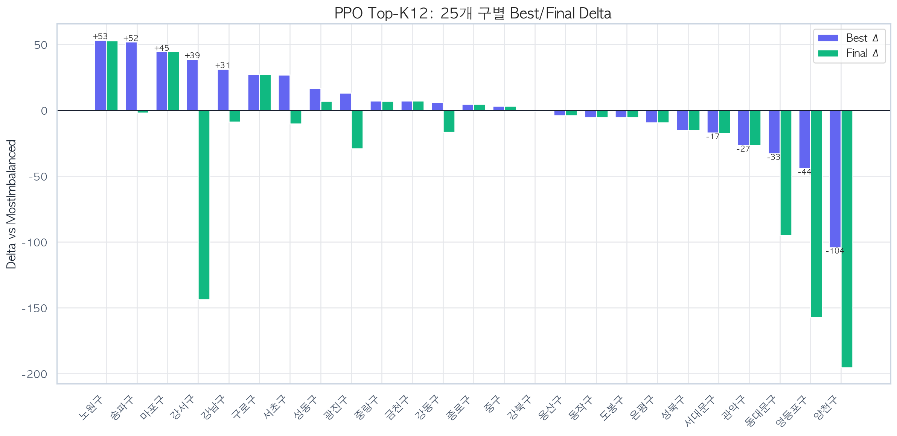
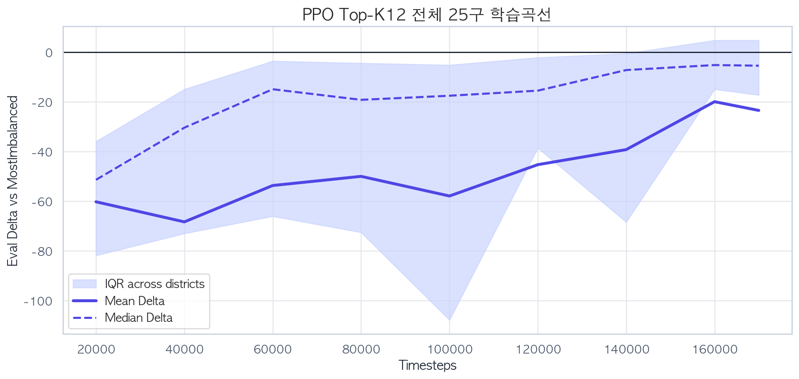
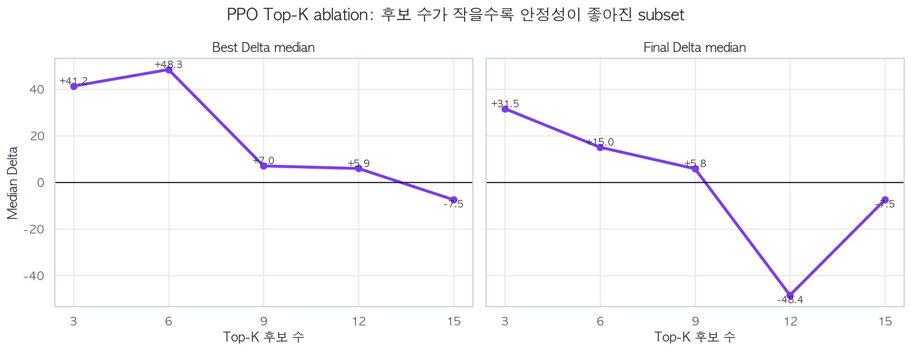
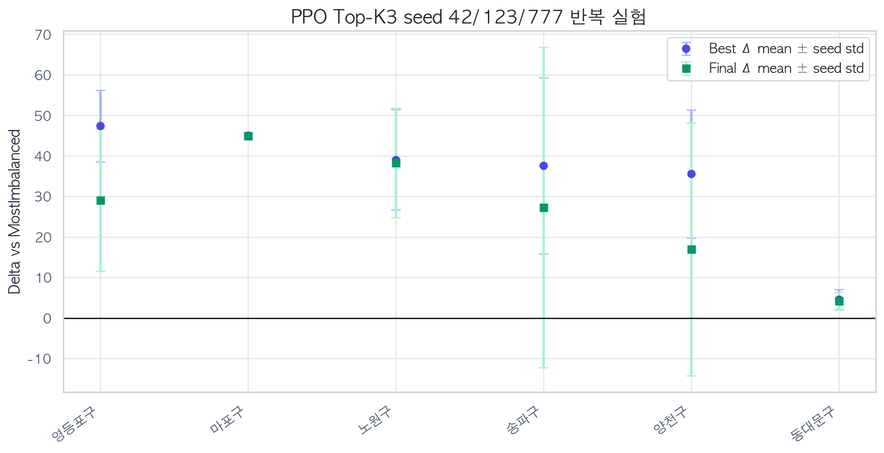
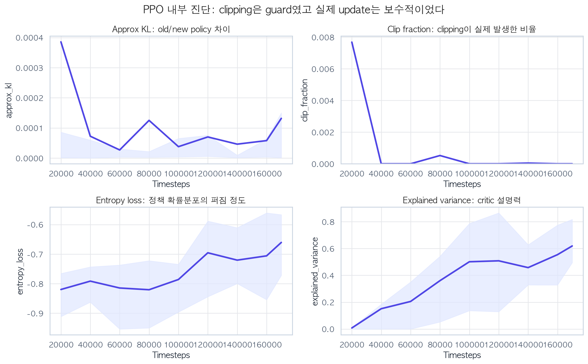
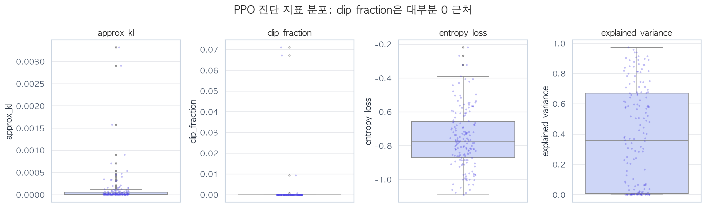
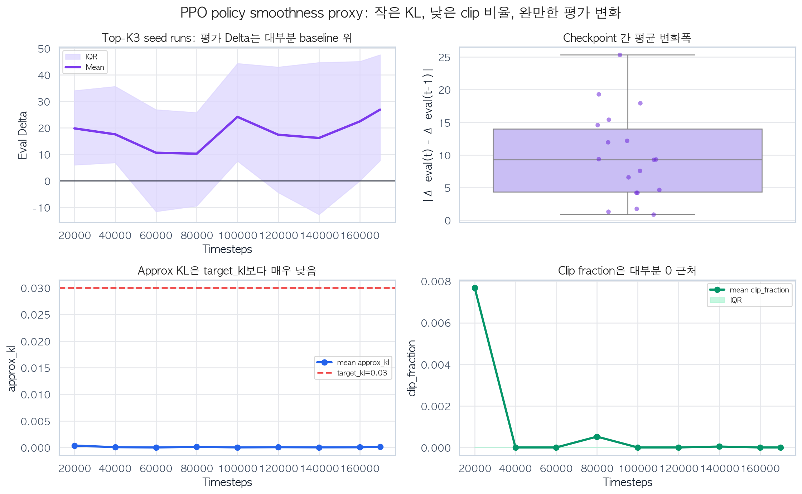

# PPO 기반 따릉이 재배치 실험 보고서

**Clipped policy update와 Top-K 후보 행동 구조가 PPO 안정성에 미친 영향**

작성자: 박제영(A73024)

작성일: 2026-06-11 09:58

---

## Abstract

본 문서는 서울 25개 구 따릉이 재배치 환경에서 수행한 **MaskablePPO** 실험을 정리한다. 평가 기준은 `2025-10-20`부터 `2025-12-31`까지 **73일 chronological holdout**이며, 지표는 `Delta = PPO reward - MostImbalanced reward`이다. MostImbalanced는 현재 재고가 목표 재고에서 가장 크게 벗어난 정류소를 우선 방문하는 학습 없는 규칙 기반 baseline이다.

PPO의 핵심 질문은 두 가지다. 첫째, **clipped surrogate objective**가 policy update를 보수적으로 만들어 학습 안정성을 높이는가. 둘째, 전체 정류소를 직접 선택하지 않고 **Top-K 후보 rank**를 선택하게 했을 때 PPO의 성능과 안정성이 어떻게 달라지는가. 전체 25개 구 Top-K12 실험에서 PPO는 Best Delta 평균 `+2.7`, baseline 초과 `14/25구`였지만, Final Delta 평균은 `-23.5`로 떨어졌다. 반면 Best/Worst subset의 Top-K ablation과 Top-K3 seed 반복 실험에서는 모든 seed와 대상 구에서 baseline을 초과했다. PPO 진단 지표에서는 `clip_fraction` 중앙값이 0에 가까워, clipping은 강하게 자주 작동했다기보다 policy update를 제한하는 안전장치 역할에 가까웠다.

---

## 1. 문제 정의와 PPO 적용 이유

따릉이 재배치는 트럭이 하루 동안 여러 정류소를 순차적으로 방문하며 자전거 부족(stockout), 거치대 포화(full), 이동 비용을 줄이는 문제다. 현재 행동은 다음 시점의 재고와 이후 보상에 영향을 주므로 MDP로 볼 수 있다.

PPO를 적용한 이유는 policy gradient 계열이면서도 update가 너무 크게 움직이지 않도록 제한하는 구조가 있기 때문이다. PPO 논문은 샘플을 모아 surrogate objective를 여러 epoch 최적화하되, clipped objective로 policy 변화가 과도해지는 것을 막는 방식을 제안했다. Spinning Up 문서에서도 PPO-Clip은 명시적인 KL constraint 대신 objective clipping으로 새 policy가 old policy에서 지나치게 멀어지는 유인을 제거한다고 설명한다.

본 실험에서는 `sb3-contrib`의 `MaskablePPO`를 사용했다. action mask가 필요한 이유는 Top-K 후보 구조 안에서도 특정 step에서 선택 불가능한 action이 있을 수 있기 때문이다.

## 2. State, Action, Reward

| 항목 | 설계 |
|---|---|
| State | 현재 재고, capacity, 트럭 위치/적재량, 시간 정보, 1시간 수요예측 feature |
| Action | 전체 정류소 직접 선택이 아니라 Top-K 후보 중 rank 선택 |
| Reward | stockout, full, 이동거리, 이동 step 비용을 음수로 합산 |
| Baseline | MostImbalanced 규칙 정책 |
| 평가 | 73일 holdout 평균 reward와 baseline 대비 Delta |

Top-K 후보 점수는 다음 형태로 계산했다.

```text
candidate_score = forecast_imbalance
                - travel_coef * travel_distance
                - zone_penalty
```

PPO는 이 후보 정류소 중 하나를 직접 station id로 선택하지 않고 `0 ... K-1` rank를 선택한다. 이 구조는 탐색해야 할 행동 수를 줄여 PPO가 좋은 후보 사이의 상대적 선택을 학습하게 한다.

Reward는 평가 시 추가 shaping 없이 원본 환경 reward를 사용했다.

```text
r_t = w_stockout * stockout_t
    + w_full * full_t
    + w_travel_km * travel_km_t
    + w_travel_step * travel_step_t
```

## 3. PPO 알고리즘

### 3.1 네트워크 모델 설계

| 항목 | 설정 | 이유 |
|---|---|---|
| 구현 | sb3-contrib `MaskablePPO("MlpPolicy")` | rollout/update 단계에서 action mask 사용 |
| 입력 | `obs_dim` | 구별 정류소 수와 feature 수에 따라 달라짐 |
| Policy net | `obs_dim -> 256 -> 256 -> n_actions` | Top-K 후보 rank별 action logit 출력 |
| Value net | `obs_dim -> 256 -> 256 -> 1` | GAE와 value loss를 위한 상태가치 예측 |
| Action distribution | Masked categorical | invalid action을 제거한 뒤 후보 rank를 sampling |
| Optimizer | Adam | PPO 표준 구현 |
| gamma | 0.99 | 재배치 효과가 늦게 나타나는 장기 보상 반영 |
| gae_lambda | 0.95 | TD bias와 MC variance의 절충 |
| clip_range | 0.1 | policy ratio가 과도하게 커지는 것을 제한 |
| learning_rate | 1e-4 | 기존 PPO보다 보수적인 update |
| n_steps / batch / epochs | 256 / 128 / 5 | 계산 시간과 update 안정성 절충 |
| target_kl | 0.03 | KL이 지나치게 커질 때 조기 제한 |
| ent_coef | 0.003 | 정책 collapse를 완화하되 과도한 탐색은 줄임 |

실제 코드에서는 아래처럼 policy network와 value network를 분리한 MLP 구조를 넘긴다.

```python
model = MaskablePPO(
    "MlpPolicy",
    train_env,
    learning_rate=1e-4,
    n_steps=256,
    batch_size=128,
    n_epochs=5,
    gamma=0.99,
    gae_lambda=0.95,
    clip_range=0.1,
    ent_coef=0.003,
    target_kl=0.03,
    policy_kwargs={
        "net_arch": dict(pi=[256, 256], vf=[256, 256])
    },
)
```

### 3.2 Loss 함수 설계(Python code)

PPO의 핵심은 old policy와 new policy의 확률비 `r_t(theta)`를 clipping하는 것이다.

```text
r_t(theta) = pi_theta(a_t | s_t) / pi_old(a_t | s_t)

L_clip(theta) =
  E[min(r_t(theta) * A_t,
        clip(r_t(theta), 1 - eps, 1 + eps) * A_t)]

value_loss = MSE(V(s_t), return_target_t)
entropy_bonus = entropy(pi_theta(. | s_t))
```

보고서용으로 실제 loss 흐름을 Python 형태로 쓰면 다음과 같다. 내부 update는 `sb3-contrib`가 수행하지만, 의미는 아래 식과 같다.

```python
ratio = torch.exp(new_log_prob - old_log_prob)

policy_loss_1 = advantage * ratio
policy_loss_2 = advantage * torch.clamp(
    ratio,
    1.0 - clip_range,
    1.0 + clip_range,
)

policy_loss = -torch.min(policy_loss_1, policy_loss_2).mean()
value_loss = F.mse_loss(value_pred, return_target)
entropy_loss = -entropy.mean()

loss = policy_loss + vf_coef * value_loss + ent_coef * entropy_loss
```

이때 `ratio`가 `1 ± clip_range` 밖으로 나가면 policy loss가 더 커지는 방향으로 무한히 업데이트되지 않는다. 그래서 PPO는 REINFORCE보다 update가 급격히 움직이는 것을 억제할 수 있다. 단, clipping이 성능을 자동으로 올려주는 것은 아니며, 좋은 후보 action과 적절한 advantage/value 추정이 함께 필요하다.

구현 관점에서는 다음 지표를 함께 저장했다.

| 진단 지표 | 의미 | 해석 |
|---|---|---|
| `approx_kl` | old/new policy 차이의 근사값 | 작으면 update가 보수적 |
| `clip_fraction` | clipping 범위 밖으로 나간 sample 비율 | 높으면 PPO clipping이 많이 개입 |
| `entropy_loss` | `-entropy`로 기록되는 정책 분포 지표 | 0에 가까워질수록 더 결정적 policy |
| `explained_variance` | value function이 return을 설명하는 정도 | 높을수록 critic fit이 좋음 |

## 4. 실험 설계

| 단계 | 실험 | 목적 |
|---|---|---|
| 1 | Top-K12 서울 25구 full run | PPO의 기본 성능과 Best/Final gap 확인 |
| 2 | Best/Worst subset Top-K ablation | K=3/6/9/12/15 중 안정적인 후보 수 탐색 |
| 3 | Top-K3 seed validation | seed 42/123/777 반복으로 안정성 확인 |
| 4 | PPO diagnostics | approx_kl, clip_fraction, entropy, value fit 확인 |

이 실험의 중요한 제한은 Top-K ablation과 seed validation이 전체 25개 구가 아니라 Best/Worst subset에서 수행되었다는 점이다. 따라서 Top-K3 결과는 “전체 서울에서 항상 최적”이라는 뜻이 아니라, 어려운 구와 쉬운 구를 섞은 subset에서 PPO 안정성이 좋아진 후보 설정이라는 뜻으로 해석한다.

## 5. 전체 Top-K12 결과

| 실험 | 구 | Best Δ 평균 | Best Δ 중앙값 | Best 승리 | Final Δ 평균 | Final Δ 중앙값 | Final 승리 | Best-Final gap 평균 |
| --- | --- | --- | --- | --- | --- | --- | --- | --- |
| PPO Full TopK12 | 25 | +2.7 | +4.7 | 14 | -23.5 | -5.5 | 8 | +26.2 |



Top-K12 전체 실험에서 PPO는 Best 기준으로는 25개 구 중 14개 구에서 baseline을 넘었다. 그러나 Final 기준으로는 8개 구만 baseline을 넘었고, 평균 Final Delta가 음수로 떨어졌다. 이는 PPO가 한 시점에는 좋은 policy를 찾지만, 모든 구에서 마지막 checkpoint까지 그 성능을 유지하지는 못한다는 뜻이다.

Best 3구는 다음과 같다.

| 구 | Baseline | Best Δ | Final Δ | Best step |
| --- | --- | --- | --- | --- |
| 노원구 | -457.2 | +53.3 | +52.9 | 80000 |
| 송파구 | -1225.8 | +52.0 | -2.0 | 20000 |
| 마포구 | -490.4 | +44.6 | +44.6 | 100000 |

Worst 3구는 다음과 같다.

| 구 | Baseline | Best Δ | Final Δ | Best step |
| --- | --- | --- | --- | --- |
| 양천구 | -1083.3 | -104.1 | -195.3 | 80000 |
| 영등포구 | -1897.0 | -44.0 | -157.0 | 20000 |
| 동대문구 | -321.1 | -32.9 | -94.7 | 160000 |



학습곡선의 평균선은 중반 이후 baseline 근처로 올라오지만, IQR이 넓다. 즉 PPO 자체는 update를 보수적으로 하더라도 구별 수요 규모와 후보 품질에 따라 결과 차이가 컸다.

## 6. Top-K ablation

| Top-K | 구 | Best Δ 평균 | Best Δ 중앙값 | Best 승리 | Final Δ 평균 | Final Δ 중앙값 | Final 승리 | Gap 평균 |
| --- | --- | --- | --- | --- | --- | --- | --- | --- |
| 3 | 6 | +35.1 | +41.2 | 6 | +29.6 | +31.5 | 6 | +5.5 |
| 6 | 6 | +39.8 | +48.3 | 6 | +8.8 | +15.0 | 4 | +31.0 |
| 9 | 6 | -2.5 | +7.0 | 4 | -19.0 | +5.8 | 4 | +16.5 |
| 12 | 6 | -5.2 | +5.9 | 3 | -58.6 | -48.4 | 2 | +53.4 |
| 15 | 6 | -4.7 | -7.5 | 3 | -18.7 | -7.5 | 3 | +14.1 |



Best/Worst subset에서는 Top-K3가 가장 안정적이었다. Top-K3는 Best/Final 모두 6개 구에서 baseline을 넘었고, Best-Final gap도 작았다. 반대로 Top-K12는 후보가 넓어졌지만 Final 평균이 크게 하락했다. 이 결과는 PPO가 “많은 후보를 다 탐색하는 것”보다 “좋은 후보를 좁혀 안정적으로 선택하는 것”에서 더 강하게 작동했음을 보여준다.

## 7. Seed validation과 안정성

| 구 수 | 실험 수 | Best Δ 평균 | Best seed std 평균 | Best seed std 중앙값 | Final Δ 평균 | Final seed std 평균 | Final seed std 중앙값 | Final 승리 합 |
| --- | --- | --- | --- | --- | --- | --- | --- | --- |
| 6 | 18 | +34.9 | 10.3 | 10.6 | +26.8 | 17.4 | 15.5 | 16 |

| 구 | Best Δ 평균 | Best std | Best 승리 | Final Δ 평균 | Final std | Final 승리 |
| --- | --- | --- | --- | --- | --- | --- |
| 노원구 | +39.1 | 12.4 | 3 | +38.3 | 13.5 | 3 |
| 동대문구 | +4.6 | 2.5 | 3 | +4.2 | 2.2 | 3 |
| 마포구 | +45.1 | 0.7 | 3 | +45.0 | 0.7 | 3 |
| 송파구 | +37.6 | 21.7 | 3 | +27.3 | 39.5 | 2 |
| 양천구 | +35.6 | 15.8 | 3 | +17.0 | 31.2 | 2 |
| 영등포구 | +47.4 | 8.8 | 3 | +29.1 | 17.5 | 3 |



Top-K3 seed validation에서는 6개 구 × 3개 seed의 모든 Best 결과가 baseline을 넘었다. Final 기준도 seed 42와 123은 6/6구, seed 777은 4/6구에서 baseline을 넘었다. 이 결과는 Top-K3가 PPO에서 후보 구조를 안정화하는 데 의미가 있음을 보여준다. 다만 송파구와 양천구는 Final std가 커서, 특정 seed에서는 후반 policy가 흔들릴 수 있다.

## 8. PPO clipping 진단

| 지표 | 평균 | 중앙값 | 75% | 최대 |
| --- | --- | --- | --- | --- |
| approx_kl | 0.0001 | 0 | 0.0001 | 0.0033 |
| clip_fraction | 0.0009 | 0 | 0 | 0.0711 |
| entropy_loss | -0.7573 | -0.7734 | -0.6563 | -0.2176 |
| explained_variance | 0.3741 | 0.3567 | 0.6707 | 0.9733 |
| policy_gradient_loss | -0.0004 | -0.0001 | 0 | 0.0009 |
| value_loss | 5211.4968 | 1083.4239 | 4459.7586 | 59609.5062 |





진단 지표를 보면 `approx_kl` 평균은 매우 작고, `clip_fraction` 중앙값은 0에 가깝다. 이는 PPO clipping이 매 update마다 강하게 자주 개입했다기보다, policy ratio가 급격히 커지는 경우를 막는 guard로 작동했다는 뜻이다. 이 결과는 PPO의 안정성이 clipping 자체의 빈번한 작동만으로 설명되는 것이 아니라, 작은 learning rate, target_kl, Top-K 후보 축소가 함께 만든 보수적 update 구조로 해석하는 것이 적절하다.

`explained_variance`는 중간값이 양수이며 일부 checkpoint에서는 높게 올라간다. 하지만 분산이 커서 critic이 모든 구와 모든 seed에서 일관되게 return을 설명한 것은 아니다. 따라서 PPO 성능 차이는 policy clipping뿐 아니라 critic의 value fit 품질에도 영향을 받았다.

### 8.1 PPO policy smoothness proxy

PPO가 “smooth하다”는 표현을 보고서에서 쓰려면 지표로 정의해야 한다. 본 보고서에서는 다음 네 가지를 proxy로 사용했다.

| run 수 | 평균 |평가 변화| | 중앙값 |평가 변화| | Best-Final gap 평균 | 평균 KL | 최대 KL | 평균 clip 비율 | 최대 clip 비율 |
| --- | --- | --- | --- | --- | --- | --- | --- |
| 18 | +9.7670 | +9.2916 | +8.0870 | 0.0001 | 0.0033 | 0.0009 | 0.0711 |



이 그림은 PPO의 안정성을 세 층으로 보여준다. 첫째, Top-K3 seed 반복에서는 평균 평가 Delta가 baseline 위에서 유지됐다. 둘째, `approx_kl`은 `target_kl=0.03`보다 훨씬 낮게 유지되어 old policy와 new policy의 차이가 작았다. 셋째, `clip_fraction`은 대부분 0 근처라 clipping이 자주 발동했다기보다 update 폭을 막는 안전장치로 있었다. 따라서 본 실험에서 PPO의 smoothness는 **clipping 단독 효과**라기보다 `clip_range=0.1`, `target_kl=0.03`, 작은 learning rate, Top-K3 후보 축소가 함께 만든 결과로 해석하는 것이 객관적이다.

## 9. 해석

PPO의 강점은 update 안정성이다. REINFORCE처럼 episode 전체 return의 고분산 gradient에 직접 의존하지 않고, GAE와 value function을 사용해 advantage를 추정한다. 또한 clipped objective와 target_kl은 새 policy가 old policy에서 너무 멀어지는 것을 제한한다. 본 실험에서도 PPO 내부 진단은 update가 매우 보수적으로 진행되었음을 보여준다.

하지만 PPO가 항상 가장 높은 reward를 보장하지는 않았다. Top-K12 전체 실험에서는 Best 성능이 괜찮았지만 Final 성능이 떨어지는 구가 있었다. 이는 후보 action이 넓을 때 PPO가 안정적으로 update되더라도, 좋은 후보 선택을 마지막까지 유지하지 못할 수 있음을 의미한다.

Top-K3 실험은 이 문제를 줄였다. 후보 수를 줄이면 policy가 탐색해야 할 action rank가 줄고, PPO의 clipped update가 작은 후보군 안에서 더 안정적으로 작동했다. 다만 이 결론은 Best/Worst subset에서 확인한 결과이므로, 전체 25개 구 일반화는 별도 full run으로 확인하는 것이 더 좋다.

## 10. 결론

PPO 실험의 결론은 다음과 같다.

1. PPO는 Top-K12 전체 서울 실험에서 Best 기준으로 절반 이상의 구에서 baseline을 넘었지만, Final 안정성은 충분하지 않았다.
2. Best/Worst subset에서는 Top-K3가 PPO의 Best와 Final 성능을 모두 안정화했다.
3. PPO clipping 진단 결과 `approx_kl`과 `clip_fraction`이 낮았다. 이는 policy가 old policy에서 크게 벗어나지 않았다는 근거이며, PPO의 conservative update 특성을 보여준다.
4. 다만 clipping이 자주 발동하지 않았기 때문에 성능 개선을 “clipping 덕분”이라고 단정하면 안 된다. 본 실험의 개선은 Top-K 후보 축소, 낮은 learning rate, target_kl, GAE/value learning이 함께 만든 결과다.
5. PPO 결과를 보고서에 넣을 때는 단순 reward뿐 아니라 Best-Final gap, seed std, approx_kl, clip_fraction, entropy, explained_variance를 함께 제시하는 것이 PPO 알고리즘 특성을 가장 잘 보여준다.

## References

- Schulman et al. (2017), [Proximal Policy Optimization Algorithms](https://arxiv.org/abs/1707.06347): PPO의 clipped surrogate objective와 여러 epoch minibatch update 근거.
- OpenAI Spinning Up, [Proximal Policy Optimization](https://spinningup.openai.com/en/latest/algorithms/ppo.html): PPO-Clip의 clipping 해석과 old/new policy 변화 제한 설명.
- Henderson et al. (2017), [Deep Reinforcement Learning that Matters](https://arxiv.org/abs/1709.06560): RL 실험에서 seed 반복, 분산, 재현성 보고가 중요한 이유.

## Appendix. 산출물 위치

- PPO Top-K12 full 결과: `output/results/ppo_report_full_topk12_*.csv`
- PPO Top-K ablation 결과: `output/results/ppo_report_topk_ablation_*.csv`
- PPO seed validation 결과: `output/results/ppo_report_seed_detail_*.csv`
- PPO diagnostics 결과: `output/results/ppo_report_diagnostics_*.csv`
- 보고서 그림: `docs/figures/ppo_73d_*.png`
