# REINFORCE/A2C 기반 따릉이 재배치 실험 보고서

**73일 시간순 평가 프로토콜에서 본 A2C의 안정성과 REINFORCE의 seed 민감도**

작성자: 박제영(A73024)

작성일: 2026-06-10 15:56

---

## Abstract

본 보고서는 서울 25개 구 따릉이 재배치 문제에서 **REINFORCE with Value Baseline**과 **A2C(Advantage Actor-Critic)** 를 중심으로 수행한 실험 결과를 정리한다. 연구 질문은 **수요예측과 Top-K 후보 행동 구조를 적용한 재배치 환경에서 TD 기반 A2C가 Monte Carlo 기반 REINFORCE보다 더 안정적인가**이다. 팀 프로젝트 전체에서는 DQN/PPO도 함께 비교하지만, 본 문서는 담당 알고리즘인 REINFORCE와 A2C, 그리고 보조 실험인 **VAE latent feature**와 **Contextual Bandit(LinUCB)** 만 다룬다.

평가는 시간순 분할을 사용했다. 학습은 과거 292일로 수행하고, 평가는 `2025-10-20`부터 `2025-12-31`까지 총 **73일 holdout**에서 수행했다. 성능 지표는 모델 reward에서 **MostImbalanced** 규칙 baseline reward를 뺀 `Delta`이며, Delta가 양수이면 baseline보다 좋다. MostImbalanced는 현재 트럭 적재 상태에 따라 자전거가 가장 과잉이거나 부족한 정류소를 선택하는 학습 없는 규칙 기반 기준 정책이다. 검증은 전체 25개 구 학습, Top-K 후보 수 ablation, seed 42/123/777 반복 실험 순서로 진행했다.

핵심 결과는 세 가지다. 첫째, **A2C가 REINFORCE보다 평균 성능과 안정성 모두 우수했다.** 전체 25개 구 Top-K12 실험에서 A2C는 Best Delta 평균 `+13.0`, baseline 초과 `17/25구`였고, REINFORCE는 Best Delta 평균 `-8.4`, baseline 초과 `8/25구`였다. 둘째, seed 반복 실험에서 A2C의 Best seed std 중앙값은 `1.0`으로 REINFORCE의 `24.4`보다 낮았다. 셋째, VAE와 Contextual Bandit은 탐색적 실험으로 의미는 있었지만, 현재 설정에서는 A2C를 대체할 만큼의 일관된 개선은 만들지 못했다.

---

## 1. 문제 정의

### 1.1 연구 질문

본 실험은 다음 질문에 답하기 위해 설계했다.

```text
수요예측 feature와 Top-K 후보 행동 구조를 적용한 따릉이 재배치 환경에서
TD 기반 A2C는 Monte Carlo 기반 REINFORCE보다 더 안정적인가?
```

이 질문을 확인하기 위해 평균 성능뿐 아니라 학습곡선, Top-K ablation, seed 반복 실험, 구별 Best/Worst 결과를 함께 비교했다.

따릉이 재배치는 정류소마다 자전거가 부족하거나 거치 공간이 부족해지는 상황을 줄이기 위한 순차 의사결정 문제다. 재배치 트럭은 하루 동안 여러 step을 거치며 다음 방문 정류소를 선택하고, 선택 결과에 따라 재고 부족, 포화, 이동 비용이 발생한다.

본 문제의 강화학습 목표는 episode 누적 reward를 최대화하는 것이다. 환경 reward는 실패와 비용을 음수로 계산하므로, 실제 의미는 다음과 같다.

```text
maximize episode reward
= minimize(stockout penalty + full penalty + travel cost)
```

즉 좋은 정책은 **자전거 부족과 반납 실패를 줄이면서, 불필요한 이동거리도 줄이는 정책**이다.

## 2. State, Action, Reward

### 2.1 상태(state)

상태는 현재 재고뿐 아니라 미래 수요 가능성을 함께 보도록 구성했다. 특히 정류소별 capacity와 1시간 수요예측을 추가해, 현재는 괜찮아 보여도 곧 부족해질 정류소를 agent가 볼 수 있게 했다.

| 범주 | 포함 정보 |
|---|---|
| 정류소 재고 | 현재 자전거 수, capacity, 목표 재고 대비 편차 |
| 수요예측 | 1시간 예측 대여량, 반납량, 순수요, 예측 후 재고 편차 |
| 트럭 상태 | 현재 위치, 적재량, 이동 상태 |
| 시간 정보 | 날짜, 요일, 10분 단위 step |
| 후보 행동 | Top-K 후보별 불균형 점수, 이동거리 penalty, 권역 penalty |

`obs_dim`은 구별 정류소 수와 사용한 보조 feature에 따라 달라진다. 예를 들어 **forecast feature + Top-K 12** 기준으로 강남구는 `obs_dim=1126`, 강동구는 `obs_dim=821`, 관악구는 `obs_dim=611`이었다. 따라서 본 실험의 policy network는 고정 입력 차원을 가정하지 않고, 각 구별 환경을 만든 뒤 `env.observation_space.shape[0]`에서 입력 차원을 읽어 생성했다. 행동 차원은 Top-K 후보 수와 같으므로 Top-K 12 실험에서는 `n_actions=12`, Top-K 9 실험에서는 `n_actions=9`가 된다.

수요예측 기반 feature는 다음 개념으로 계산했다.

```text
pred_net_1h = pred_returns_1h - pred_rentals_1h
projected_bikes = current_bikes + pred_net_1h
projected_deviation = (projected_bikes - target_bikes) / capacity
```

### 2.2 수요예측 feature를 추가한 이유와 구현

기본 상태는 현재 시점의 재고를 중심으로 구성되어 있다. 하지만 따릉이 재배치에서는 현재 재고만으로는 다음 1시간 동안 어디에서 자전거가 부족해질지, 어디에서 반납이 몰릴지 알기 어렵다. 예를 들어 현재 재고가 적당한 정류소라도 곧 대여가 집중되면 stockout이 발생할 수 있고, 현재 여유가 있는 정류소라도 반납이 몰리면 full penalty가 커질 수 있다. 그래서 agent가 **현재 불균형**뿐 아니라 **가까운 미래의 불균형 가능성**을 함께 보도록 1시간 수요예측 feature를 상태에 추가했다.

구현은 별도의 수요예측 산출물(`demand_forecast_1h_구명.parquet`)을 만든 뒤, episode를 구성할 때 같은 정류소와 같은 10분 time step에 해당하는 예측값을 observation 뒤에 붙이는 방식이다. 평가 기간의 실제 미래 값을 직접 읽는 oracle 방식이 아니라, 과거 학습 구간으로 만든 예측 feature를 사용한다.

| feature | 의미 | RL에서 기대한 역할 |
|---|---|---|
| `pred_rentals_1h` | 앞으로 1시간 동안 예상 대여량 | 자전거가 부족해질 정류소 탐지 |
| `pred_returns_1h` | 앞으로 1시간 동안 예상 반납량 | 거치 공간이 부족해질 정류소 탐지 |
| `pred_net_1h` | `pred_returns_1h - pred_rentals_1h` | 순수요 방향 확인 |
| `projected_deviation` | 예측 후 재고가 목표 재고에서 벗어나는 정도 | 재배치 우선순위 판단 |

즉 수요예측 feature는 reward 함수를 바꾸는 것이 아니라, 같은 reward를 더 잘 얻기 위해 agent가 보는 **상태(state)를 보강**한 것이다.

### 2.3 Top-K 후보 행동 구조를 추가한 이유와 구현

전체 정류소를 직접 선택하면 action 수가 너무 많아 탐색이 어려워진다. 따라서 매 step마다 수요예측과 이동거리 정보를 이용해 후보 정류소를 만들고, agent는 그중 하나를 선택한다.

```text
candidate_score =
    forecast_imbalance
  - travel_coef * travel_distance
  - zone_penalty
```

최종 실험 runner에서 사용한 기본값은 `travel_coef=0.20`, `zone_mode=static3`, `zone_penalty=1.0`이다. `static3`는 정류소를 3개 권역으로 나누고, 현재 트럭이 속한 권역과 다른 후보에 작은 penalty를 주어 과도한 장거리 이동을 줄이는 설정이다.

서울 전체 구 기준으로 정류소 수는 구마다 수십 개에서 200개 이상까지 달라진다. 전체 정류소를 그대로 action으로 두면 policy가 매 step마다 너무 많은 선택지를 비교해야 하고, 대부분의 선택은 현재 상황에서 의미가 낮은 정류소가 된다. 이 문제를 줄이기 위해 먼저 휴리스틱 점수로 후보 정류소를 고르고, REINFORCE/A2C는 그 후보 중 하나의 rank를 선택하게 했다.

구현 흐름은 다음과 같다.

| 단계 | 처리 내용 |
|---|---|
| 1 | 현재 재고, 목표 재고, 1시간 예측 수요로 정류소별 예상 불균형을 계산 |
| 2 | 이동거리와 권역 penalty를 반영해 candidate score 계산 |
| 3 | score가 높은 정류소를 Top-K 후보로 선택 |
| 4 | agent의 action space를 전체 정류소가 아니라 `0 ... K-1` 후보 rank로 제한 |
| 5 | 선택된 rank를 실제 정류소 id로 변환해 환경 step에 전달 |

이 구조의 목적은 정답을 미리 정하는 것이 아니라, **탐색해야 할 행동공간을 현실적인 후보로 줄이는 것**이다. K가 너무 작으면 좋은 정류소가 후보에서 빠질 수 있고, K가 너무 크면 다시 탐색 난이도가 커진다. 그래서 K=3, 6, 9, 12, 15를 비교하는 ablation을 수행했다.

최종 전체 실험에서는 Top-K 12와 Top-K 9를 모두 비교했다. Top-K 12는 전체 25개 구에서 가장 안정적인 기준선 역할을 했고, Top-K 9는 Best/Worst subset에서 seed, VAE, Bandit 실험까지 확장하기 위해 사용했다.

### 2.4 보상(reward)

평가 reward는 원본 환경의 reward를 사용했다.

```text
r_t =
    w_stockout    * stockout_t
  + w_full        * full_t
  + w_travel_km   * travel_km_t
  + w_travel_step * travel_step_t
```

본 보고서의 REINFORCE/A2C 평가 환경에서는 다음 계수를 사용했다.

| 항목 | 값 | 의미 |
|---|---:|---|
| `w_stockout` | -1.0 | 대여 수요를 만족하지 못한 자전거 수 penalty |
| `w_full` | -0.8 | 반납 수요를 수용하지 못한 자전거 수 penalty |
| `w_travel_km` | -0.008 | 트럭 이동거리 penalty |
| `w_travel_step` | -0.002 | 트럭이 이동 중인 10분 step penalty |
| `urgent_bonus` | 0.0 | 평가에서는 추가 bonus 사용 안 함 |
| `shaping_scale` | 0.0 | 평가에서는 reward shaping 사용 안 함 |

보고서의 주 지표는 baseline 대비 개선량이다.

```text
Delta = model_eval_reward - MostImbalanced_eval_reward
```

Reward는 음수일 수 있으므로 원점에 가까울수록 좋다. Delta가 양수이면 모델이 MostImbalanced baseline보다 좋다.

## 3. 알고리즘

### 3.1 네트워크 모델과 optimizer

REINFORCE와 A2C는 비교의 공정성을 위해 같은 형태의 MLP를 사용했다. Policy/Actor는 상태 벡터를 action 후보별 logit으로 바꾸고, Value/Critic은 상태 가치 `V(s)` 하나를 예측한다.

| 구성 | REINFORCE | A2C | 이유 |
|---|---|---|---|
| Policy/Actor | Linear(obs_dim, 256) -> ReLU -> Linear(256, 256) -> ReLU -> Linear(256, n_actions) | 동일 | 구별 obs_dim이 달라져도 같은 MLP 구조로 비교하기 위함 |
| Value/Critic | Linear(obs_dim, 256) -> ReLU -> Linear(256, 256) -> ReLU -> Linear(256, 1) | 동일 | REINFORCE baseline과 A2C critic을 같은 용량으로 맞춤 |
| Action distribution | Masked Categorical(logits) | Masked Categorical(logits) | Top-K 후보 중 하나를 확률적으로 선택하고 invalid action을 제거 |
| Optimizer | Adam(policy lr=3e-4), Adam(value lr=1e-3) | Adam(actor lr=1e-4), Adam(critic lr=3e-4) | actor/policy는 급격한 policy 변화를 줄이고, value/critic은 TD 또는 return target을 빠르게 추정하도록 분리 |
| Gamma | 0.99 | 0.99 | 하루 episode 안에서 이동 후 재고 영향이 늦게 나타나므로 장기 reward를 반영 |
| Advantage normalization | 사용 | 사용 | policy gradient scale을 안정화해 구별 reward scale 차이를 완화 |
| Update 단위 | episode 종료 후 1회 | batch transition 단위 | REINFORCE는 MC return, A2C는 1-step TD advantage 비교를 명확히 하기 위함 |
| TD 방식 | 해당 없음 | 1-step TD | A2C는 매 transition에서 critic target을 만들어 더 빠른 feedback을 사용 |
| Entropy regularization | 사용 안 함 | 사용 안 함 | 최종 비교에서는 추가 regularizer 없이 기본 policy/value update 효과를 확인 |
| Gradient clipping | 사용 안 함 | 사용 안 함 | 최종 실험 기준. 별도 안정화 장치 없이 알고리즘 차이를 관찰 |
| BC / rollback | 최종 실험에서는 사용하지 않음 | 최종 실험에서는 사용하지 않음 | imitation/rollback 효과와 순수 RL fine-tuning 효과가 섞이지 않도록 제외 |

실제 코드의 핵심 네트워크 구조는 다음과 같다. action mask가 False인 후보는 logit을 `-1e9`로 내려 선택되지 않게 했다.

```python
class PolicyNetwork(nn.Module):
    def __init__(self, input_size, output_size, hidden_layer_size=256):
        self.fc1 = nn.Linear(input_size, hidden_layer_size)
        self.fc2 = nn.Linear(hidden_layer_size, hidden_layer_size)
        self.fc3 = nn.Linear(hidden_layer_size, output_size)

    def forward(self, x, mask=None):
        x = F.relu(self.fc1(x))
        x = F.relu(self.fc2(x))
        logits = self.fc3(x)
        if mask is not None:
            logits = logits.masked_fill(~mask, -1e9)
        return logits

class ValueNetwork(nn.Module):
    def __init__(self, input_size, hidden_layer_size=256):
        self.fc1 = nn.Linear(input_size, hidden_layer_size)
        self.fc2 = nn.Linear(hidden_layer_size, hidden_layer_size)
        self.fc3 = nn.Linear(hidden_layer_size, 1)
```

### 3.2 Loss 함수(Python code): REINFORCE with Value Baseline

REINFORCE는 episode가 끝난 뒤 reward-to-go를 계산해 policy를 업데이트하는 Monte Carlo policy gradient 알고리즘이다. 본 구현에서는 Value Network를 baseline으로 사용해 advantage를 계산했다.

```python
returns = discounted_reward_to_go(rewards, gamma)
advantages = returns - value_net(states)

policy_loss = -(log_probs * advantages.detach()).mean()
value_loss = mse_loss(value_net(states), returns)
```

보고서에 사용한 실제 구현의 loss 계산은 아래와 같다.

```python
values = value(states)
advantages = returns_t - values.detach()
advantages = (advantages - advantages.mean()) / (advantages.std() + 1e-8)

policy_loss_terms = [-logp * advantages[i] for i, logp in enumerate(traj.logp)]
policy_loss = torch.stack(policy_loss_terms).mean()

value_loss = F.mse_loss(values, returns_t)
```

장점은 구조가 명확하다는 점이다. 단점은 episode 전체 return을 사용하므로 reward 분산과 seed에 민감하다는 점이다.

### 3.3 Loss 함수(Python code): A2C

A2C는 policy를 만드는 Actor와 value를 추정하는 Critic을 함께 학습한다. 본 구현은 **1-step TD A2C**이며, Critic이 `r + gamma * V(s')` 형태의 TD target을 만들기 때문에 REINFORCE보다 더 자주 학습 신호를 받을 수 있다.

```python
target = reward + gamma * (1 - done) * value(next_state)
advantage = target - value(state)

actor_loss = -(log_prob(action) * advantage.detach()).mean()
critic_loss = mse_loss(value(state), target)
```

보고서에 사용한 실제 구현의 loss 계산은 아래와 같다.

```python
value_target = batch_reward + gamma * (1.0 - batch_done) * value(batch_next_state)
advantage = value_target - value(batch_state)
advantage = (advantage - advantage.mean()) / (advantage.std() + 1e-8)

logits = policy(batch_state, batch_mask)
dist = Categorical(logits=logits)
log_prob = dist.log_prob(batch_action).unsqueeze(1)
actor_loss = -(log_prob * advantage).mean()

critic_loss = F.mse_loss(value(batch_state), value_target)
```

Actor와 Critic은 하나의 `total_loss`로 합쳐서 업데이트하지 않았다. `actor_loss`는 actor optimizer로, `critic_loss`는 critic optimizer로 각각 분리해 업데이트했다. 따라서 critic loss weight를 별도로 두지 않았고, 두 손실은 서로 다른 optimizer와 learning rate를 사용한다.

이번 실험에서는 이 1-step TD 기반 업데이트가 REINFORCE보다 안정적인 결과로 이어졌다.

### 3.4 보조 실험: VAE와 Contextual Bandit

VAE는 정류소별 수요 패턴을 작은 latent vector로 압축해 state에 추가하는 방식으로 실험했다. 의도는 고차원 수요 패턴을 부드러운 표현으로 제공하는 것이었다.

Contextual Bandit은 현재 step의 context만 보고 후보 action을 고르는 LinUCB 방식이다. 장기 return을 보지 못하므로 RL의 대조군으로 사용했다.

## 4. 실험 프로토콜

### 4.1 학습 데이터와 평가 데이터

데이터는 2025년 1월 1일부터 2025년 12월 31일까지의 10분 단위 따릉이 대여/반납 기록을 episode로 변환해 사용했다. 한 episode는 하루 단위 환경이며, 각 step에서는 3대의 트럭 중 현재 의사결정 대상 트럭이 다음 정류소를 선택한다.

최종 실험은 시간순 split을 사용했다. 앞쪽 80% 날짜는 학습용, 뒤쪽 20% 날짜는 평가용 holdout으로 사용했다.

| 구분 | 기간 | 일수 | 용도 |
|---|---:|---:|---|
| Train | 2025-01-01 ~ 2025-10-19 | 292일 | policy/value 학습 |
| Eval holdout | 2025-10-20 ~ 2025-12-31 | 73일 | 학습 중 평가와 최종 비교 |

`n_eval_points=11`은 평가 날짜 수가 아니라, 500 episode 동안 50 episode 간격으로 평가한 checkpoint 수다. 각 checkpoint의 reward는 73일 holdout 전체 평균이다.

### 4.2 MostImbalanced baseline

MostImbalanced는 학습하지 않는 규칙 기반 정책이다. 현재 트럭 적재량과 정류소별 목표 재고를 보고, 가장 불균형이 큰 정류소를 선택한다.

| 트럭 상태 | 선택 기준 |
|---|---|
| 비어 있음 | `bikes - target`이 가장 큰 정류소로 이동해 자전거를 싣는다 |
| 가득 참 | `target - bikes`가 가장 큰 정류소로 이동해 자전거를 내린다 |
| 부분 적재 | `abs(bikes - target)`이 가장 큰 정류소로 이동한다 |

다른 트럭의 목적지와 현재 위치는 제외해 중복 이동을 줄인다. 본 보고서의 모든 Delta는 이 MostImbalanced reward를 기준으로 계산했다.

### 4.3 실험 시나리오

실험은 모든 조합을 무작정 전수조사하지 않고, 머신러닝 실험에서 자주 쓰는 screening -> confirmation -> seed validation 흐름으로 구성했다.

1. **Full baseline run**: 서울 25개 구 전체를 Top-K 12, seed 42로 학습해 기본 성능을 확인했다.
2. **Best/Worst subset 선정**: 전체 결과에서 성능이 좋은 구와 어려운 구를 골라 후속 실험 대상으로 삼았다.
3. **Top-K ablation**: subset에서 K=3, 6, 9, 12, 15를 비교해 후보 action 수의 영향을 확인했다. 이 단계는 Best/Worst 구 subset screening이므로 전체 25개 구 일반화 근거로 해석하지 않는다.
4. **Confirmation**: 선택한 K에서 500 episode로 다시 학습해 짧은 screening 결과가 유지되는지 확인했다.
5. **Seed validation**: seed 42, 123, 777을 반복하고, 같은 구 안에서 seed 표준편차를 계산해 안정성을 비교했다.
6. **Final full run**: 선택한 설정으로 서울 25개 구 전체를 다시 학습했다.

| 항목 | 설정 |
|---|---|
| 대상 지역 | 서울 25개 구 |
| 평가 방식 | 시간순 chronological holdout |
| 평가 기간 | 2025-10-20 ~ 2025-12-31, 총 73일 |
| 학습 길이 | 500 episodes |
| 평가 주기 | 50 episodes |
| 공통 seed | 42 |
| seed 검증 | 42, 123, 777 |
| baseline | MostImbalanced rule policy |
| main metric | Delta = model reward - baseline reward |
| rollback | 사용하지 않음 |

`history.npy`의 평가점은 11개다. 이는 평가 날짜가 11일이라는 뜻이 아니라, 500 episode 동안 50 episode마다 73일 평균 평가를 수행했다는 뜻이다.

## 5. 전체 실험 요약

| 실험 | 알고리즘 | 구 수 | Best Δ 평균 | Best Δ 중앙값 | Best 승리 구 | Final Δ 평균 | Final Δ 중앙값 | Final 승리 구 |
| --- | --- | --- | --- | --- | --- | --- | --- | --- |
| Full TopK12 | A2C | 25 | +13.0 | +7.0 | 17 | +3.2 | +4.7 | 14 |
| Full TopK12 | REINFORCE | 25 | -8.4 | -9.1 | 8 | -35.5 | -33.8 | 6 |
| Final TopK9 | A2C | 25 | +11.6 | +6.3 | 16 | -0.4 | -2.2 | 12 |
| Final TopK9 | REINFORCE | 25 | +0.2 | +4.7 | 13 | -24.0 | -5.5 | 9 |
| VAE TopK9 BW | A2C+VAE | 10 | -3.1 | -14.5 | 4 | -15.5 | -16.1 | 4 |
| VAE TopK9 BW | REINFORCE+VAE | 10 | -13.1 | -15.4 | 4 | -30.2 | -15.6 | 4 |
| Bandit TopK9 BW | Contextual Bandit | 10 | -31.4 | -23.4 | 0 | -50.2 | -30.3 | 0 |
| Bandit TopK12 all | Contextual Bandit | 25 | -260.4 | -131.9 | 0 | -283.6 | -161.0 | 0 |

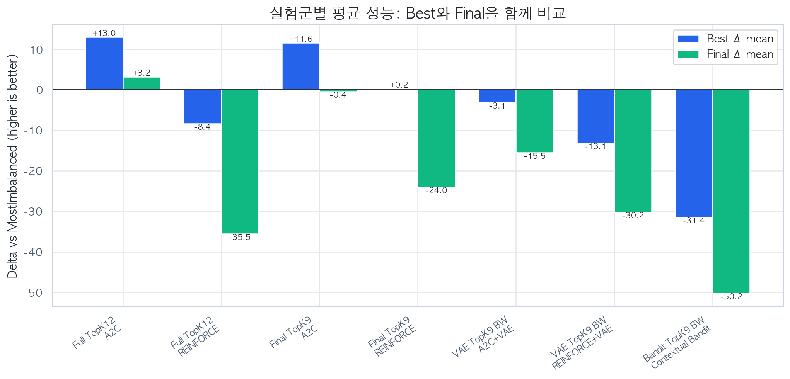

Top-K 12 전체 실험에서 A2C는 Best Δ 평균 +13.0, Final Δ 평균 +3.2로 가장 안정적이었다. REINFORCE는 Top-K 9 후속 실험에서 Best Δ 평균 +0.2까지 올라왔지만, Final Δ 평균은 -24.0로 떨어졌다.

REINFORCE가 Top-K 후보 수에 더 민감했던 이유는 알고리즘 특성과 연결해 해석할 수 있다. REINFORCE는 episode 전체 reward-to-go로 policy gradient를 계산하는 Monte Carlo 방식이라 분산이 크다. 후보 행동 수가 줄어들면 잘못된 정류소를 탐색할 가능성이 줄어 Best 성능은 좋아질 수 있지만, 후보가 너무 좁거나 seed가 달라지면 특정 행동에 policy가 빨리 몰려 Final 성능이 흔들릴 수 있다. 반면 A2C는 1-step TD advantage를 매 transition에서 갱신하므로 같은 Top-K 변화에서도 상대적으로 완만하게 반응했다.

## 6. 구별 결과

| 구 | Baseline | REINFORCE Best Δ | REINFORCE Final Δ | REINFORCE Best ep | A2C Best Δ | A2C Final Δ | A2C Best ep | Best 승자 |
| --- | --- | --- | --- | --- | --- | --- | --- | --- |
| 강남구 | -350.4 | +31.3 | +31.3 | 200 | +31.3 | +31.3 | 100 | Tie |
| 강동구 | -334.3 | +6.1 | +6.1 | 450 | +6.1 | +6.1 | 50 | Tie |
| 강북구 | -13.6 | -0.6 | -0.8 | 100 | -0.6 | -2.2 | 50 | REINFORCE(Final) |
| 강서구 | -2676.1 | +38.7 | +38.7 | 400 | +38.7 | +38.7 | 50 | Tie |
| 관악구 | -73.9 | -27.7 | -28.6 | 300 | -26.5 | -26.5 | 50 | A2C |
| 광진구 | -591.6 | +19.7 | +19.7 | 300 | +19.7 | +19.7 | 100 | Tie |
| 구로구 | -609.6 | +13.2 | -114.4 | 400 | +27.3 | +27.3 | 200 | A2C |
| 금천구 | -256.2 | +7.1 | +7.1 | 100 | +7.1 | +7.1 | 50 | Tie |
| 노원구 | -457.2 | +26.7 | +26.7 | 500 | +52.9 | -11.3 | 50 | A2C |
| 도봉구 | -82.2 | -5.5 | -5.5 | 150 | -5.5 | -5.5 | 150 | Tie |
| 동대문구 | -321.1 | -10.5 | -19.1 | 300 | +6.3 | +6.3 | 50 | A2C |
| 동작구 | -97.8 | -5.2 | -5.2 | 300 | -5.2 | -17.5 | 200 | REINFORCE(Final) |
| 마포구 | -490.4 | +44.6 | +44.1 | 400 | +44.6 | +44.6 | 100 | A2C(Final) |
| 서대문구 | -139.3 | -17.3 | -64.7 | 450 | -17.3 | -31.9 | 50 | A2C(Final) |
| 서초구 | -173.7 | +26.5 | +26.5 | 500 | +27.1 | -22.2 | 50 | A2C |
| 성동구 | -594.9 | +16.7 | -46.8 | 50 | +16.7 | -7.5 | 100 | A2C(Final) |
| 성북구 | -102.1 | -15.0 | -34.3 | 150 | -15.0 | -15.0 | 50 | A2C(Final) |
| 송파구 | -1225.8 | -63.5 | -155.1 | 1 | +52.0 | -76.4 | 50 | A2C |
| 양천구 | -1083.3 | +12.8 | -59.3 | 150 | +52.8 | +52.8 | 100 | A2C |
| 영등포구 | -1897.0 | -24.2 | -24.2 | 500 | -24.1 | -29.7 | 200 | A2C |
| 용산구 | -66.9 | -3.8 | -3.8 | 100 | -3.8 | -3.8 | 50 | Tie |
| 은평구 | -150.2 | -47.2 | -112.7 | 100 | -9.1 | -9.4 | 150 | A2C |
| 종로구 | -268.3 | +4.7 | +4.7 | 400 | +4.7 | +4.7 | 100 | Tie |
| 중구 | -182.6 | -29.5 | -78.3 | 200 | +3.3 | +3.3 | 100 | A2C |
| 중랑구 | -161.6 | +7.0 | -53.4 | 350 | +7.0 | +7.0 | 100 | A2C(Final) |

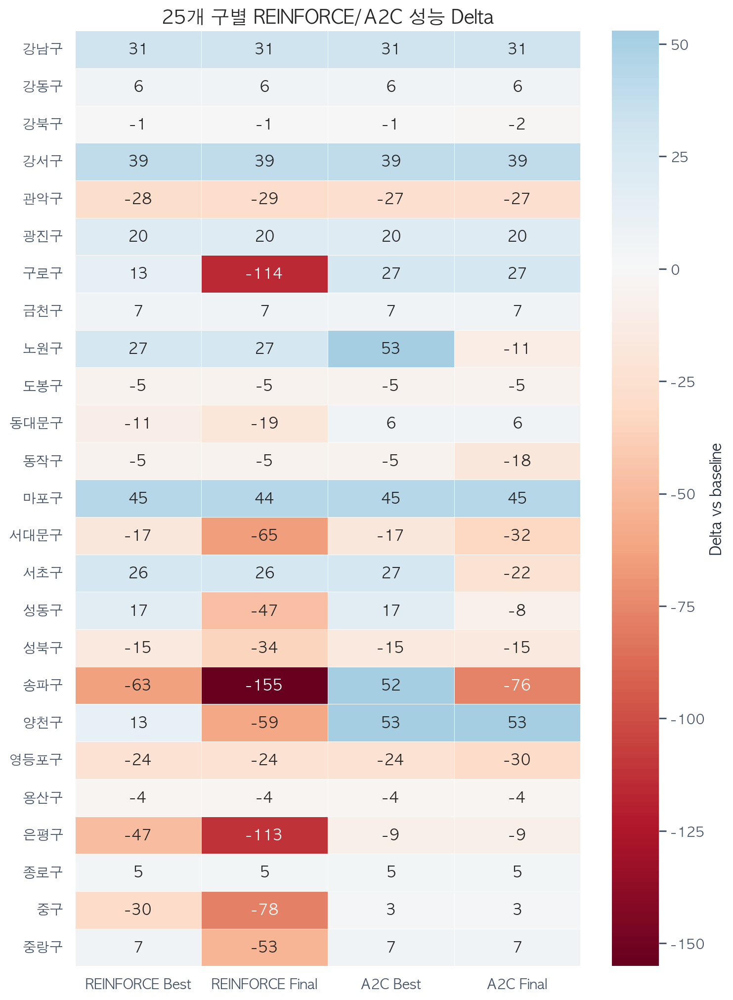

Best checkpoint 기준으로 A2C가 더 많은 구에서 우세했다. REINFORCE도 일부 구에서는 강한 성능을 보였지만, 구별 편차가 더 컸다.

승자 판정은 Best Delta를 우선 기준으로 했다. 단, 보고서 표기 기준인 소수 1자리에서 Best Delta가 같으면 Final Delta가 더 높은 알고리즘을 `A2C(Final)` 또는 `REINFORCE(Final)`로 표시했고, Best/Final 모두 같으면 `Tie`로 표시했다.

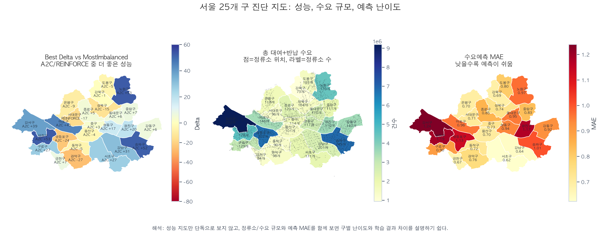

서울 지도는 결과 해석을 공간적으로 보완한다. 왼쪽 지도는 구별 Best Delta와 우수 알고리즘을 보여주고, 가운데 지도는 정류소 위치와 총 수요 규모를 보여주며, 오른쪽 지도는 수요예측 MAE를 보여준다. 이 세 지도를 함께 보면 단순히 어떤 구가 이겼는지뿐 아니라, **정류소 밀도·수요 규모·예측 난이도**가 학습 결과 차이에 어떤 배경으로 작용했는지 설명할 수 있다.

## 7. Best/Worst 구

| 알고리즘 | Best 3 구 | Worst 3 구 |
| --- | --- | --- |
| REINFORCE | 마포구 +44.6, 강서구 +38.7, 강남구 +31.3 | 송파구 -63.5, 은평구 -47.2, 중구 -29.5 |
| A2C | 노원구 +52.9, 양천구 +52.8, 송파구 +52.0 | 관악구 -26.5, 영등포구 -24.1, 서대문구 -17.3 |

Best/Worst 구는 이후 Top-K ablation과 seed validation의 대상이 되었다. 전체 25개 구를 모든 조합으로 돌리는 것은 비용이 너무 커서, 먼저 Best/Worst 구를 골라 후보 하이퍼파라미터를 좁히고, 최종 후보만 전체로 확장하는 sequential screening 방식으로 진행했다.

## 8. 학습곡선

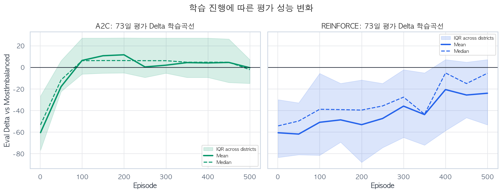

A2C는 초반부터 baseline 근처 또는 그 이상으로 이동한 뒤 비교적 완만하게 유지된다. 반면 REINFORCE는 평균선이 개선되더라도 IQR 구간이 넓다. 이는 REINFORCE가 Monte Carlo return을 사용해 advantage 추정의 분산이 크고, episode 초반 sampling이 이후 policy 방향을 크게 바꿀 수 있기 때문이다.

Best checkpoint와 Final checkpoint의 격차도 같은 방향을 보였다. 아래 표의 `Best-Final gap`은 Best Delta에서 Final Delta를 뺀 값으로, 값이 클수록 학습 중 좋았던 정책을 마지막까지 유지하지 못했다는 뜻이다.

| 알고리즘 | Best-Final gap 평균 | 중앙값 | 최대 gap | 최대 gap 구 | Best ep 평균 | Best ep 중앙값 | 100ep 이내 Best 구 수 |
| --- | --- | --- | --- | --- | --- | --- | --- |
| REINFORCE | 24.3 | 0.2 | 127.7 | 구로구 | 274.0 | 300.0 | 6 |
| A2C | 12.0 | 0.0 | 128.4 | 송파구 | 92.0 | 100.0 | 20 |

A2C의 Best-Final gap 평균은 `12.0`이고 REINFORCE는 `24.3`이었다. 또한 A2C의 Best episode 중앙값은 `100`인 반면, REINFORCE는 `300`이었다. 즉 현재 로그 기준으로 A2C는 비교적 초기에 좋은 정책을 찾는 구가 많았고, REINFORCE는 더 늦게 개선되거나 후반 유지가 흔들리는 경우가 많았다.

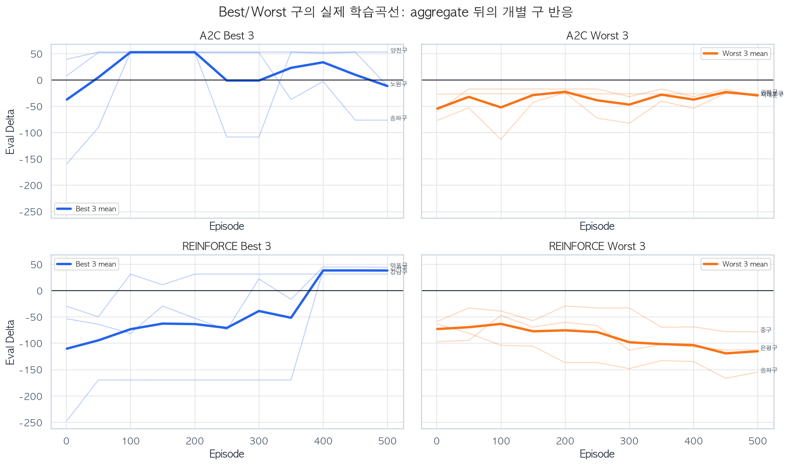

위 그림은 평균선 뒤에 숨어 있던 구별 반응을 보여준다. Best 3구는 초반부터 baseline 위로 올라가는 경우가 많지만, Worst 3구는 같은 알고리즘과 같은 Top-K 설정에서도 0선 아래에 머무르거나 후반에 다시 내려간다. 따라서 평균 성능만으로는 충분하지 않고, 구별 수요 패턴과 seed 안정성을 함께 봐야 한다.

## 9. Top-K 후보 수 ablation

| 알고리즘 | Top-K | 구 수 | Best Δ 평균 | Best Δ 중앙값 | Best 승리 | Final Δ 평균 | Final Δ 중앙값 | Final 승리 |
| --- | --- | --- | --- | --- | --- | --- | --- | --- |
| A2C | 3 | 12 | -21.5 | +14.7 | 7 | -27.5 | -5.9 | 6 |
| A2C | 6 | 12 | -24.0 | +13.7 | 7 | -42.8 | -16.1 | 5 |
| A2C | 9 | 12 | -23.4 | +15.3 | 7 | -27.9 | -5.9 | 6 |
| A2C | 12 | 12 | -24.9 | +8.0 | 7 | -53.1 | -16.1 | 5 |
| A2C | 15 | 12 | -24.9 | +8.0 | 7 | -34.0 | -5.9 | 6 |
| REINFORCE | 3 | 10 | +8.6 | +12.5 | 6 | -4.2 | -5.3 | 4 |
| REINFORCE | 6 | 10 | +3.9 | +4.2 | 6 | -24.4 | -20.7 | 4 |
| REINFORCE | 9 | 10 | -31.6 | -23.6 | 3 | -72.3 | -65.2 | 1 |
| REINFORCE | 12 | 10 | -6.1 | -22.7 | 4 | -48.1 | -54.8 | 2 |
| REINFORCE | 15 | 10 | -14.7 | -15.1 | 4 | -45.7 | -47.2 | 2 |

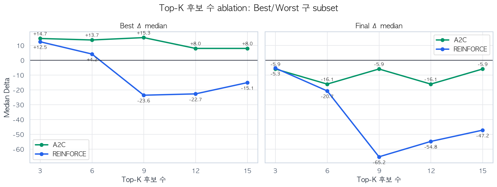

Top-K 후보 수는 단순히 클수록 좋거나 작을수록 좋은 값이 아니었다. 너무 작으면 탐색 후보가 부족하고, 너무 크면 policy가 학습해야 할 선택지가 늘어난다. 이 ablation은 각 알고리즘의 Best/Worst subset에서 수행했으므로 selection bias 가능성이 있다. 따라서 Top-K 결과는 인과 증명보다는 후보 설정을 좁히는 screening 결과로 해석한다. subset 실험에서는 REINFORCE가 K=3에서 비교적 좋았고, A2C는 K=9~12 범위에서 안정적이었다. 후속 seed/VAE 실험은 공통 비교를 위해 K=9로 진행했다.

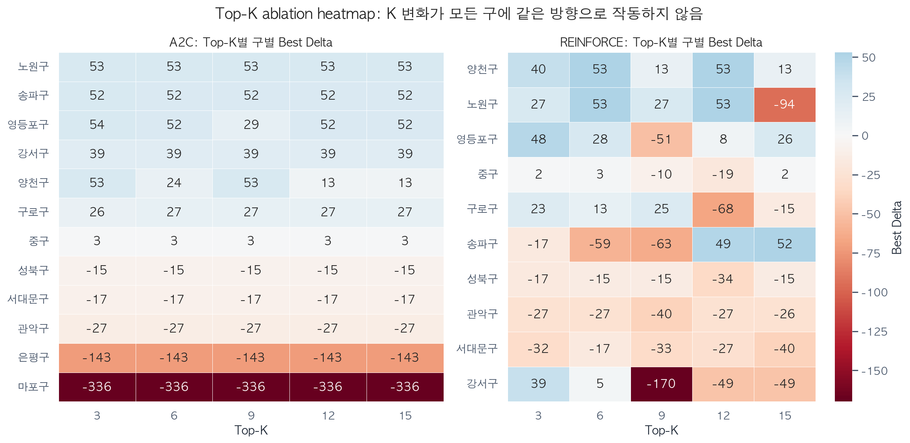

구별 heatmap을 보면 같은 K라도 모든 구에서 같은 방향으로 작동하지 않는다. 어떤 구는 K가 작아져도 성능이 유지되지만, 다른 구는 후보가 지나치게 좁아지면 성능이 급격히 나빠진다. 이 때문에 최종 K는 단일 최고값만 보고 정하지 않고, Best/Worst subset에서의 중앙값과 안정성을 함께 보고 선택했다.

## 10. Seed 민감도

| 알고리즘 | 구 수 | Best Δ 평균 | Best seed std 평균 | Best seed std 중앙값 | Best seed std 최대 | Best 승리 | Final Δ 평균 | Final seed std 평균 | Final seed std 중앙값 | Final seed std 최대 | Final 승리 |
| --- | --- | --- | --- | --- | --- | --- | --- | --- | --- | --- | --- |
| A2C | 10 | +13.7 | 10.2 | 1.0 | 52.3 | 18 | -3.8 | 31.4 | 25.3 | 86.4 | 13 |
| REINFORCE | 10 | -12.3 | 28.3 | 24.4 | 74.1 | 10 | -47.6 | 49.8 | 33.6 | 162.9 | 6 |

### Seed별 요약

| 알고리즘 | Seed | 실험 수 | Best Δ 평균 | Best Δ 표준편차 | Best 승리 | Final Δ 평균 | Final Δ 표준편차 | Final 승리 |
| --- | --- | --- | --- | --- | --- | --- | --- | --- |
| A2C | 42 | 10 | +14.4 | +33.8 | 6 | -6.9 | +38.5 | 4 |
| A2C | 123 | 10 | +21.7 | +32.3 | 7 | -9.0 | +52.0 | 4 |
| A2C | 777 | 10 | +4.9 | +34.7 | 5 | +4.7 | +35.1 | 5 |
| REINFORCE | 42 | 10 | -8.6 | +30.9 | 4 | -49.3 | +59.1 | 2 |
| REINFORCE | 123 | 10 | -10.3 | +38.6 | 2 | -48.4 | +95.1 | 2 |
| REINFORCE | 777 | 10 | -18.2 | +53.7 | 4 | -45.1 | +63.7 | 2 |

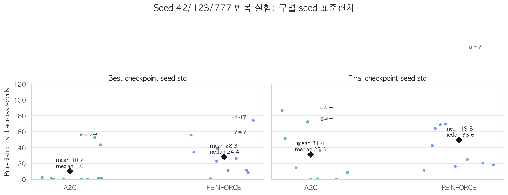

Seed 실험은 이번 보고서의 중요한 해석 근거다. 단, seed 안정성은 raw 30회 결과를 한꺼번에 표준편차로 계산하지 않았다. 그렇게 하면 구별 난이도 차이와 seed 차이가 섞이기 때문이다. 대신 같은 구에서 seed 42/123/777의 표준편차를 먼저 계산하고, 그 구별 표준편차를 알고리즘별로 요약했다.

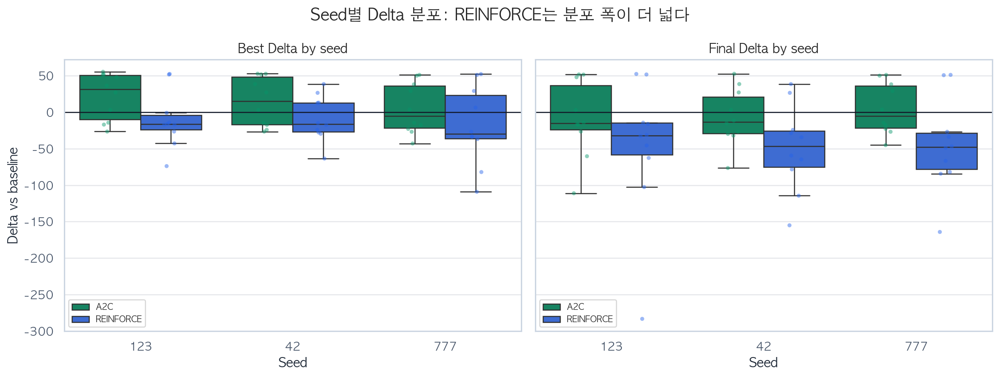

seed별 Delta 분포를 직접 보면 REINFORCE의 box와 점들이 A2C보다 넓게 퍼진다. 이는 단순히 특정 seed 하나가 나빠서라기보다, Monte Carlo reward-to-go 기반 policy gradient가 구별 수요 패턴과 초기 sampling에 더 민감하게 반응했음을 보여준다.

A2C는 Best seed std 평균이 `10.2`, 중앙값이 `1.0`이었다. 이 차이는 대부분의 구에서는 seed 변화에 거의 민감하지 않았지만, **영등포구 Best seed std `52.3`**과 **양천구 `43.4`**처럼 일부 구가 평균을 끌어올렸다는 뜻이다. Final 기준에서는 강서구 `86.4`, 송파구 `72.5`, 구로구 `51.1`이 큰 outlier였다. 따라서 A2C 안정성은 평균보다 중앙값과 구별 outlier를 함께 보는 것이 타당하다. 반면 REINFORCE는 Best seed std 평균 `28.3`, 중앙값 `24.4`로, 전반적으로 seed에 더 민감했다.

특히 REINFORCE는 강서구에서 Final seed std가 `162.9`로 가장 크게 나타났고, 송파구 `69.6`, 영등포구 `68.6`, 양천구 `63.9`도 큰 편이었다. seed별 raw 분포에서는 REINFORCE seed 123의 Final std가 `95.1`로 컸는데, 이는 강서구 seed 123의 Final Delta가 `-283.4`까지 떨어진 영향이 크다. 즉 seed 123 자체가 항상 나쁘다기보다는 특정 구와 seed 조합에서 후반 policy collapse가 발생한 것으로 해석하는 편이 안전하다.

## 11. VAE latent feature 실험

| 알고리즘 | 구 수 | 기존 Best Δ | VAE Best Δ | Best Δ gain 평균 | 개선 구 수 | 기존 Final Δ | VAE Final Δ | Final Δ gain 평균 |
| --- | --- | --- | --- | --- | --- | --- | --- | --- |
| A2C+VAE | 10 | +14.4 | -3.1 | -17.5 | 1 | -6.9 | -15.5 | -8.6 |
| REINFORCE+VAE | 10 | -8.6 | -13.1 | -4.5 | 6 | -49.3 | -30.2 | 19.2 |

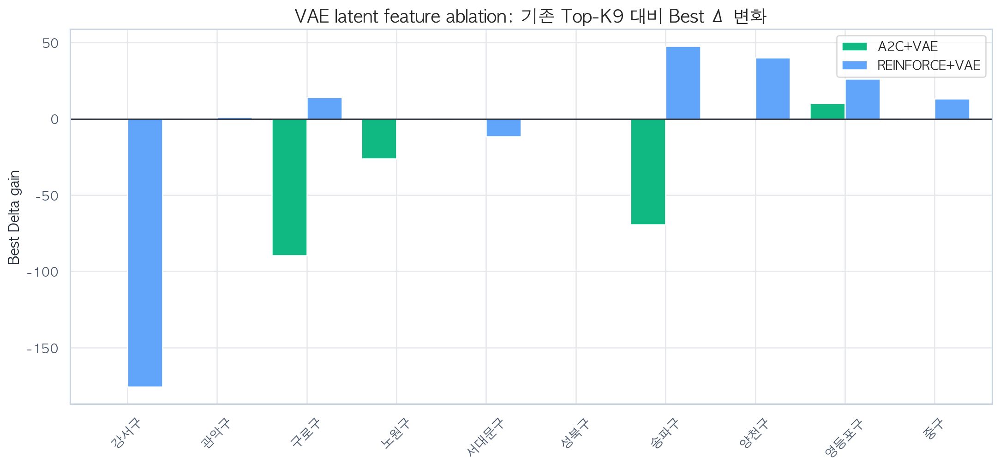

VAE는 정류소별 1시간 수요 패턴을 작은 latent vector로 압축해 state 뒤에 추가한 실험이다. 입력은 정류소별 수요 관련 feature이고, 출력 latent는 기존 forecast feature를 대체하지 않고 보조 feature로 붙였다. 위 표의 기존값은 **동일 10개 구 subset에서 seed 42로 학습한 Top-K9 결과**이고, gain은 그 값과 VAE 결과의 차이다. 따라서 Section 5의 전체 25개 구 평균과 직접 빼서 계산하면 안 된다.

결과적으로 VAE는 REINFORCE의 일부 구에서는 Final 성능을 개선했지만, Best 기준으로는 일관된 개선이 아니었다. 특히 A2C는 이미 critic이 상태의 장기 가치를 학습하기 때문에, VAE latent가 추가 정보라기보다 noise처럼 작동한 구가 있었다.

## 12. Contextual Bandit 비교

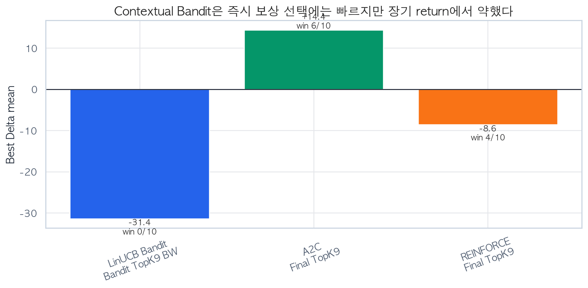

Contextual Bandit은 현재 step에서 가장 좋아 보이는 후보를 고르는 데는 빠르지만, 재배치 문제처럼 현재 선택이 다음 재고와 미래 reward에 영향을 주는 문제에서는 한계가 뚜렷했다. Bandit 결과가 baseline을 안정적으로 넘지 못한 것은 이 문제가 단순한 즉시 보상 최적화가 아니라 장기 return 최적화 문제라는 점을 보여준다.

## 13. 결론과 Insight

### 13.1 그래프 구성의 의미

본 보고서의 그래프는 강화학습/머신러닝 실험 보고서에서 일반적으로 요구되는 네 가지 질문에 대응하도록 구성했다.

| 질문 | 사용한 그림 | 해석 |
|---|---|---|
| 평균적으로 어떤 알고리즘이 좋은가? | 실험군별 Best/Final 평균 Delta | A2C가 REINFORCE보다 안정적 |
| 지역별 편차가 있는가? | 25개 구 heatmap | 특정 구에서는 두 알고리즘 모두 어려움 |
| 학습이 실제로 진행되는가? | episode별 평가 학습곡선 | A2C는 안정적, REINFORCE는 변동 폭 큼 |
| 결과가 seed에 민감한가? | 구별 seed 표준편차 scatter | REINFORCE가 seed variance 큼 |
| 하이퍼파라미터 선택 근거가 있는가? | Top-K ablation | K 선택을 임의가 아니라 실험적으로 설명 |

따라서 최종 보고서에서는 단순히 Best 결과만 제시하지 않고, 학습곡선, ablation, seed 반복, 구별 heatmap을 함께 보여 주어 실험 결과의 신뢰도를 높였다.

1. **A2C가 주 모델로 가장 적합하다.** 25개 구 전체와 seed 반복 실험 모두에서 REINFORCE보다 안정적이었다.
2. **REINFORCE는 policy gradient 기본 구조를 설명하기 좋지만 seed 민감도가 크다.** Monte Carlo return 기반이라 구별 수요 패턴과 초기 sampling에 크게 흔들렸다.
3. **Top-K 후보 구조는 필수적인 action restructuring이다.** 전체 정류소 직접 선택보다 탐색 난이도를 크게 낮춘다.
4. **VAE는 흥미로운 보조 feature지만 현재 설정에서는 선택적이다.** REINFORCE 일부 구에는 도움이 되었지만 A2C에는 일관되지 않았다.
5. **Bandit은 좋은 대조군이었다.** 단기 후보 선택만으로는 장기 재배치 성능을 만들기 어렵다는 점을 확인했다.

최종적으로 본 담당 범위에서는 **A2C + 수요예측 state + Top-K 후보 action**을 가장 설득력 있는 결과로 제시하고, REINFORCE는 이론적 비교 및 seed sensitivity 분석의 핵심 비교군으로 제시하는 것이 적절하다.

## Appendix A. 사용 파일

| 파일 | 설명 |
|---|---|
| `output/results/current_all_experiments_review.csv` | 전체 실험 요약 집계 |
| `output/results/final73_seedci_topk9_summary_detail.csv` | seed 42/123/777 반복 실험 |
| `output/results/topk_ablation_73d_summary.csv` | Top-K ablation 결과 |

## Appendix B. 재현 명령

```bash
PYTHONUNBUFFERED=1 PYTHONPATH=. .venv/bin/python -m src.agents.ours.run_a2c_reinforce_interactive
```

메뉴에서 `Final 73-day Protocol`을 선택하면 전체 baseline, Top-K ablation, confirmation, seed validation, final full run을 순서대로 실행할 수 있다.
