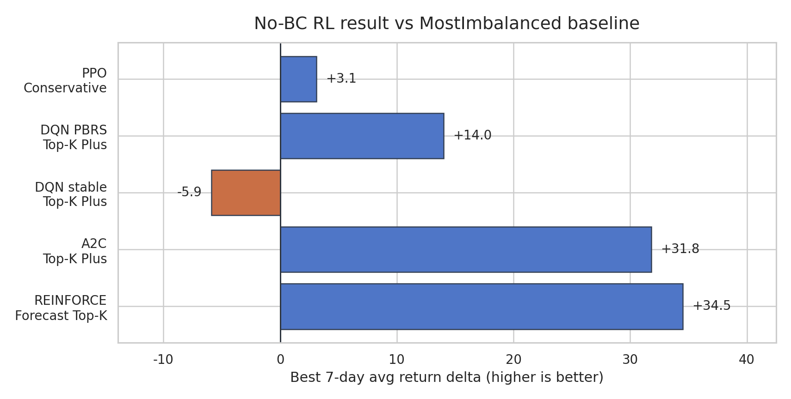
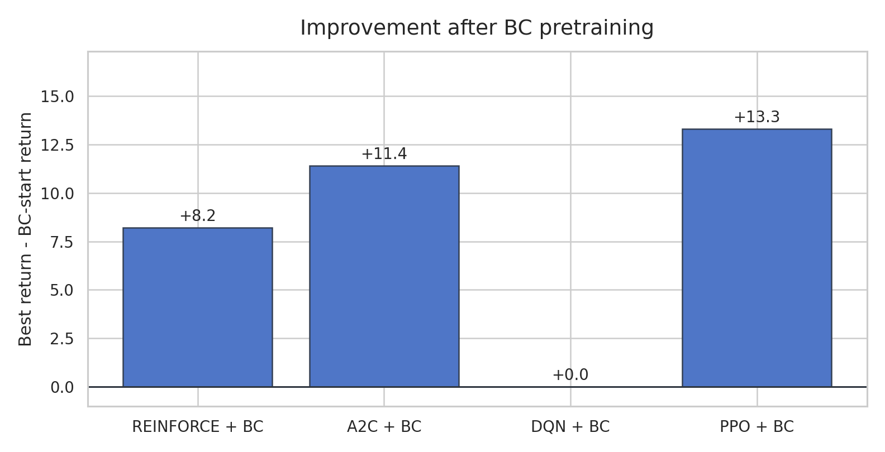
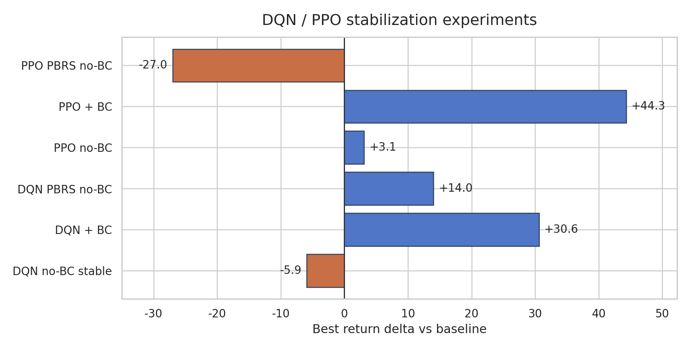
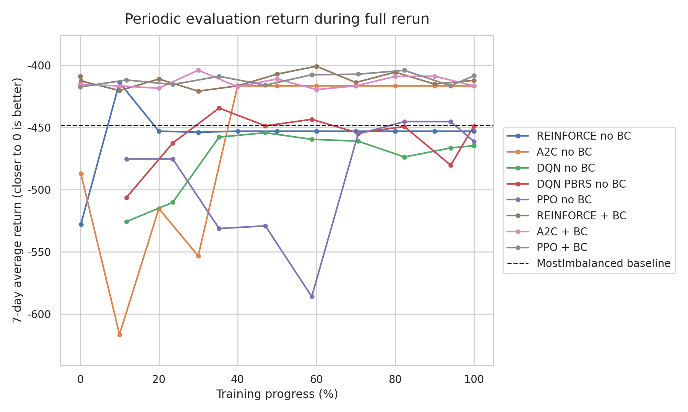

# 수요예측 기반 액션 후보 구조를 활용한 따릉이 재배치 강화학습

**수요예측 feature와 후보 action 구조를 이용한 REINFORCE / A2C / Double DQN / PPO 비교 실험**

작성일: 2026-06-06

---

## Abstract

본 연구는 서울시 마포구 따릉이 정류소 재배치 문제를 **강화학습(Reinforcement Learning, RL)** 으로 해결할 수 있는지 검증하는 것을 목표로 한다. 초기 실험에서 **REINFORCE, A2C, DQN, PPO** 등 네 가지 알고리즘을 기본 환경에 그대로 적용하였으나, 단순 휴리스틱인 `MostImbalanced` baseline을 하회하는 결과를 보였다.

이는 (1) 전체 146개 정류소를 대상으로 하는 큰 **action space**, (2) 행동의 효과가 즉각적인 reward로 연결되지 않는 **delayed reward** 구조, (3) 미래 수요 정보가 부족한 **state 표현**이 주된 원인으로 분석되었다.

이를 해결하기 위해 세 가지 개선을 적용하였다. 첫째, **1시간 수요예측(predicted net demand)** 을 state에 포함시켜 agent가 미래 수급 상황을 관측할 수 있도록 하였다. 둘째, 전체 정류소 중 점수 기반으로 선별한 **상위 12개 후보**로 action space를 축소하였다. 셋째, 일부 실험에서는 휴리스틱 행동을 모방하는 **Behavior Cloning(BC)** 사전 학습과 **best checkpoint rollback**을 적용하였다.

결과적으로 **BC 없이도 REINFORCE, A2C, PPO가 baseline을 상회**했으며, DQN은 일반 안정화 no-BC 설정에서는 baseline을 넘지 못했지만 PBRS no-BC 설정에서 baseline을 초과하였다. 최신 full rerun 기준 no-BC 개선폭은 REINFORCE `+34.5`, A2C `+31.8`, PPO `+3.1`, DQN PBRS `+14.0`이다.

BC 적용 실험에서는 REINFORCE, A2C, PPO가 BC 직후 대비 RL fine-tuning 이후 추가 개선을 보였다. DQN은 BC 직후 policy가 최고 성능으로 유지되어, RL 추가 개선보다는 BC policy 보존 효과로 해석된다.

---

## 1. 서론 (Introduction)

공공 자전거 공유 시스템의 효율적 운영을 위해서는 **수요 불균형이 발생하는 정류소에 자전거를 선제적으로 재배치**하는 것이 중요하다. 서울시 따릉이의 경우 마포구에 146개 정류소가 포함되어 있으며, 재배치 트럭은 제한된 시간 안에 어느 정류소를 방문할지 결정해야 한다.

기존의 규칙 기반 휴리스틱은 현재 재고 불균형을 즉시 해소하는 방향으로 작동하지만, 향후 수요 변화에 대한 선제적 대응이 어렵다.

강화학습은 **누적 reward 최대화**라는 목적 아래 이러한 순차 의사결정 문제를 학습할 수 있는 프레임워크다. 그러나 실제 적용 시에는 **state 설계, reward 구조, action space 크기**가 학습 안정성에 큰 영향을 미친다.

본 연구의 주요 기여는 다음과 같다.

- **수요예측 기반 state 설계**: 1시간 예측 수요를 state에 포함함으로써 agent가 미래 부족/초과 위험을 볼 수 있게 하였다.
- **후보 action space 축소**: 전체 정류소를 직접 선택하는 대신, 점수 기반 상위 12개 후보로 action space를 구조화하여 탐색 효율을 높였다.
- **BC 효과의 분리 분석**: BC 직후 성능과 RL fine-tuning 이후 성능을 구분하여 RL 개선 여부를 독립적으로 평가하였다.
- **4종 알고리즘 비교**: REINFORCE, A2C, Double DQN, PPO를 동일 평가 기준에서 비교하고, no-BC와 BC/guard 조건을 구분하였다.

---

## 2. 관련 연구 (Related Work)

### 2.1 공유 자전거 재배치 문제

공유 자전거 재배치 문제는 정류소별 재고, 트럭 용량, 정류소 capacity, 이동 시간, 시간대별 수요가 함께 작용하는 동적 운영 문제다. 기존 연구에서는 이를 vehicle routing 또는 inventory rebalancing 문제로 보고, 정수계획법, 휴리스틱, 메타휴리스틱, 수요예측 결합 최적화 등으로 접근해 왔다. 예를 들어 KDD 2016의 multi-source data 기반 재배치 연구는 날씨, 교통, POI 등 다양한 데이터를 결합해 재배치 의사결정을 개선하려 했고, 최근 static bike rebalancing 연구들은 정류소 capacity와 수요 불확실성을 반영한 최적화 모델을 제안한다.

### 2.2 강화학습 기반 재배치 및 차량경로 문제

강화학습은 동적 차량경로 문제(Dynamic Vehicle Routing Problem, DVRP)와 실시간 재배치 문제에서 점차 활용되고 있다. DVRP 연구들은 stochastic demand 또는 stochastic request time이 있는 상황에서 policy가 순차적으로 route 또는 dispatch action을 선택하도록 문제를 MDP로 정의한다. 공유 자전거 재배치에서도 spatio-temporal feature, multi-vehicle setting, PPO 또는 actor-critic 구조를 활용해 동적 수요에 대응하려는 연구가 제안되어 왔다.

### 2.3 본 실험의 위치

본 실험은 대규모 최적화 모델을 새로 설계하기보다, 기존 따릉이 시뮬레이션 환경에서 **RL agent가 학습 가능한 형태로 state와 action을 재구성**하는 데 초점을 둔다.

특히 전체 정류소를 직접 선택하는 action space를 수요예측 기반 후보 12개로 줄이고, BC 직후 성능과 RL fine-tuning 이후 성능을 분리해 평가한다는 점에서 기존 휴리스틱 모방과 순수 RL 개선을 구분한다.

---

## 3. 용어 정리 (Terminology)

보고서에서 사용하는 주요 용어는 다음과 같다. 복잡한 약어는 먼저 쉬운 의미로 해석한 뒤 실험 결과를 읽는 것이 좋다.

| 용어 | 쉬운 설명 | 이 실험에서의 의미 |
|---|---|---|
| Baseline | 비교 기준 | `MostImbalanced` 휴리스틱 |
| MostImbalanced | 가장 불균형한 곳으로 가는 규칙 | 현재 재고가 목표보다 너무 많거나 적은 정류소를 선택 |
| Reward / Return | 하루 운행 점수 | 음수이며 0에 가까울수록 좋음 |
| Delta | baseline보다 얼마나 나은지 | `model reward - baseline reward`, 양수면 baseline보다 좋음 |
| State | agent가 보는 정보 | 현재 재고, 트럭 상태, 시간, 수요예측 등 |
| Action | agent가 고르는 행동 | 다음에 이동할 정류소 또는 후보 순위 |
| Top-K | 후보 줄이기 | 전체 146개 대신 좋은 후보 12개 중 선택 |
| Forecast Top-K | 수요예측 후보 | 1시간 뒤 예상 부족/초과를 보고 후보를 만듦 |
| Top-K Plus | 후보 고도화 | 수요예측 후보에 이동거리, 권역 penalty, 후보별 feature 추가 |
| BC | 예습 | 휴리스틱 행동을 먼저 따라하게 하는 지도학습 |
| Rollback | 되돌리기 | 평가가 나빠지면 가장 좋았던 모델로 복구 |
| PBRS | 보조 reward | 학습 중에만 쓰는 potential-based reward shaping |

---

## 4. 문제 정의 (Problem Formulation)

### 4.1 환경 설정

본 연구의 환경은 마포구 따릉이 정류소 재배치를 시뮬레이션하는 **다중 트럭 문제**로 정의된다. 실험 설정에서는 트럭 3대를 사용하였고, episode 하나는 하루 24시간을 10분 단위로 나눈 **144 time steps**로 구성된다.

각 decision step에서 현재 선택된 트럭은 다음 방문 정류소를 결정한다.

공공 데이터에는 실시간 재고 스냅샷이 포함되어 있지 않으므로, 환경은 초기 재고를 설정한 후 10분 단위 대여/반납 기록을 시간 순서대로 replay하여 재고를 갱신한다.

### 4.2 State

| 범주 | 구성 요소 |
|---|---|
| 정류소 재고 | 정류소별 현재 재고 비율 (`bikes / capacity`) |
| 수요예측 | 정류소별 1시간 예측 순수요 (`pred_net_1h`), 예측 편차 (`projected_deviation`) |
| 트럭 상태 | 현재 위치, 적재량, 이동 상태 |
| 시간 정보 | 현재 time step, 시간대 |
| 캘린더/날씨 | 주말 여부, 공휴일 여부, 공휴일 전날 여부 |

수요예측 feature는 다음과 같이 산출된다.

```text
pred_net_1h = pred_returns_1h - pred_rentals_1h
projected_bikes = current_bikes + pred_net_1h
projected_deviation = (projected_bikes - target_bikes) / capacity
```

`projected_deviation`이 음수이면 1시간 후 재고 부족이 예상됨을 의미하며, 양수이면 거치 공간 포화가 예상됨을 의미한다.

### 4.3 Action

기본 구조에서는 agent가 전체 146개 정류소 중 하나를 직접 선택한다. 개선된 구조에서는 점수 기반으로 선별된 상위 12개 후보 중 하나를 선택하도록 action space를 축소하였다.

| 구조 | Action space 크기 | 설명 |
|---|---:|---|
| 기본 | 146 | 전체 정류소 중 직접 선택 |
| Forecast Top-K | 12 | 수요예측 기반 후보 중 선택 |
| Top-K Plus | 12 | 수요예측 + 이동거리 + 권역 penalty + 후보 feature 포함 |

후보 점수는 예측 불균형에서 이동거리 penalty와 권역 외 penalty를 차감하여 산출한다.

```text
candidate_score =
    forecast_imbalance
  - distance_penalty
  - zone_penalty
```

### 4.4 Reward

Reward는 운행 중 발생하는 서비스 실패와 이동 비용을 음수로 합산한 값이다. Reward가 0에 가까울수록 성능이 우수하다.

```text
r_t = -1.0 * stockout
      -0.8 * full
      -0.008 * travel_km
      -0.002 * travel_step
```

| 항목 | 정의 |
|---|---|
| `stockout` | 대여 요청이 있었으나 재고 부족으로 실패한 횟수 |
| `full` | 반납 요청이 있었으나 거치 공간 포화로 실패한 횟수 |
| `travel_km` | 이동 거리 |
| `travel_step` | 이동 time step 수 |

Episode 점수(Return)는 하루 전체 reward의 합산이며, 평가 지표는 고정된 7개 날짜에 대한 평균 Return이다.

### 4.5 Baseline: MostImbalanced

`MostImbalanced`는 학습 없이 규칙만으로 동작하는 강한 휴리스틱 baseline이다. 목표 재고를 `capacity * target_fill_ratio`로 설정하고, 현재 목표 재고와의 편차가 가장 큰 정류소를 다음 방문지로 선택한다.

- 트럭이 비어 있으면: 자전거가 목표 이상으로 많은 정류소로 이동하여 적재
- 트럭이 가득 찼으면: 자전거가 목표 이하로 부족한 정류소로 이동하여 하역
- 그 외: 현재 목표 편차가 가장 큰 정류소를 선택

수정 환경 기준 baseline은 다음과 같다.

```text
MostImbalanced baseline = -448.3
```

---

## 5. 방법론 (Methodology)

### 5.1 수요예측 기반 State 확장

기존 state는 현재 재고 중심으로 구성되어 있어, agent가 미래 수급 불균형을 사전에 파악하기 어려웠다. 재배치 문제의 특성상 "현재 부족한 정류소"보다 "곧 부족해질 정류소"를 선제적으로 방문하는 것이 더 효과적일 수 있다.

이에 따라 1시간 수요예측 데이터(`demand_forecast_1h_rlholdout_seed42.parquet`)를 state에 포함시켰다. 이를 통해 agent는 현재 재고 편차뿐 아니라 1시간 후 예측 재고 편차를 함께 관측할 수 있다.

### 5.2 후보 Action Space 축소

146개 정류소를 대상으로 하는 직접 선택 구조는 학습 초기 탐색 공간을 지나치게 넓힌다. 대부분의 action이 학습 초기 단계에서 무의미한 선택이 되어 학습 신호가 희석된다.

이 문제를 해결하기 위해 매 decision step마다 후보 집합을 사전 생성하고, agent는 해당 집합 내에서만 선택한다. 후보 생성은 수요예측 기반 점수 함수로 이루어지며, Top-K Plus 설정에서는 이동거리 및 권역 penalty를 추가한다.

### 5.3 Behavior Cloning과 Checkpoint Rollback

일부 실험에서는 `MostImbalanced` 휴리스틱의 행동을 teacher action으로 활용한 BC 사전 학습을 수행하였다. BC는 지도학습 방식으로 policy가 휴리스틱 행동을 모방하도록 초기화하는 역할을 한다.

BC 이후 RL fine-tuning 단계에서 성능이 오히려 하락하는 경우를 방지하기 위해, 평가 지표가 악화될 경우 최고 성능 checkpoint로 자동 복원하는 rollback을 적용하였다.

BC 적용 결과는 다음 기준으로 해석한다.

| 조건 | 해석 |
|---|---|
| no-BC가 baseline 초과 | RL 자체가 유의미한 개선을 만든 증거 |
| BC 직후보다 RL fine-tuning 후 개선 | BC 이후 RL이 추가 개선을 만든 증거 |
| BC 직후가 최고이고 RL 후 개선 없음 | BC policy를 유지한 결과이며, RL 개선으로 주장하지 않음 |

---

## 6. 알고리즘 (Algorithms)

### 6.1 REINFORCE with Value Baseline

REINFORCE는 episode 종료 후 실제 누적 보상(reward-to-go)을 이용하여 policy를 업데이트하는 Monte Carlo policy gradient 알고리즘이다. Value Network를 baseline으로 활용하여 gradient 분산을 감소시켰다.

```python
returns = discounted_reward_to_go(rewards, gamma)
advantages = returns - value_net(states)

policy_loss = -(log_probs * advantages.detach()).mean()
value_loss = mse_loss(value_net(states), returns)
```

### 6.2 Advantage Actor-Critic (A2C)

A2C는 현재 reward와 다음 state value를 이용하여 advantage를 추정하는 actor-critic 알고리즘이다. REINFORCE보다 더 자주 업데이트할 수 있어 학습 신호를 빠르게 반영할 수 있다.

```python
target = reward + gamma * (1 - done) * value(next_state)
advantage = target - value(state)

actor_loss = -(log_prob(action) * advantage.detach()).mean()
critic_loss = mse_loss(value(state), target)
```

### 6.3 Double DQN

DQN은 각 action의 Q값을 직접 학습하는 value-based 알고리즘이다. 본 실험에서는 Q값 과대추정 문제를 완화하기 위해 Double DQN을 기본으로 적용하였다. Double DQN은 action 선택과 Q값 평가를 각각 online network와 target network로 분리한다.

```python
next_action = online_q(next_state).argmax()
target_q = target_q_network(next_state)[next_action]
```

### 6.4 Proximal Policy Optimization (PPO)

PPO는 policy update 크기를 clipping을 통해 제한하는 policy gradient 알고리즘이다. 본 실험의 안정화 설정에서는 learning rate, clip range, target KL을 보수적으로 설정하여 급격한 policy 변화를 억제하였다.

```text
r_t(theta) = pi_theta(a_t | s_t) / pi_old(a_t | s_t)
L_clip = min(
    r_t(theta) * A_t,
    clip(r_t(theta), 1 - epsilon, 1 + epsilon) * A_t
)
```

---

## 7. 실험 설정 (Experimental Setup)

### 7.1 데이터

| 파일 | 행 수 | 기간/범위 | 정류소 수 |
|---|---:|---|---:|
| `stations.parquet` | 3,341 | 전체 정류소 마스터 | 전체 3,341 / 마포구 146 |
| `trips.parquet` | 1,267,998 | 2025년 대여 이력 | 관측 정류소 122 |
| `demand_10min.parquet` | 1,547,459 | 2025-01-01 ~ 2026-01-01 | 관측 정류소 122 |
| `weather_10min.parquet` | 52,549 | 2025년 | 해당 없음 |
| `demand_forecast_1h_rlholdout_seed42.parquet` | 6,413,662 | 2025-01-01 ~ 2026-01-01 | 관측 정류소 122 |

마포구 action 대상은 146개 정류소이나, 실제 수요가 관측된 정류소는 122개이며 나머지는 수요값 0으로 처리된다. Trip 로그는 다음 규칙에 따라 10분 단위 수요 테이블로 변환하였다.

```text
대여 시각의 출발 정류소 -> rentals += 1
반납 시각의 도착 정류소 -> returns += 1
```

### 7.2 학습 및 평가 설정

| 항목 | 기준 |
|---|---|
| 학습 기간 | 2025년 날짜 중 seed 42 shuffle 후 train pool |
| 최종 학습 날짜 | 200일 |
| 평가 날짜 | 2025-03-25, 2025-04-18, 2025-05-17, 2025-07-01, 2025-07-06, 2025-07-09, 2025-08-21 |
| 평가 지표 | 7일 평균 Return |
| 비교 기준 | 동일 환경의 `MostImbalanced` |

| 알고리즘 | 학습량 |
|---|---:|
| REINFORCE | 500 episodes |
| A2C | 500 episodes |
| DQN | 170,000 timesteps |
| PPO | 170,000 timesteps |

`100K`, `170K`는 데이터 행 수가 아니라 환경과 상호작용한 step 수를 의미한다.

본 보고서의 학습곡선은 supervised learning의 validation loss가 아니라, 학습 중 일정 간격으로 현재 policy를 고정 평가 날짜 7일에 실행한 **periodic evaluation return**이다.

RL에서는 탐색 noise와 stochastic policy 때문에 학습 중 수집되는 return만으로 성능을 판단하기 어렵기 때문에, 별도 평가 episode를 주기적으로 실행해 평균 return을 확인하는 방식이 널리 사용된다. 따라서 본 곡선은 최종 성능 순위표라기보다, 학습 과정에서 성능이 안정적으로 개선되는지, BC 이후 RL fine-tuning이 policy를 개선하는지 또는 망가뜨리는지 확인하기 위한 **진단 그래프**이다.

---

## 8. 실험 결과 (Results)

모든 결과는 `MostImbalanced` baseline(Return = `-448.3`)과의 차이로 비교한다. `Delta > 0`이면 baseline 대비 개선을 의미한다. 아래 수치는 2026-06-06 full rerun 결과를 반영한다.

### 8.1 BC 없는 RL 단독 실험

BC 없이 RL만으로 baseline을 상회한 경우, 강화학습 자체가 유의미한 개선을 만든 것으로 해석할 수 있다. 최신 재학습에서는 REINFORCE, A2C, PPO가 baseline을 넘었고, DQN은 일반 안정화 설정에서는 하회했지만 PBRS를 추가한 no-BC 설정에서 baseline을 넘었다.

| 알고리즘 | 설정 | Best Return | Final Return | Delta | 해석 |
|---|---|---:|---:|---:|---|
| REINFORCE | Forecast Top-K | -413.8 | -453.0 | **+34.5** | no-BC 최고 성능, final은 하락 |
| A2C | Forecast Top-K Plus | -416.5 | -416.5 | **+31.8** | 안정적인 actor-critic 결과 |
| DQN | Forecast Top-K Plus 안정화 | -454.2 | -454.2 | -5.9 | baseline 하회, 안정화만으로는 부족 |
| DQN | Forecast Top-K Plus + PBRS | -434.3 | -434.3 | **+14.0** | DQN no-BC 중 채택 가능한 설정 |
| PPO | Forecast Top-K Plus 보수적 업데이트 | -445.2 | -445.2 | **+3.1** | 개선폭은 작지만 baseline 초과 |



### 8.2 BC 적용 실험

BC 적용 결과를 해석할 때는 BC 직후 성능과 RL fine-tuning 이후 성능을 반드시 구분해야 한다.

| 알고리즘 | BC 직후 Return | Best Return | Delta | BC 이후 RL 개선 | 해석 |
|---|---:|---:|---:|---:|---|
| REINFORCE | -408.9 | -400.6 | **+47.6** | **+8.3** | BC 이후 RL 추가 개선 |
| A2C | -415.3 | -403.8 | **+44.4** | **+11.4** | BC 이후 RL 추가 개선 |
| DQN | -417.7 | -417.7 | +30.6 | +0.0 | BC policy 유지, RL 개선 주장 불가 |
| PPO | -417.3 | -404.0 | **+44.3** | **+13.4** | BC 이후 RL 추가 개선 |



### 8.3 DQN / PPO 안정화 추가 실험

안정화 설정을 포함한 DQN 및 PPO 실험 결과는 다음과 같다.

| 설정 | Best Return | Delta | 비고 |
|---|---:|---:|---|
| DQN no-BC 안정화 | -454.2 | -5.9 | baseline 하회 |
| DQN BC 유지 | -417.7 | +30.6 | 참고, RL 개선 아님 |
| DQN PBRS no-BC | -434.3 | +14.0 | 채택 가능한 DQN no-BC 설정 |
| PPO no-BC 보수적 | -445.2 | +3.1 | 채택 |
| PPO BC + 보수적 | -404.0 | +44.3 | 보조 결과, BC 이후 RL 개선 있음 |
| PPO PBRS no-BC | -475.3 | -27.0 | baseline 하회, 제외 |

PBRS는 알고리즘별로 효과가 달랐다. DQN에서는 delayed reward를 완화해 baseline을 넘는 데 도움이 되었지만, PPO에서는 오히려 성능이 하락하였다. 따라서 PBRS는 일괄 적용할 설정이 아니라 알고리즘별 ablation으로 다루는 것이 타당하다.



### 8.4 학습곡선 기반 안정성 분석

강화학습 실험에서는 최종 점수뿐 아니라 학습 중 reward가 어떻게 변하는지도 중요하다. 아래 그림은 알고리즘별 periodic evaluation return을 나타낸다. REINFORCE/A2C는 episode 단위로, DQN/PPO는 timestep 단위로 학습되므로 직접적인 sample efficiency 비교를 피하기 위해 각 run의 진행률을 0-100%로 정규화하였다.



이 그림은 다음 세 가지 질문을 확인하기 위한 보조 분석이다.

| 질문 | 관찰 결과 | 해석 |
|---|---|---|
| BC 없이도 학습 신호가 있는가 | REINFORCE, A2C, PPO no-BC는 baseline 위 checkpoint를 만들었다. DQN은 PBRS no-BC에서 baseline을 넘었다 | 후보 action과 수요예측 state는 RL 단독 학습을 가능하게 하지만, DQN은 추가 reward 보조가 필요했다 |
| BC 이후 RL fine-tuning이 추가 개선을 만드는가 | REINFORCE, A2C, PPO는 BC 시작점보다 더 좋은 checkpoint가 나타났다 | BC를 단순 복사가 아니라 좋은 초기 policy로 활용한 사례다 |
| BC 이후 policy가 망가지는가 | DQN은 BC 직후가 최고였고 이후 평가가 하락해 early stop/rollback에 의존했다 | DQN + BC는 RL 개선이 아니라 BC policy 보존으로 해석해야 한다 |

따라서 이 학습곡선은 "어떤 알고리즘이 가장 빠르게 학습했는가"를 주장하기 위한 그림이 아니다. 핵심 목적은 no-BC에서도 학습 신호가 있는지, BC 이후 추가 개선이 있는지, 그리고 rollback이 필요한 알고리즘이 무엇인지 구분하는 것이다. 본 실험은 단일 seed 중심이므로, 논문식 통계 검증을 위해서는 향후 여러 seed 평균과 confidence interval을 추가해야 한다.

### 8.5 결과 채택 기준 요약

| 실험 설정 | 채택 여부 | 근거 |
|---|---|---|
| REINFORCE no-BC | 채택 | RL 단독으로 baseline 크게 초과 |
| A2C no-BC | 채택 | RL 단독으로 baseline 크게 초과 |
| DQN no-BC 안정화 | 제외 | 최신 full rerun에서 baseline 하회 |
| DQN PBRS no-BC | 채택 | DQN no-BC 중 baseline 초과 |
| PPO no-BC 보수적 | 채택 | 개선폭은 작으나 baseline 초과 |
| REINFORCE + BC | 보조 결과로 채택 | BC 이후 RL 개선 확인 |
| A2C + BC | 보조 결과로 채택 | BC 이후 RL 개선 확인 |
| PPO + BC | 보조 결과로 채택 | BC 이후 RL 개선 확인 |
| DQN + BC | 참고 결과 | RL 개선이 아닌 BC policy 유지 |
| PPO PBRS no-BC | 제외 권장 | baseline 하회 |

---

## 9. 논의 (Discussion)

### 9.1 State와 Action 설계의 중요성

본 실험 결과에서 가장 중요한 시사점은, **알고리즘 자체보다 state/action 구조 설계가 성능에 더 결정적인 영향을 미쳤다**는 점이다.

기본 환경에서 네 알고리즘 모두 baseline을 하회하였으나, 수요예측 feature 및 후보 action 구조를 적용한 이후 REINFORCE, A2C, PPO는 no-BC로 baseline을 초과하였다. DQN은 일반 안정화 설정만으로는 baseline을 넘지 못했지만, PBRS를 추가한 no-BC 설정에서는 baseline을 초과하였다.

### 9.2 알고리즘별 특성

- **REINFORCE / A2C**: 후보 action 구조와 수요예측 feature가 적용되었을 때 BC 없이도 가장 큰 개선을 보였다.
- **DQN**: Q값 학습이 큰 action space에서 불안정해지는 경향이 있었다. 일반 안정화 no-BC는 baseline을 넘지 못했지만, PBRS를 추가하면 no-BC에서도 baseline을 초과하였다.
- **PPO**: 보수적 update 설정 없이는 성능이 흔들렸으나, 작은 learning rate와 target KL을 적용하면 baseline을 넘을 수 있었다.

### 9.3 알고리즘 구조와 결과 해석

최신 full rerun 결과는 같은 state/action 개선을 적용하더라도 알고리즘 구조에 따라 학습 안정성과 개선폭이 달라짐을 보여준다. REINFORCE와 A2C는 policy를 직접 업데이트하는 구조 덕분에 수요예측 feature와 후보 action 축소 효과를 비교적 잘 활용했으며, 각각 `+34.5`, `+31.8`의 no-BC 개선을 보였다. 반면 DQN은 action별 Q값을 추정하는 value-based 구조상 delayed reward에 더 민감하여 일반 안정화 no-BC에서는 baseline을 넘지 못했고, PBRS를 추가했을 때 `+14.0` 개선을 달성했다. PPO는 clipping 기반의 보수적 update로 안정성은 확보했지만, 본 설정에서는 개선폭이 `+3.1`로 제한적이었다.

### 9.4 BC 효과 해석

BC는 RL 탐색의 시작점을 개선하는 효과를 가지지만, 반드시 RL fine-tuning으로 이어지는 추가 개선이 확인되어야 **"BC + RL"을 의미 있는 접근**으로 평가할 수 있다.

REINFORCE, A2C, PPO는 이 기준을 충족하였다. DQN은 BC 직후 policy가 최고였으므로 BC policy를 유지한 결과로 해석한다.

### 9.5 한계 및 향후 연구

본 연구는 다음과 같은 한계를 가진다.

- **마포구 한정 평가**: 타 자치구나 전체 서울 범위로 일반화하려면 추가 검증이 필요하다.
- **단일 seed 중심 실험**: 결과의 통계적 신뢰성을 높이기 위해 여러 seed 반복 실험이 필요하다.
- **후보 집합 크기 K 고정**: 본 실험은 K=12를 사용했으며, K=6, 24 등 후보 수 변화에 대한 ablation이 필요하다.
- **수요예측 모델 고도화**: 현재는 1시간 예측 feature를 사용했지만, 더 정교한 수요예측 모델을 적용할 여지가 있다.
- **Reward 계수 분석**: `stockout`, `full`, 이동 비용 계수의 민감도 분석이 추가되면 해석력이 높아진다.

---

## 10. 결론 (Conclusion)

본 연구는 마포구 따릉이 재배치 문제에 강화학습을 적용하는 과정에서 state/action 설계의 중요성을 실험적으로 확인하였다.

기본 환경에서는 어떤 알고리즘도 단순 휴리스틱 baseline을 넘기 어려웠으나, 1시간 수요예측 feature와 후보 action space 축소를 적용하였을 때 REINFORCE, A2C, PPO는 BC 없이도 baseline을 초과하였다. DQN은 일반 안정화 no-BC에서는 baseline을 넘지 못했지만, PBRS를 추가한 no-BC 설정에서 `+14.0` 개선을 달성하였다. 특히 REINFORCE(`+34.5`)와 A2C(`+31.8`)는 BC 없이도 큰 폭의 개선을 보였다.

BC 적용 실험에서는 REINFORCE, A2C, PPO가 BC 이후 RL fine-tuning으로 추가 개선을 보였다. DQN은 BC 직후 policy가 최고였으므로 RL 개선보다는 BC policy 보존으로 해석한다. 따라서 BC의 효과를 평가할 때 BC 직후 성능과 RL fine-tuning 이후 성능을 반드시 구분하여 분석해야 한다.

> 따릉이 재배치 문제에서는 단순히 RL 알고리즘을 교체하는 것보다, agent가 학습할 수 있도록 state와 action 구조를 재설계하는 것이 더 중요하였다. 그 결과, 후보 action 구조와 수요예측 feature를 적용했을 때 REINFORCE, A2C, PPO는 no-BC로 baseline을 넘었고, DQN은 PBRS 보조를 통해 no-BC baseline 초과 설정을 확보하였다.

---

## References

1. Liu, J. et al. (2016). Rebalancing Bike Sharing Systems: A Multi-source Data Smart Optimization. *KDD*.
2. Schuijbroek, J., Hampshire, R., & van Hoeve, W. (2017). Inventory rebalancing and vehicle routing in bike sharing systems. *European Journal of Operational Research*.
3. Li, Y. et al. (2018). A Deep Reinforcement Learning Framework for Rebalancing Dockless Bike Sharing Systems. *AAAI*.
4. Pan, L. et al. (2024). A Reinforcement Learning Approach for Dynamic Rebalancing in Bike-Sharing System. *arXiv:2402.03589*.
5. Joe, W., & Lau, H. C. (2020). Deep Reinforcement Learning Approach to Solve Dynamic Vehicle Routing Problem with Stochastic Customers. *ICAPS*.
6. Williams, R. J. (1992). Simple statistical gradient-following algorithms for connectionist reinforcement learning. *Machine Learning*, 8, 229-256.
7. Mnih, V. et al. (2015). Human-level control through deep reinforcement learning. *Nature*, 518, 529-533.
8. van Hasselt, H., Guez, A., & Silver, D. (2016). Deep Reinforcement Learning with Double Q-learning. *AAAI*.
9. Schulman, J. et al. (2017). Proximal Policy Optimization Algorithms. *arXiv:1707.06347*.
10. Sutton, R. S., & Barto, A. G. (2018). *Reinforcement Learning: An Introduction*.
11. Henderson, P. et al. (2018). Deep Reinforcement Learning that Matters. *AAAI*. https://arxiv.org/abs/1709.06560
12. Raffin, A. et al. Stable-Baselines3 Documentation: Reinforcement Learning Tips and Tricks. [Software documentation]. https://stable-baselines3.readthedocs.io/en/master/guide/rl_tips.html

---

## Appendix A. 주요 하이퍼파라미터

| 항목 | REINFORCE | A2C | DQN 안정화 | PPO 보수적 |
|---|---|---|---|---|
| 할인율 `gamma` | 0.99 | 0.99 | 0.99 | 0.99 |
| network hidden | 256, 256 | 256, 256 | 256, 256 | pi/vf 256, 256 |
| policy learning rate | 3e-4 | 1e-4 | - | 5e-5(no-BC), 3e-5(BC) |
| value learning rate | 1e-3 | 3e-4 | - | vf_coef 0.5 |
| batch size | episode update | 32 | 256 | 256 |
| BC epochs | 0 또는 20 | 0 또는 20 | 0 또는 10 | 0 또는 10 |
| DQN n-step | - | - | 3 | - |
| DQN replay buffer | - | - | 100,000 | - |
| PPO clip range | - | - | - | 0.05 |
| PPO target KL | - | - | - | 0.01 |
| 후보 action 수 | 12 | 12 | 12 | 12 |

---

## Appendix B. 권장 추가 실험

1. **다수 seed 반복 실험**: 평균과 표준편차를 제시하여 결과 신뢰성을 높인다.
2. **K 값 ablation**: K=6, 12, 24를 비교하여 후보 action 수의 영향을 확인한다.
3. **State ablation**: 수요예측 feature, 이동거리 penalty, 권역 penalty를 하나씩 제거해 기여도를 분리한다.
4. **PPO no-BC 추가 튜닝**: PPO no-BC 개선폭이 작으므로 learning rate, clip range, entropy 계수를 추가 탐색한다.
5. **DQN 안정성 분석**: DQN은 일반 안정화 no-BC에서는 baseline을 넘지 못하고 PBRS에서 개선되었으므로, replay buffer, exploration schedule, PBRS 계수의 추가 분석이 필요하다.
