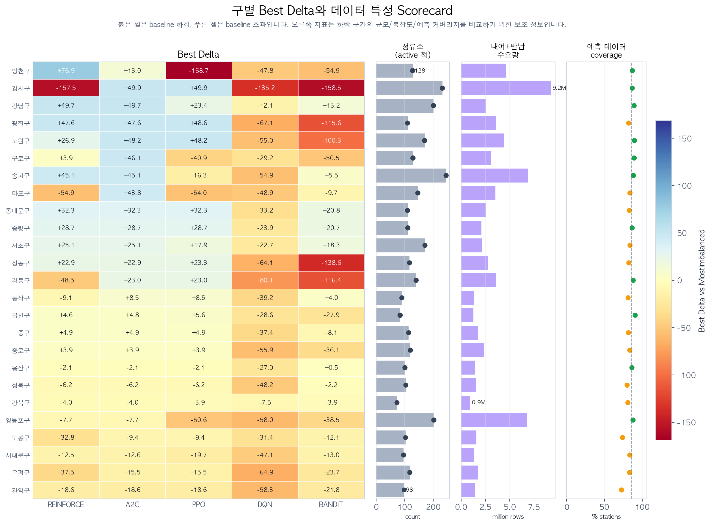
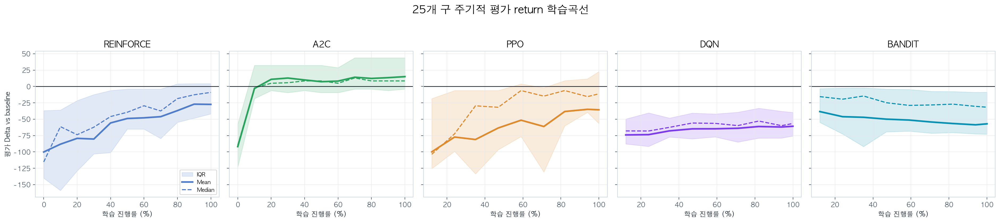
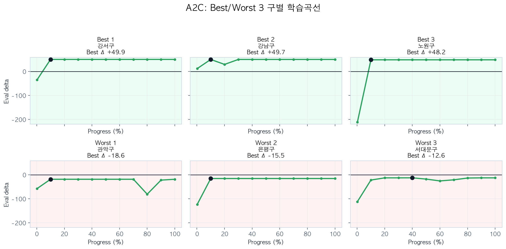
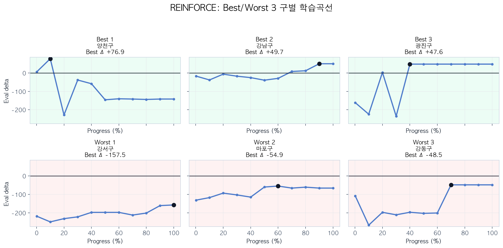
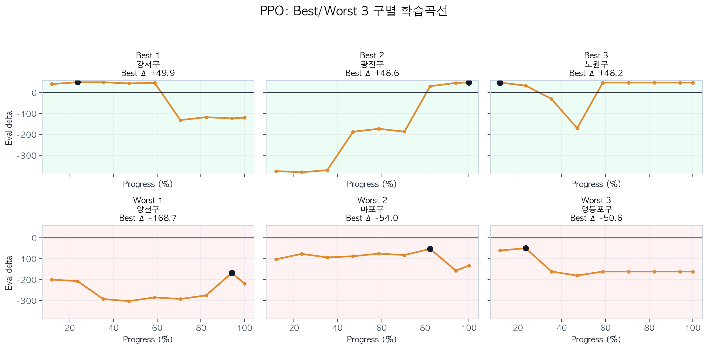
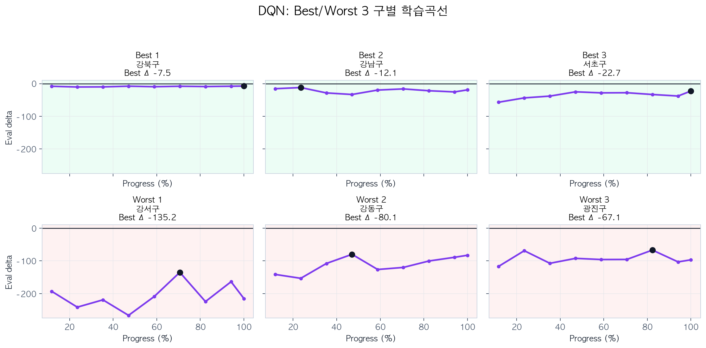
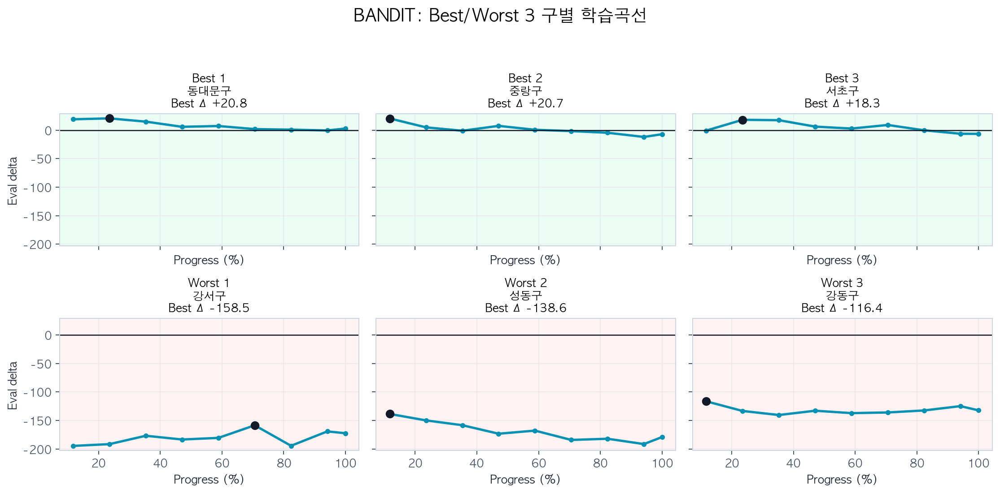
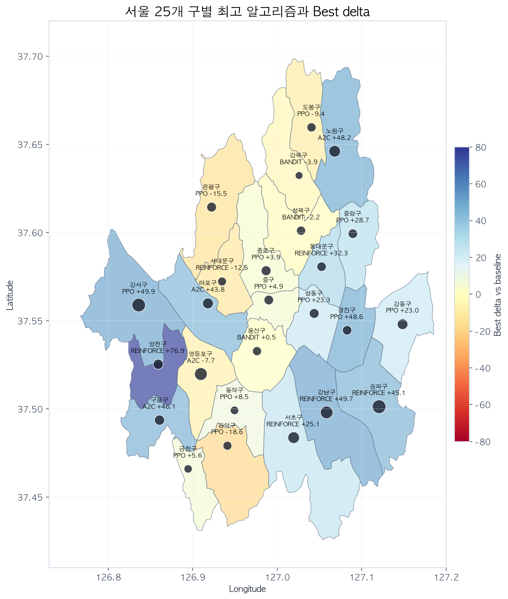
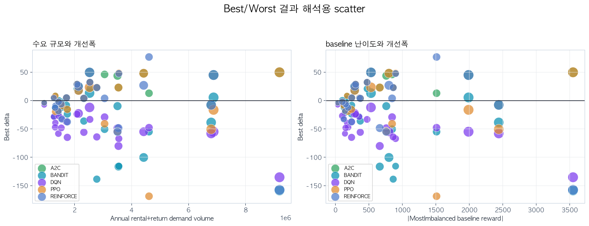

# 수요예측 기반 Top-K 후보 구조를 활용한 서울 따릉이 재배치 강화학습

**서울 25개 구 실험에서 A2C가 가장 안정적이었고 Bandit은 단기 후보 선택의 한계를 보여준 알고리즘 비교**

작성일: 2026-06-07

---

## Abstract

본 연구는 서울 25개 구 따릉이 정류소 재배치 문제를 **강화학습(Reinforcement Learning, RL)** 으로 해결할 수 있는지 검증한다. 재배치 문제는 현재 재고뿐 아니라 앞으로 어느 정류소에서 대여와 반납이 집중될지에 영향을 받는다. 따라서 단순히 현재 가장 불균형한 정류소를 방문하는 규칙만으로는 선제적인 대응에 한계가 있다.

본 실험에서는 세 가지 설계를 적용했다. 첫째, 10분 단위 대여/반납 데이터를 이용해 구별 **1시간 수요예측 feature**를 만들고 상태(state)에 추가했다. 둘째, 전체 정류소 행동(action)을 직접 선택하는 대신 매 step마다 수요예측 기반 **Top-K 후보 정류소 12개**를 구성했다. 셋째, 서울 25개 구를 같은 평가 날짜와 같은 baseline 기준으로 비교해 지역별 성능 차이를 분석했다.

현재 보고서의 비교 알고리즘은 **REINFORCE with Value Baseline, A2C, PPO, Double DQN, Contextual Bandit(LinUCB)** 이다. 모든 성능은 고정된 7개 평가일 평균 reward와 `MostImbalanced` baseline 대비 Delta로 평가했다. 결과적으로 **A2C가 평균 Best Delta +16.9, 평균 Final Delta +15.0로 가장 안정적**이었다. REINFORCE와 PPO는 Best checkpoint 기준 가능성은 있었지만 Final 안정성이 낮았고, DQN은 Top-K rank action 구조에서 Q-value 학습이 가장 어려웠다. Bandit은 일부 구에서 빠르게 baseline을 넘었지만 장기 재배치 효과를 학습하지 못하는 한계가 있었다.

---

## 1. 서론 (Introduction)

공공 자전거 공유 시스템에서 재배치는 운영 품질을 좌우하는 핵심 문제다. 특정 정류소에 자전거가 부족하면 대여 실패가 발생하고, 특정 정류소가 가득 차면 반납 실패가 발생한다. 재배치 트럭은 제한된 시간 안에서 어느 정류소를 먼저 방문할지 순차적으로 결정해야 한다.

이 문제는 강화학습의 관점에서 자연스럽게 해석된다. 상태는 현재 재고, 시간, 트럭 상태, 예측 수요를 포함하고, 행동은 다음 방문 정류소 선택이며, 보상은 stockout/full과 이동 비용을 반영한 하루 누적 점수다.

초기 실험에서 단순 RL agent는 강한 규칙 기반 baseline을 넘기 어려웠다. 주요 원인은 행동 공간(action space)이 크고, 보상(reward)이 하루 운영 결과로 늦게 반영되며, 현재 상태만으로는 미래 수요 집중을 충분히 볼 수 없다는 점이었다. 이에 따라 본 실험은 알고리즘만 바꾸는 방식이 아니라 **상태와 행동 구조를 학습 가능한 형태로 재구성**하는 방향으로 진행했다.

본 연구의 기여는 다음과 같다.

- **서울 25개 구 확장 실험**: 단일 구 중심 실험이 아니라 25개 구를 같은 방식으로 학습하고 평가했다.
- **수요예측 기반 상태 설계**: 1시간 예측 대여/반납 정보를 상태에 포함했다.
- **Top-K 행동 후보 구조**: 매 step마다 의미 있는 후보 정류소 12개를 만들고 그 안에서 policy가 선택하도록 했다.
- **Best/Final 분리 평가**: 학습 중 최고 성능과 마지막 성능을 분리해 성능 가능성과 안정성을 함께 해석했다.

---

## 2. 관련 연구 (Related Work)

공유 자전거 재배치 문제는 vehicle routing, inventory rebalancing, demand forecasting이 결합된 동적 운영 문제로 연구되어 왔다. Liu et al.(2016)은 multi-source data를 이용해 정류소별 수요와 재고 목표를 함께 고려했고, TAGCN 계열 연구는 graph 구조와 시간 attention을 이용해 정류소별 대여/반납 수요를 예측했다.

강화학습 기반 재배치 연구에서는 dynamic vehicle routing problem과 bike rebalancing을 MDP로 정의하고, policy가 시간에 따라 다음 방문지 또는 dispatch action을 선택하도록 학습한다. 최근 연구들은 historical usage, weather, station attributes, demand forecast를 state에 넣는 방향을 사용한다.

또한 RL에서 고차원 관측을 그대로 쓰지 않고 latent representation으로 압축해 policy 입력으로 사용하는 연구도 있다. Ha and Schmidhuber의 World Models는 비지도 방식으로 환경 표현을 압축하고 그 feature를 agent 입력으로 사용할 수 있음을 보였고, PlaNet은 latent dynamics를 학습해 latent 공간에서 planning을 수행했다. DeepMDP는 단순 복원(reconstruction)보다 reward와 다음 latent state를 잘 예측하는 representation이 RL에 더 직접적으로 유용하다는 관점을 제시한다.

본 실험은 이 흐름과 맞닿아 있다. 핵심은 복잡한 알고리즘을 추가하는 것보다, **agent가 볼 수 있는 상태에 미래 수요를 넣고**, **탐색해야 하는 행동 후보를 줄여 학습 신호를 선명하게 만드는 것**이다. 추가로 VAE latent 실험은 과거 수요 패턴을 압축한 feature가 기존 수요예측 state를 보완할 수 있는지 확인하기 위한 확장 실험으로 배치했다.

---

## 3. 용어 정리 (Terminology)

| 용어 | 의미 |
|---|---|
| MostImbalanced | 현재 재고가 목표 재고에서 가장 많이 벗어난 정류소를 우선 방문하는 규칙 기반 baseline |
| Reward | stockout, full, 이동거리 비용을 음수로 합산한 하루 점수. 0에 가까울수록 좋음 |
| Delta | 모델 평가 reward - baseline reward. 양수이면 baseline보다 좋음 |
| Best checkpoint | 학습 중 고정 평가일 평균 reward가 가장 좋았던 시점 |
| Final checkpoint | 학습이 끝난 마지막 시점. Best와의 차이는 학습 안정성을 보여줌 |
| Top-K action | 전체 정류소를 직접 고르지 않고 수요예측 점수 상위 12개 후보 중 선택하는 구조 |

---

## 4. 문제 정의 (Problem Formulation)

### 4.1 환경 설정

서울 25개 구를 각각 독립된 재배치 실험 단위로 두었다. episode 하나는 하루 운영을 의미하며, 10분 단위 대여/반납 데이터를 시간 순서대로 replay하면서 정류소 재고가 변한다. 재배치 agent는 매 decision step마다 다음 방문 정류소를 선택한다.

공공 데이터에는 실시간 재고 스냅샷이 충분히 포함되어 있지 않으므로, 환경은 초기 재고를 설정한 뒤 시간별 대여/반납 기록을 반영해 재고를 갱신한다.

### 4.2 State

| 범주 | 구성 요소 |
|---|---|
| 정류소 상태 | 현재 재고 비율, capacity, target 대비 편차 |
| 수요예측 | 1시간 예측 대여량, 반납량, 순수요, 예측 재고 편차 |
| 트럭 상태 | 현재 위치, 적재량, 이동 상태 |
| 시간 정보 | 10분 time step, 평가 날짜의 시간 흐름 |
| 후보 feature | Top-K 후보별 점수, 거리 penalty, 권역 penalty |

수요예측 feature는 다음 식으로 사용된다.

```text
pred_net_1h = pred_returns_1h - pred_rentals_1h
projected_bikes = current_bikes + pred_net_1h
projected_deviation = (projected_bikes - target_bikes) / capacity
```

`projected_deviation`이 음수이면 1시간 뒤 재고 부족 가능성이 크고, 양수이면 거치 공간 포화 가능성이 크다는 의미다.

### 4.3 Action

기본적으로 정류소 재배치 action은 "다음에 방문할 정류소 선택"이다. 하지만 구마다 정류소 수가 많기 때문에 전체 정류소를 직접 action으로 두면 탐색 공간이 커진다. 본 실험에서는 매 step마다 수요예측 기반 후보 12개를 생성하고, agent는 이 후보 중 하나를 선택한다.

```text
candidate_score =
    forecast_imbalance
  - candidate_travel_coef * travel_distance
  - zone_penalty
```

### 4.4 Reward와 평가 지표

Reward는 서비스 실패와 이동 비용을 음수로 합산한다. 따라서 reward는 **0에 가까울수록 좋다**.

```text
r_t = -1.0 * stockout
      -0.8 * full
      -0.008 * travel_km
      -0.002 * travel_step
```

평가 지표는 고정된 7개 날짜에서 episode reward를 평균한 값이다. 서로 다른 구는 reward scale이 다르므로 raw reward보다 baseline 대비 Delta를 중심으로 해석한다.

```text
Delta = model_eval_reward - MostImbalanced_eval_reward
```

### 4.5 Baseline: MostImbalanced

`MostImbalanced`는 학습 없이 현재 목표 재고에서 가장 크게 벗어난 정류소를 방문하는 규칙 기반 정책이다. 현재 상태만으로도 강하게 작동하는 baseline이므로, 본 실험에서는 이 baseline을 넘는지 여부를 주요 기준으로 삼았다.

---

## 5. 방법론 (Methodology)

### 5.1 데이터 구성과 수요예측

서울 전체 전처리 데이터는 정류소 테이블과 10분 단위 대여/반납 테이블로 구성된다.

| 데이터 | 현재 보고서 기준 |
|---|---:|
| 구 수 | 25 |
| 분석 대상 정류소 수 | 3313 |
| active 정류소 수 | 2808 |
| 10분 대여/반납 row 수 | 40,565,021 |
| 구별 forecast parquet | 25개 |

수요예측 파일은 구별로 생성되며, 각 row는 특정 시각과 정류소의 1시간 예측 대여량, 반납량, 순수요를 담는다.

### 5.2 Top-K 후보 구조

Top-K 구조는 agent가 정류소 전체를 무작위로 탐색하지 않도록 돕는다. 후보는 예측 불균형, 이동거리, 권역 penalty를 함께 고려해 만들어진다. policy network의 action index는 "정류소 ID"가 아니라 "현재 step의 후보 rank"를 의미한다.

이 방식은 action space를 줄이는 장점이 있지만, 매 step마다 후보 목록이 바뀌므로 PPO처럼 policy 변화 안정성을 전제로 하는 알고리즘에는 추가 variance를 만들 수 있다.

### 5.3 Best/Final Checkpoint 해석

학습 중 주기적으로 고정 평가일을 다시 실행하고, 가장 좋은 평가 성능을 Best checkpoint로 저장한다. Final checkpoint는 학습 종료 시점이다.

Best는 "해당 설정에서 도달 가능한 성능"을 보여주고, Final은 "학습이 안정적으로 유지되는지"를 보여준다. 두 값을 함께 봐야 RL fine-tuning 중 policy가 무너지는지 판단할 수 있다.

### 5.4 VAE latent state 보강

VAE(Variational Autoencoder)는 정책을 직접 학습하는 알고리즘이 아니라, **과거 수요 패턴을 낮은 차원의 latent feature로 압축하는 표현학습 모듈**이다. 본 실험에서는 정류소별 같은 요일과 시간대의 대여 평균, 반납 평균, 순수요 평균, 총수요 평균, 순수요 표준편차를 VAE 입력으로 사용했다. 학습된 latent vector는 기존 observation 뒤에 추가했다.

```text
input_profile = [rental_mean, return_mean, net_mean, total_mean, net_std]
z = VAE_encoder(input_profile)
state_plus = concat(original_state, forecast_features, z)
```

따라서 VAE 실험은 imitation learning이나 policy 초기화가 아니다. 목적은 "수요예측 feature만으로 부족한 지역별 반복 패턴을 latent state로 보완할 수 있는가"를 확인하는 것이다.

---

## 6. 알고리즘 (Algorithms)

### 6.1 REINFORCE with Value Baseline

REINFORCE는 episode 종료 후 reward-to-go를 계산하여 policy를 업데이트하는 Monte Carlo policy gradient 알고리즘이다. Value network는 baseline으로 사용해 advantage의 분산을 줄인다.

```python
returns = discounted_reward_to_go(rewards, gamma)
advantages = returns - value_net(states)

policy_loss = -(log_probs * advantages.detach()).mean()
value_loss = mse_loss(value_net(states), returns)
```

### 6.2 A2C

A2C는 actor(policy)와 critic(value)을 함께 학습한다. TD target을 사용하므로 REINFORCE보다 더 자주 업데이트할 수 있고, 이번 실험에서는 가장 안정적인 평균 성능을 보였다.

```python
target = reward + gamma * (1 - done) * value(next_state)
advantage = target - value(state)

actor_loss = -(log_prob(action) * advantage.detach()).mean()
critic_loss = mse_loss(value(state), target)
```

### 6.3 PPO

PPO는 policy가 한 번에 너무 크게 변하지 않도록 clipped objective를 사용한다. 본 실험에서는 action mask를 지원하는 MaskablePPO를 사용해 Top-K 후보 밖의 action은 선택되지 않도록 했다.

```text
r_t(theta) = pi_theta(a_t | s_t) / pi_old(a_t | s_t)
L_clip = min(
    r_t(theta) * A_t,
    clip(r_t(theta), 1 - epsilon, 1 + epsilon) * A_t
)
```

### 6.4 Double DQN

DQN은 Q-network가 각 action의 가치를 추정하고, replay buffer에서 뽑은 transition으로 TD target을 학습한다. 본 실험에서는 Q-value 과대추정을 줄이기 위해 Double DQN을 사용했고, 실행 설정에서는 Dueling Q-network도 함께 사용했다. 평가 reward는 원본 reward 그대로이며, 학습 TD target 안정화를 위해 학습 reward에만 `reward_scale=0.01`을 적용했다.

```text
a* = argmax_a Q_online(s', a)
y = r + gamma * Q_target(s', a*)
loss = Huber(Q_online(s, a), y)
```

### 6.5 Contextual Bandit (LinUCB)

Contextual Bandit은 현재 state의 Top-K 후보 feature를 보고, 이번 step에서 어떤 후보를 고를지 학습한다. REINFORCE/A2C/PPO/DQN과 달리 다음 state 이후의 장기 return을 직접 bootstrapping하지 않는다. 본 실험에서는 LinUCB를 사용해 예측 reward와 uncertainty bonus를 함께 고려했다.

```text
theta_a = inv(A_a) b_a
score_a = theta_a^T x_a + alpha * sqrt(x_a^T inv(A_a) x_a)
A_a <- A_a + x_a x_a^T
b_a <- b_a + reward * x_a
```

---

## 7. 실험 설정 (Experimental Setup)

| 항목 | 값 |
|---|---|
| 범위 | 서울 25개 구 |
| 학습 데이터 | 구별 train pool 200일 |
| 평가 날짜 | 2025-03-25, 2025-04-18, 2025-05-17, 2025-07-01, 2025-07-06, 2025-07-09, 2025-08-21 |
| 평가 지표 | 7개 평가일 평균 reward |
| baseline | `MostImbalanced` |
| 후보 action 수 | Top-K 12 |
| 수요예측 horizon | 6개 10분 구간, 즉 1시간 |
| candidate mode | `forecast_imbalance` |
| travel penalty coefficient | 0.20 |
| zone mode | `static3` |
| BC 사용 여부 | 현재 결과는 no-BC |
| rollback 사용 여부 | 현재 interactive full run은 rollback 없음 |
| REINFORCE/A2C 학습량 | 500 episodes |
| PPO 학습량 | 170,000 timesteps |
| DQN 학습량 | 170,000 timesteps |
| Bandit 학습량 | 170,000 timesteps |

### 7.1 주요 하이퍼파라미터

| 알고리즘 | 주요 설정 |
|---|---|
| REINFORCE | gamma=0.99, hidden=256, lr_policy=3e-4, lr_value=1e-3, normalize_advantages=True |
| A2C | gamma=0.99, hidden=256, lr_policy=1e-4, lr_value=3e-4, batch_size=32, memory_size=200 |
| PPO | gamma=0.99, gae_lambda=0.95, learning_rate=1e-4, clip_range=0.1, ent_coef=0.003, target_kl=0.03, n_steps=256, batch_size=128, n_epochs=5 |
| DQN | Double DQN=True, Dueling=True, masked target Q=True, reward_scale=0.01, initial_eps=0.3, final_eps=0.02 |
| Bandit | LinUCB, alpha=0.5, l2=1.0, reward_scale=0.01 |

---

## 8. 실험 결과 (Results)

### 8.1 알고리즘별 전체 요약

| Algorithm | 구 수 | Best 승리 구 | Final 승리 구 | Mean Best Δ | Median Best Δ | Mean Final Δ |
|---|---:|---:|---:|---:|---:|---:|
| A2C | 25.0 | 17.0 | 17.0 | 16.9 | 13.0 | 15.0 |
| REINFORCE | 25.0 | 13.0 | 9.0 | -0.8 | 3.9 | -27.4 |
| PPO | 25.0 | 13.0 | 10.0 | -3.5 | 3.9 | -35.7 |
| DQN | 25.0 | 0.0 | 0.0 | -47.1 | -47.8 | -60.9 |
| BANDIT | 25.0 | 7.0 | 1.0 | -34.0 | -13.0 | -57.1 |

**A2C**는 Best와 Final 모두 평균적으로 가장 안정적이었다. **REINFORCE**는 일부 구에서 큰 개선을 만들었지만 평균 Final Delta가 낮아 학습 후반 안정성 문제가 있었다. **PPO**는 Best checkpoint에서는 baseline을 넘는 구가 있었지만 Final에서 하락하는 경우가 많았다. **DQN**은 Double DQN과 Dueling Q-network를 사용했음에도 baseline을 넘지 못해, 현재 Top-K rank action 구조에서는 Q-value 기반 학습이 가장 어려운 것으로 나타났다. **Bandit**은 학습 속도는 가장 빠르지만, 장기 재고 변화와 이동 경로 효과를 직접 학습하지 못해 구별 편차가 컸다.

Figure 1은 기존 막대 분포 대신 **구별 scorecard**로 구성했다. 왼쪽 다섯 열은 알고리즘별 Best Delta이고, 오른쪽은 정류소 수, 전체 수요량, forecast coverage이다. 붉은 셀이 몰린 구는 baseline을 넘지 못한 구이며, 오른쪽 지표를 함께 보면 단순 알고리즘 문제인지, 수요 규모가 큰 구의 reward scale 문제인지, 예측 데이터 coverage가 낮은 문제인지 비교할 수 있다.



### 8.2 학습곡선

아래 그림은 train reward가 아니라, 학습 중 주기적으로 고정 평가일을 다시 실행한 **주기적 평가 return**이다. 실선은 25개 구 평균 Delta, 점선은 중앙값, 음영은 IQR이다.



학습곡선에서 A2C는 초반에 빠르게 baseline 근처까지 올라온 뒤 비교적 안정적으로 유지된다. REINFORCE는 후반 개선 구간이 있으나 구별 편차가 크다. PPO는 일부 구에서 강하게 개선되지만 Final로 갈수록 정책이 흔들리는 구가 있어 Best/Final 차이가 커진다. DQN은 Q-value bootstrapping을 사용하지만, 현재 후보 rank action의 의미가 매 step 바뀌기 때문에 평균적으로 baseline 아래에 머무는 경향이 나타났다. Bandit은 빠르게 수렴하지만, 단기 후보 선택만 학습하기 때문에 지역에 따라 baseline을 넘는 구와 크게 하락하는 구가 함께 나타났다.

### 8.3 Best 3 / Worst 3 구 분석

| Algorithm | 구분 | 구 | 정류소 | Active | 수요량 | Baseline | Best | Final | Best Δ | Final Δ | Best step |
|---|---|---|---:|---:|---:|---:|---:|---:|---:|---:|---:|
| A2C | Best | 강서구 | 232.0 | 201.0 | 9191249.0 | -3549.0 | -3499.1 | -3499.1 | 49.9 | 49.9 | 50.0 |
| A2C | Best | 강남구 | 201.0 | 179.0 | 2526424.0 | -531.7 | -482.0 | -482.0 | 49.7 | 49.7 | 50.0 |
| A2C | Best | 노원구 | 170.0 | 152.0 | 4424799.0 | -800.3 | -752.1 | -752.1 | 48.2 | 48.2 | 50.0 |
| A2C | Worst | 서대문구 | 96.0 | 80.0 | 1318854.0 | -191.4 | -204.0 | -204.2 | -12.6 | -12.7 | 200.0 |
| A2C | Worst | 은평구 | 118.0 | 98.0 | 1746039.0 | -241.8 | -257.3 | -257.3 | -15.5 | -15.5 | 50.0 |
| A2C | Worst | 관악구 | 98.0 | 71.0 | 1432418.0 | -143.5 | -162.1 | -162.1 | -18.6 | -18.6 | 50.0 |
| BANDIT | Best | 동대문구 | 110.0 | 91.0 | 2537854.0 | -473.8 | -453.0 | -470.9 | 20.8 | 3.0 | 40000.0 |
| BANDIT | Best | 중랑구 | 111.0 | 96.0 | 2087258.0 | -301.3 | -280.6 | -308.3 | 20.7 | -7.0 | 20000.0 |
| BANDIT | Best | 서초구 | 171.0 | 143.0 | 2137382.0 | -288.8 | -270.6 | -295.2 | 18.3 | -6.4 | 40000.0 |
| BANDIT | Worst | 강동구 | 140.0 | 123.0 | 3540785.0 | -662.9 | -779.3 | -795.2 | -116.4 | -132.3 | 20000.0 |
| BANDIT | Worst | 성동구 | 117.0 | 96.0 | 2779995.0 | -863.7 | -1002.3 | -1042.8 | -138.6 | -179.1 | 20000.0 |
| BANDIT | Worst | 강서구 | 232.0 | 201.0 | 9191249.0 | -3549.0 | -3707.5 | -3721.5 | -158.5 | -172.4 | 120000.0 |
| DQN | Best | 강북구 | 73.0 | 59.0 | 934477.0 | -35.2 | -42.8 | -42.8 | -7.5 | -7.5 | 170000.0 |
| DQN | Best | 강남구 | 201.0 | 179.0 | 2526424.0 | -531.7 | -543.7 | -550.9 | -12.1 | -19.2 | 40000.0 |
| DQN | Best | 서초구 | 171.0 | 143.0 | 2137382.0 | -288.8 | -311.6 | -311.6 | -22.7 | -22.7 | 170000.0 |
| DQN | Worst | 광진구 | 110.0 | 90.0 | 3553277.0 | -899.5 | -966.6 | -996.5 | -67.1 | -97.0 | 140000.0 |
| DQN | Worst | 강동구 | 140.0 | 123.0 | 3540785.0 | -662.9 | -743.0 | -745.9 | -80.1 | -83.0 | 80000.0 |
| DQN | Worst | 강서구 | 232.0 | 201.0 | 9191249.0 | -3549.0 | -3684.2 | -3764.5 | -135.2 | -215.5 | 120000.0 |
| PPO | Best | 강서구 | 232.0 | 201.0 | 9191249.0 | -3549.0 | -3499.1 | -3668.7 | 49.9 | -119.6 | 40000.0 |
| PPO | Best | 광진구 | 110.0 | 90.0 | 3553277.0 | -899.5 | -850.9 | -850.9 | 48.6 | 48.6 | 170000.0 |
| PPO | Best | 노원구 | 170.0 | 152.0 | 4424799.0 | -800.3 | -752.1 | -752.1 | 48.2 | 48.2 | 20000.0 |
| PPO | Worst | 영등포구 | 202.0 | 177.0 | 6793154.0 | -2440.1 | -2490.7 | -2602.1 | -50.6 | -162.0 | 40000.0 |
| PPO | Worst | 마포구 | 146.0 | 122.0 | 3506436.0 | -760.2 | -814.2 | -894.6 | -54.0 | -134.4 | 140000.0 |
| PPO | Worst | 양천구 | 128.0 | 111.0 | 4612053.0 | -1511.2 | -1679.9 | -1731.2 | -168.7 | -219.9 | 160000.0 |
| REINFORCE | Best | 양천구 | 128.0 | 111.0 | 4612053.0 | -1511.2 | -1434.3 | -1652.9 | 76.9 | -141.7 | 50.0 |
| REINFORCE | Best | 강남구 | 201.0 | 179.0 | 2526424.0 | -531.7 | -482.0 | -482.0 | 49.7 | 49.7 | 450.0 |
| REINFORCE | Best | 광진구 | 110.0 | 90.0 | 3553277.0 | -899.5 | -851.9 | -851.9 | 47.6 | 47.6 | 200.0 |
| REINFORCE | Worst | 강동구 | 140.0 | 123.0 | 3540785.0 | -662.9 | -711.4 | -711.4 | -48.5 | -48.5 | 350.0 |
| REINFORCE | Worst | 마포구 | 146.0 | 122.0 | 3506436.0 | -760.2 | -815.2 | -826.3 | -54.9 | -66.1 | 300.0 |
| REINFORCE | Worst | 강서구 | 232.0 | 201.0 | 9191249.0 | -3549.0 | -3706.5 | -3706.5 | -157.5 | -157.5 | 500.0 |

아래 그림은 알고리즘별 Best/Worst 3 구를 분리한 것이다. 각 박스는 하나의 구이며, 초록 배경은 Best 3, 붉은 배경은 Worst 3을 의미한다. 검은 점은 해당 구에서 가장 좋았던 평가 시점을 나타낸다.











### 8.4 서울 지도 시각화

아래 지도는 각 구에서 가장 좋은 알고리즘과 Best Delta를 표시한다. 점 크기는 구별 정류소 수에 비례하고, 색은 Best Delta의 크기를 나타낸다.



### 8.5 원인 분석용 Scatter

수요 규모와 baseline 난이도를 함께 보면, 성능 차이가 단순히 알고리즘 차이만으로 설명되지 않는다는 점을 볼 수 있다. 수요량이 많고 baseline reward scale이 큰 구는 한 번의 잘못된 이동이 더 큰 reward 손실로 이어질 수 있다.



---

## 9. 논의 (Discussion)

### 9.1 지역별 편차의 의미

구별 성능 차이는 세 가지 요인으로 해석할 수 있다.

1. **수요의 시공간 집중도**: 특정 시간과 지역에 수요가 강하게 몰리면 Top-K 후보가 실제 문제 정류소를 잘 잡을 때 개선폭이 커진다.
2. **baseline 난이도**: `MostImbalanced`가 이미 잘 작동하는 구에서는 RL이 추가로 개선할 여지가 작다.
3. **reward scale**: 수요량이 큰 구는 stockout/full 실패 수가 커져 reward 절댓값도 커진다. 따라서 raw reward보다 baseline 대비 Delta가 더 공정하다.

### 9.2 알고리즘별 해석

**A2C**는 평균 Best Δ와 Final Δ가 모두 가장 안정적이다. TD 기반 advantage를 사용하기 때문에 episode 전체 reward를 기다리는 REINFORCE보다 업데이트 신호가 빠르고, PPO보다 현재 Top-K rank action 구조에 덜 민감하게 작동한 것으로 해석된다.

**REINFORCE**는 일부 구에서 큰 개선을 만들지만 Final 안정성이 낮다. Monte Carlo return을 사용하기 때문에 reward 분산이 크고, 구별 수요 패턴에 따라 학습곡선의 흔들림이 커질 수 있다.

**PPO**는 clipping과 target KL을 사용하므로 일반적으로 안정적이라고 알려져 있지만, 이번 구조에서는 구별 편차가 컸다. Top-K rank 행동은 매 step마다 행동 index의 의미가 바뀌므로, PPO가 기대하는 완만한 policy update가 항상 좋은 방향으로 누적되지 않을 수 있다. 따라서 PPO는 Best checkpoint와 Final checkpoint를 반드시 함께 봐야 한다.

**DQN**은 Double DQN으로 target action 선택과 target value 평가를 분리하고, Dueling Q-network로 상태 가치와 action advantage를 나누어 추정했다. 그럼에도 평균 Best Delta와 Final Delta가 가장 낮았다. 주된 원인은 세 가지로 해석된다. 첫째, Top-K wrapper에서 action index는 고정 정류소가 아니라 현재 후보 rank이므로 같은 action 번호의 의미가 state마다 바뀐다. 둘째, 재배치 reward는 이동 후 여러 step에 걸쳐 재고 변화로 나타나기 때문에 Q-learning의 TD target이 noisy해진다. 셋째, forecast feature와 이동거리 penalty가 함께 작용하면서 특정 rank의 Q-value가 쉽게 포화되거나 잘못된 후보에 과대평가가 누적될 수 있다. 따라서 현재 설정에서 DQN은 baseline을 넘기보다 action 후보 구조와 reward scale에 더 민감하게 반응했다.

**Contextual Bandit**은 현재 후보 feature와 즉시 reward만 사용하므로 학습이 매우 빠르다. 실제 실행에서도 25개 구 전체를 비교적 짧은 시간에 돌릴 수 있었다. 그러나 이 방법은 다음 state 이후의 재고 변화와 트럭 위치 효과를 장기 return으로 보지 않는다. 따라서 강남구처럼 단기 Top-K 선택만으로 개선되는 구에서는 baseline을 넘을 수 있지만, 강동구처럼 현재 선택이 이후 이동 경로와 재고 균형에 크게 영향을 주는 구에서는 성능이 크게 떨어졌다. 이 결과는 따릉이 재배치가 단순한 후보 선택 문제만은 아니며, 일부 지역에서는 장기 순차 의사결정으로 다루어야 함을 보여준다.

### 9.3 연구 근거와 연결

자전거 재배치 선행연구들은 station-level demand prediction, inventory target, spatial-temporal feature가 중요하다고 보고한다. 본 실험의 결과도 같은 방향이다. 단순히 RL 알고리즘을 적용하는 것만으로는 baseline을 넘기 어렵고, **미래 수요를 state에 넣고 action 후보를 재구성해야 학습 신호가 살아난다**.

### 9.4 VAE latent 실험 해석

현재 완료된 25개 구 VAE-REINFORCE 실험에서는 Best 기준 10개 구, Final 기준 6개 구가 baseline을 넘었다. 평균 Best Delta는 -3.9, 평균 Final Delta는 -37.4였다.

| 구분 | 구 | Baseline | Best | Final | Best Δ | Final Δ | Best episode |
|---|---|---:|---:|---:|---:|---:|---:|
| 개선 상위 | 양천구 | -1511.2 | -1460.3 | -1460.3 | 50.9 | 50.9 | 100.0 |
| 개선 상위 | 강서구 | -3549.0 | -3499.1 | -3596.9 | 49.9 | -47.8 | 50.0 |
| 개선 상위 | 노원구 | -800.3 | -756.5 | -829.9 | 43.8 | -29.5 | 50.0 |
| 개선 상위 | 마포구 | -760.2 | -716.5 | -910.2 | 43.8 | -150.0 | 200.0 |
| 개선 상위 | 동대문구 | -473.8 | -441.6 | -441.6 | 32.3 | 32.3 | 200.0 |
| 하락 상위 | 광진구 | -899.5 | -979.9 | -982.7 | -80.3 | -83.2 | 400.0 |
| 하락 상위 | 송파구 | -1988.4 | -2055.9 | -2092.1 | -67.4 | -103.7 | 1.0 |
| 하락 상위 | 금천구 | -357.1 | -393.6 | -393.6 | -36.5 | -36.5 | 500.0 |
| 하락 상위 | 성북구 | -154.3 | -190.2 | -190.2 | -36.0 | -36.0 | 150.0 |
| 하락 상위 | 성동구 | -863.7 | -895.7 | -905.9 | -32.0 | -42.2 | 150.0 |

VAE 실험의 의미는 "모든 구에서 성능이 좋아졌다"가 아니라, **latent feature가 어떤 구에서는 수요 패턴을 보완하지만 다른 구에서는 정책 입력을 더 복잡하게 만들어 성능을 낮출 수 있다**는 점이다. 특히 reconstruction 중심 VAE는 수요 패턴을 잘 압축하더라도 reward에 중요한 정보만 골라 압축한다고 보장할 수 없다. DeepMDP 계열 연구가 reward prediction과 next-state prediction을 함께 강조하는 이유도 여기에 있다.

따라서 현재 VAE는 최종 기본 모델이 아니라 추가 ablation으로 해석하는 것이 적절하다. 후속으로는 beta, latent dimension을 바꾸는 단순 튜닝보다, latent가 reward 또는 projected imbalance를 예측하도록 auxiliary loss를 붙이는 방향이 더 타당하다.

### 9.5 한계

현재 실험은 구별 독립 학습이다. 실제 서울 전체 운영에서는 구 경계를 넘는 이동, 트럭 배치 수, depot 위치, 실시간 재고 스냅샷이 함께 고려되어야 한다. 또한 현재 수요예측은 1시간 horizon에 초점을 두므로, 장기 수요 변화와 이벤트성 수요는 충분히 반영하지 못할 수 있다.

---

## 10. 결론 (Conclusion)

현재 25개 구 결과에서 REINFORCE, A2C, PPO, DQN, Bandit을 비교하면, **A2C가 가장 안정적인 선택**이다. REINFORCE는 개선 가능성은 크지만 구별 편차가 있고, PPO는 Best checkpoint 기준 가능성은 있으나 Final 안정성이 약하다. DQN은 Double DQN과 Dueling 구조를 적용했지만 Top-K rank action과 delayed reward 조합에서 Q-value 학습이 충분히 안정화되지 못했다. Bandit은 빠른 진단 모델로는 유용하지만, 전체 문제를 대체하기에는 장기 재배치 효과를 보지 못한다.

이 결과의 함의는 단순히 "어떤 알고리즘이 가장 좋은가"에서 끝나지 않는다. 향후 연구에서는 구별 독립 학습을 넘어 구 간 이동, 트럭 배치 수, depot 위치, 실시간 재고 스냅샷을 함께 반영해야 한다. 또한 Top-K 후보가 실패한 구에서는 후보 생성 점수와 수요예측 coverage를 함께 진단해야 한다.

> 서울 따릉이 재배치 문제에서는 알고리즘 선택만큼 **상태와 행동 구조 설계**가 중요하다. 1시간 수요예측과 Top-K 후보 행동 구조는 RL이 baseline을 넘어설 수 있는 조건을 만들었고, 그 효과는 구별 수요 패턴과 baseline 난이도에 따라 다르게 나타났다.

---

## References

1. Liu, J. et al. (2016). Rebalancing Bike Sharing Systems: A Multi-source Data Smart Optimization. *KDD*. https://www.kdd.org/kdd2016/papers/files/rfp0553-liuAT3.pdf
2. Chai, D. et al. (2021). TAGCN: Station-level demand prediction for bike-sharing system via a temporal attention graph convolution network. *Information Sciences*. https://www.sciencedirect.com/science/article/abs/pii/S0020025521001031
3. Pan, L. et al. (2024). A Reinforcement Learning Approach for Dynamic Rebalancing in Bike-Sharing System. *arXiv:2402.03589*. https://arxiv.org/abs/2402.03589
4. Betkier, I., & Dawid, W. (2025). Intelligent Rebalancing: Reinforcement Learning Agent for Optimal Bike-Sharing Distribution Powered by Historical Usage Data. *SSRN*. https://papers.ssrn.com/sol3/papers.cfm?abstract_id=5258933
5. Li, Y. et al. (2018). A Deep Reinforcement Learning Framework for Rebalancing Dockless Bike Sharing Systems. *AAAI*. https://ojs.aaai.org/index.php/AAAI/article/download/3940/3818
6. Schulman, J. et al. (2017). Proximal Policy Optimization Algorithms. *arXiv:1707.06347*. https://arxiv.org/abs/1707.06347
7. Williams, R. J. (1992). Simple statistical gradient-following algorithms for connectionist reinforcement learning. *Machine Learning*.
8. Sutton, R. S., & Barto, A. G. (2018). *Reinforcement Learning: An Introduction*.
9. Seoul administrative boundary GeoJSON. https://github.com/southkorea/seoul-maps
10. Ha, D., & Schmidhuber, J. (2018). World Models. *arXiv:1803.10122*. https://arxiv.org/abs/1803.10122
11. Hafner, D. et al. (2019). Learning Latent Dynamics for Planning from Pixels. https://planetrl.github.io/
12. Gelada, C. et al. (2019). DeepMDP: Learning Continuous Latent Space Models for Representation Learning. *ICML*. https://proceedings.mlr.press/v97/gelada19a.html

---

## Appendix A. 전체 구별 결과

| Algorithm | 구 | Baseline | Best | Final | Best Δ | Final Δ | Best step |
|---|---|---:|---:|---:|---:|---:|---:|
| A2C | 강서구 | -3549.0 | -3499.1 | -3499.1 | 49.9 | 49.9 | 50.0 |
| A2C | 강남구 | -531.7 | -482.0 | -482.0 | 49.7 | 49.7 | 50.0 |
| A2C | 노원구 | -800.3 | -752.1 | -752.1 | 48.2 | 48.2 | 50.0 |
| A2C | 광진구 | -899.5 | -851.9 | -851.9 | 47.6 | 47.6 | 100.0 |
| A2C | 구로구 | -847.1 | -800.9 | -800.9 | 46.1 | 46.1 | 50.0 |
| A2C | 송파구 | -1988.4 | -1943.3 | -1943.3 | 45.1 | 45.1 | 50.0 |
| A2C | 마포구 | -760.2 | -716.5 | -716.5 | 43.8 | 43.8 | 50.0 |
| A2C | 동대문구 | -473.8 | -441.6 | -441.6 | 32.3 | 32.3 | 50.0 |
| A2C | 중랑구 | -301.3 | -272.6 | -272.6 | 28.7 | 28.7 | 100.0 |
| A2C | 서초구 | -288.8 | -263.8 | -285.4 | 25.1 | 3.5 | 50.0 |
| A2C | 강동구 | -662.9 | -639.9 | -639.9 | 23.0 | 23.0 | 50.0 |
| A2C | 성동구 | -863.7 | -840.8 | -840.8 | 22.9 | 22.9 | 50.0 |
| A2C | 양천구 | -1511.2 | -1498.2 | -1498.2 | 13.0 | 13.0 | 200.0 |
| A2C | 동작구 | -174.0 | -165.5 | -165.5 | 8.5 | 8.5 | 150.0 |
| A2C | 중구 | -244.3 | -239.4 | -239.4 | 4.9 | 4.9 | 100.0 |
| A2C | 금천구 | -357.1 | -352.3 | -352.5 | 4.8 | 4.6 | 100.0 |
| A2C | 종로구 | -371.9 | -368.0 | -368.0 | 3.9 | 3.9 | 50.0 |
| A2C | 용산구 | -104.4 | -106.5 | -106.5 | -2.1 | -2.1 | 50.0 |
| A2C | 강북구 | -35.2 | -39.2 | -39.2 | -4.0 | -4.0 | 50.0 |
| A2C | 성북구 | -154.3 | -160.5 | -160.5 | -6.2 | -6.2 | 50.0 |
| A2C | 영등포구 | -2440.1 | -2447.8 | -2471.7 | -7.7 | -31.6 | 100.0 |
| A2C | 도봉구 | -124.9 | -134.3 | -134.3 | -9.4 | -9.4 | 50.0 |
| A2C | 서대문구 | -191.4 | -204.0 | -204.2 | -12.6 | -12.7 | 200.0 |
| A2C | 은평구 | -241.8 | -257.3 | -257.3 | -15.5 | -15.5 | 50.0 |
| A2C | 관악구 | -143.5 | -162.1 | -162.1 | -18.6 | -18.6 | 50.0 |
| BANDIT | 동대문구 | -473.8 | -453.0 | -470.9 | 20.8 | 3.0 | 40000.0 |
| BANDIT | 중랑구 | -301.3 | -280.6 | -308.3 | 20.7 | -7.0 | 20000.0 |
| BANDIT | 서초구 | -288.8 | -270.6 | -295.2 | 18.3 | -6.4 | 40000.0 |
| BANDIT | 강남구 | -531.7 | -518.5 | -543.2 | 13.2 | -11.5 | 60000.0 |
| BANDIT | 송파구 | -1988.4 | -1982.9 | -2004.8 | 5.5 | -16.4 | 20000.0 |
| BANDIT | 동작구 | -174.0 | -170.0 | -176.8 | 4.0 | -2.8 | 80000.0 |
| BANDIT | 용산구 | -104.4 | -103.9 | -109.0 | 0.5 | -4.6 | 60000.0 |
| BANDIT | 성북구 | -154.3 | -156.4 | -163.0 | -2.2 | -8.8 | 60000.0 |
| BANDIT | 강북구 | -35.2 | -39.1 | -41.8 | -3.9 | -6.6 | 120000.0 |
| BANDIT | 중구 | -244.3 | -252.4 | -278.0 | -8.1 | -33.7 | 20000.0 |
| BANDIT | 마포구 | -760.2 | -770.0 | -791.5 | -9.7 | -31.3 | 60000.0 |
| BANDIT | 도봉구 | -124.9 | -137.0 | -138.8 | -12.1 | -13.8 | 80000.0 |
| BANDIT | 서대문구 | -191.4 | -204.4 | -207.6 | -13.0 | -16.2 | 80000.0 |
| BANDIT | 관악구 | -143.5 | -165.3 | -175.2 | -21.8 | -31.7 | 40000.0 |
| BANDIT | 은평구 | -241.8 | -265.5 | -294.5 | -23.7 | -52.7 | 20000.0 |
| BANDIT | 금천구 | -357.1 | -385.0 | -428.7 | -27.9 | -71.6 | 20000.0 |
| BANDIT | 종로구 | -371.9 | -408.1 | -429.3 | -36.1 | -57.4 | 20000.0 |
| BANDIT | 영등포구 | -2440.1 | -2478.6 | -2513.1 | -38.5 | -73.0 | 20000.0 |
| BANDIT | 구로구 | -847.1 | -897.6 | -916.8 | -50.5 | -69.7 | 140000.0 |
| BANDIT | 양천구 | -1511.2 | -1566.1 | -1626.6 | -54.9 | -115.4 | 20000.0 |
| BANDIT | 노원구 | -800.3 | -900.6 | -973.4 | -100.3 | -173.1 | 20000.0 |
| BANDIT | 광진구 | -899.5 | -1015.2 | -1043.3 | -115.6 | -143.7 | 20000.0 |
| BANDIT | 강동구 | -662.9 | -779.3 | -795.2 | -116.4 | -132.3 | 20000.0 |
| BANDIT | 성동구 | -863.7 | -1002.3 | -1042.8 | -138.6 | -179.1 | 20000.0 |
| BANDIT | 강서구 | -3549.0 | -3707.5 | -3721.5 | -158.5 | -172.4 | 120000.0 |
| DQN | 강북구 | -35.2 | -42.8 | -42.8 | -7.5 | -7.5 | 170000.0 |
| DQN | 강남구 | -531.7 | -543.7 | -550.9 | -12.1 | -19.2 | 40000.0 |
| DQN | 서초구 | -288.8 | -311.6 | -311.6 | -22.7 | -22.7 | 170000.0 |
| DQN | 중랑구 | -301.3 | -325.2 | -329.5 | -23.9 | -28.2 | 80000.0 |
| DQN | 용산구 | -104.4 | -131.4 | -145.6 | -27.0 | -41.3 | 20000.0 |
| DQN | 금천구 | -357.1 | -385.7 | -388.8 | -28.6 | -31.7 | 120000.0 |
| DQN | 구로구 | -847.1 | -876.2 | -903.7 | -29.2 | -56.6 | 140000.0 |
| DQN | 도봉구 | -124.9 | -156.4 | -164.7 | -31.4 | -39.7 | 160000.0 |
| DQN | 동대문구 | -473.8 | -507.0 | -527.5 | -33.2 | -53.7 | 120000.0 |
| DQN | 중구 | -244.3 | -281.7 | -295.6 | -37.4 | -51.3 | 80000.0 |
| DQN | 동작구 | -174.0 | -213.1 | -213.1 | -39.2 | -39.2 | 170000.0 |
| DQN | 서대문구 | -191.4 | -238.5 | -245.5 | -47.1 | -54.1 | 20000.0 |
| DQN | 양천구 | -1511.2 | -1559.0 | -1570.4 | -47.8 | -59.2 | 160000.0 |
| DQN | 성북구 | -154.3 | -202.4 | -202.4 | -48.2 | -48.2 | 170000.0 |
| DQN | 마포구 | -760.2 | -809.1 | -823.2 | -48.9 | -63.0 | 80000.0 |
| DQN | 송파구 | -1988.4 | -2043.3 | -2074.6 | -54.9 | -86.2 | 100000.0 |
| DQN | 노원구 | -800.3 | -855.3 | -880.7 | -55.0 | -80.4 | 140000.0 |
| DQN | 종로구 | -371.9 | -427.8 | -447.9 | -55.9 | -76.0 | 80000.0 |
| DQN | 영등포구 | -2440.1 | -2498.1 | -2515.8 | -58.0 | -75.7 | 80000.0 |
| DQN | 관악구 | -143.5 | -201.8 | -206.5 | -58.3 | -63.0 | 100000.0 |
| DQN | 성동구 | -863.7 | -927.8 | -927.8 | -64.1 | -64.1 | 170000.0 |
| DQN | 은평구 | -241.8 | -306.6 | -306.6 | -64.9 | -64.9 | 170000.0 |
| DQN | 광진구 | -899.5 | -966.6 | -996.5 | -67.1 | -97.0 | 140000.0 |
| DQN | 강동구 | -662.9 | -743.0 | -745.9 | -80.1 | -83.0 | 80000.0 |
| DQN | 강서구 | -3549.0 | -3684.2 | -3764.5 | -135.2 | -215.5 | 120000.0 |
| PPO | 강서구 | -3549.0 | -3499.1 | -3668.7 | 49.9 | -119.6 | 40000.0 |
| PPO | 광진구 | -899.5 | -850.9 | -850.9 | 48.6 | 48.6 | 170000.0 |
| PPO | 노원구 | -800.3 | -752.1 | -752.1 | 48.2 | 48.2 | 20000.0 |
| PPO | 동대문구 | -473.8 | -441.6 | -441.6 | 32.3 | 32.3 | 80000.0 |
| PPO | 중랑구 | -301.3 | -272.6 | -272.6 | 28.7 | 28.7 | 100000.0 |
| PPO | 강남구 | -531.7 | -508.3 | -508.3 | 23.4 | 23.4 | 170000.0 |
| PPO | 성동구 | -863.7 | -840.4 | -840.8 | 23.3 | 22.9 | 140000.0 |
| PPO | 강동구 | -662.9 | -639.9 | -639.9 | 23.0 | 23.0 | 160000.0 |
| PPO | 서초구 | -288.8 | -270.9 | -270.9 | 17.9 | 17.9 | 170000.0 |
| PPO | 동작구 | -174.0 | -165.5 | -172.8 | 8.5 | 1.2 | 40000.0 |
| PPO | 금천구 | -357.1 | -351.4 | -387.9 | 5.6 | -30.9 | 140000.0 |
| PPO | 중구 | -244.3 | -239.4 | -239.4 | 4.9 | 4.9 | 170000.0 |
| PPO | 종로구 | -371.9 | -368.0 | -395.1 | 3.9 | -23.2 | 120000.0 |
| PPO | 용산구 | -104.4 | -106.5 | -106.5 | -2.1 | -2.1 | 60000.0 |
| PPO | 강북구 | -35.2 | -39.2 | -43.4 | -3.9 | -8.2 | 20000.0 |
| PPO | 성북구 | -154.3 | -160.5 | -211.0 | -6.2 | -56.7 | 20000.0 |
| PPO | 도봉구 | -124.9 | -134.3 | -136.2 | -9.4 | -11.2 | 60000.0 |
| PPO | 은평구 | -241.8 | -257.3 | -257.3 | -15.5 | -15.5 | 160000.0 |
| PPO | 송파구 | -1988.4 | -2004.7 | -2201.8 | -16.3 | -213.3 | 20000.0 |
| PPO | 관악구 | -143.5 | -162.1 | -162.1 | -18.6 | -18.6 | 20000.0 |
| PPO | 서대문구 | -191.4 | -211.1 | -224.0 | -19.7 | -32.6 | 80000.0 |
| PPO | 구로구 | -847.1 | -888.0 | -941.1 | -40.9 | -94.0 | 120000.0 |
| PPO | 영등포구 | -2440.1 | -2490.7 | -2602.1 | -50.6 | -162.0 | 40000.0 |
| PPO | 마포구 | -760.2 | -814.2 | -894.6 | -54.0 | -134.4 | 140000.0 |
| PPO | 양천구 | -1511.2 | -1679.9 | -1731.2 | -168.7 | -219.9 | 160000.0 |
| REINFORCE | 양천구 | -1511.2 | -1434.3 | -1652.9 | 76.9 | -141.7 | 50.0 |
| REINFORCE | 강남구 | -531.7 | -482.0 | -482.0 | 49.7 | 49.7 | 450.0 |
| REINFORCE | 광진구 | -899.5 | -851.9 | -851.9 | 47.6 | 47.6 | 200.0 |
| REINFORCE | 송파구 | -1988.4 | -1943.3 | -1943.3 | 45.1 | 45.1 | 50.0 |
| REINFORCE | 동대문구 | -473.8 | -441.6 | -441.6 | 32.3 | 32.3 | 100.0 |
| REINFORCE | 중랑구 | -301.3 | -272.6 | -297.0 | 28.7 | 4.3 | 50.0 |
| REINFORCE | 노원구 | -800.3 | -773.4 | -957.9 | 26.9 | -157.6 | 150.0 |
| REINFORCE | 서초구 | -288.8 | -263.8 | -263.8 | 25.1 | 25.1 | 250.0 |
| REINFORCE | 성동구 | -863.7 | -840.8 | -905.6 | 22.9 | -41.9 | 50.0 |
| REINFORCE | 중구 | -244.3 | -239.4 | -239.4 | 4.9 | 4.9 | 500.0 |
| REINFORCE | 금천구 | -357.1 | -352.5 | -391.6 | 4.6 | -34.5 | 450.0 |
| REINFORCE | 구로구 | -847.1 | -843.2 | -843.2 | 3.9 | 3.9 | 400.0 |
| REINFORCE | 종로구 | -371.9 | -368.0 | -368.0 | 3.9 | 3.9 | 200.0 |
| REINFORCE | 용산구 | -104.4 | -106.5 | -106.5 | -2.1 | -2.1 | 400.0 |
| REINFORCE | 강북구 | -35.2 | -39.2 | -39.2 | -4.0 | -4.0 | 100.0 |
| REINFORCE | 성북구 | -154.3 | -160.5 | -160.5 | -6.2 | -6.2 | 150.0 |
| REINFORCE | 영등포구 | -2440.1 | -2447.8 | -2571.6 | -7.7 | -131.5 | 150.0 |
| REINFORCE | 동작구 | -174.0 | -183.0 | -183.0 | -9.1 | -9.1 | 500.0 |
| REINFORCE | 서대문구 | -191.4 | -203.9 | -204.2 | -12.5 | -12.7 | 150.0 |
| REINFORCE | 관악구 | -143.5 | -162.1 | -162.1 | -18.6 | -18.6 | 250.0 |
| REINFORCE | 도봉구 | -124.9 | -157.8 | -157.8 | -32.8 | -32.8 | 500.0 |
| REINFORCE | 은평구 | -241.8 | -279.3 | -279.3 | -37.5 | -37.5 | 450.0 |
| REINFORCE | 강동구 | -662.9 | -711.4 | -711.4 | -48.5 | -48.5 | 350.0 |
| REINFORCE | 마포구 | -760.2 | -815.2 | -826.3 | -54.9 | -66.1 | 300.0 |
| REINFORCE | 강서구 | -3549.0 | -3706.5 | -3706.5 | -157.5 | -157.5 | 500.0 |

## Appendix B. 재현용 주요 실행 설정

```bash
PYTHONUNBUFFERED=1 PYTHONPATH=. .venv/bin/python -m src.agents.ours.run_interactive
```

interactive runner에서 알고리즘과 구를 선택하면 다음 공통 설정이 적용된다.

- `processed_dir = data/processed_seoul_all`
- `forecast_dir = data/forecast_by_gu`
- `capacity_path = data/processed/station_capacity.csv`
- `future_mode = forecast_projected_travel`
- `candidate_top_k = 12`
- `candidate_mode = forecast_imbalance`
- `candidate_travel_coef = 0.20`
- `candidate_zone_mode = static3`
- `bc_epochs = 0`

VAE latent feature 생성은 별도 선행 단계다.

```bash
PYTHONUNBUFFERED=1 PYTHONPATH=. .venv/bin/python -m src.agents.ours.run_interactive
# 메뉴에서 VAE latent 생성 선택 후 구 또는 ALL 선택
```

생성된 parquet은 `data/vae_latent_by_gu/vae_demand_latent_구이름.parquet` 형식으로 저장된다. 이후 REINFORCE/A2C/PPO/DQN 실행 시 `vae_mode=demand_latent`와 `vae_latent_path`를 지정하면 observation 뒤에 latent feature가 추가된다.
